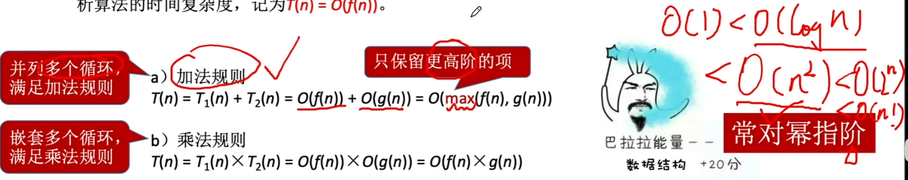
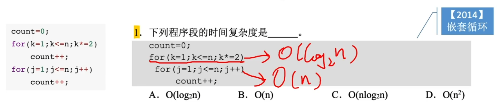
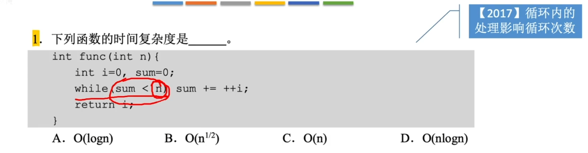
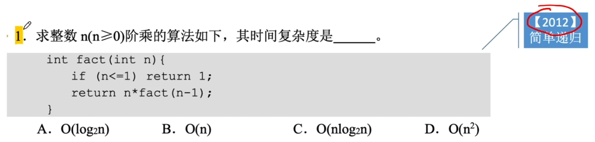
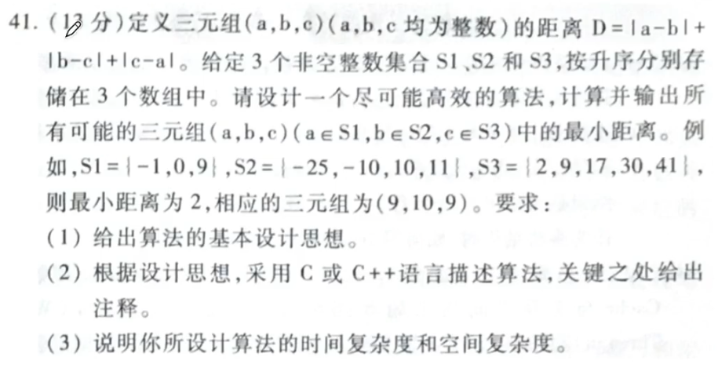
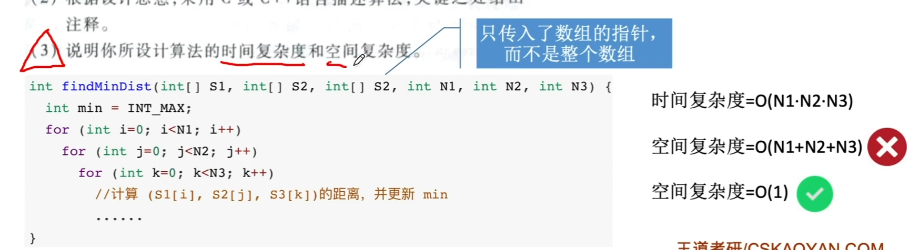

# 时间复杂度与空间复杂度

### 时间复杂度

时间复杂度T(n)是指算法中所有语句的频度（执行次数之和）。

人们关心的是当n趋于无穷时T(n)的数量级，而非T(n)的准确大小，因此以T(n)的数量级来表征时间复杂度。

数量级最大的一项必定是由最深层循环的语句贡献的，称之为基本运算。

T(n)与算法中基本运算的频度f(n)同数量级，所以通常采用基本运算的频度的数量级O(f(n))来分析算法的时间复杂度，记为T(n)=O(f(n))。

### 空间复杂度

空间复杂度S(n)指算法运行过程中所使用的辅助空间大小，通常结合算法题考查。

算法原地工作是指算法所需辅助空间是常量，即O(1)。

注意影响辅助空间大小的两个方面：

1. 算法运行过程中各种变量所占空间（如：辅助数组）
2. 递归工作栈带来的空间复杂度（通常和递归深度同等数量级）

注意：有些情况下，算法的时间复杂度、空间复杂还随问题的输入数据集的不同而不同（最好、最坏、平均）常结合查找、排序算法考察

### 命题重点

1. 给定代码段，分析算法的时间复杂度

   - 循环类代码

     分析每层循环的循环次数与问题规模n之间的关系，若有多层嵌套循环，则使用乘法规则

   - 递归类代码

     分析递归次数与问题规模n之间的关系。若要分析空间复杂度，则应找到递归深度与问题规模n之间的关系

2. 结合算法题考查，分析自己设计的算法的时、空复杂度。