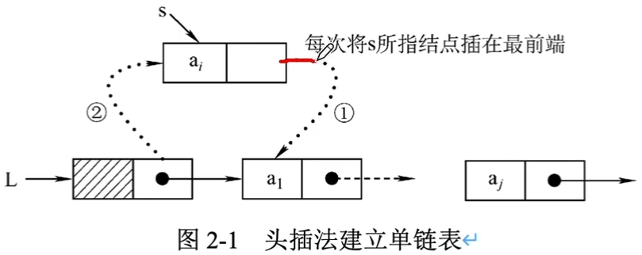
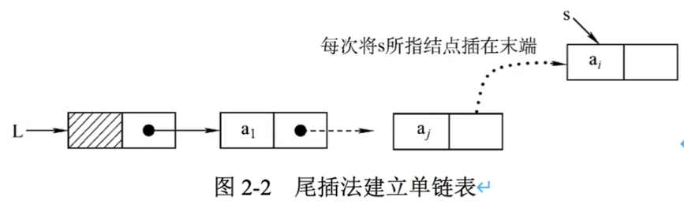
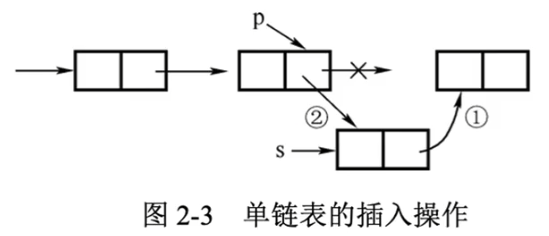
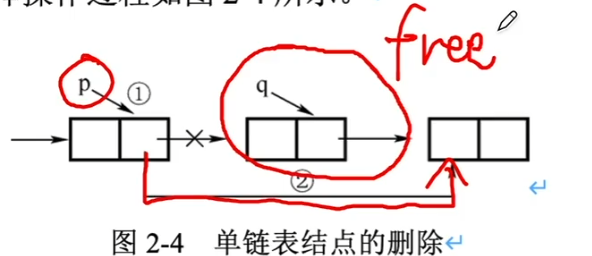
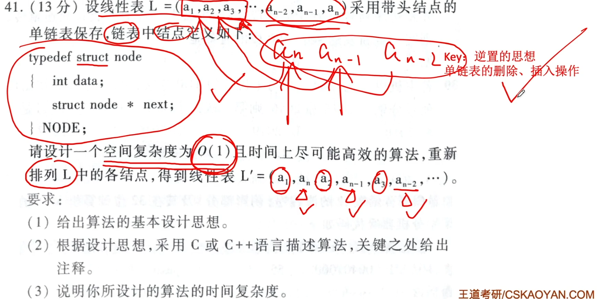
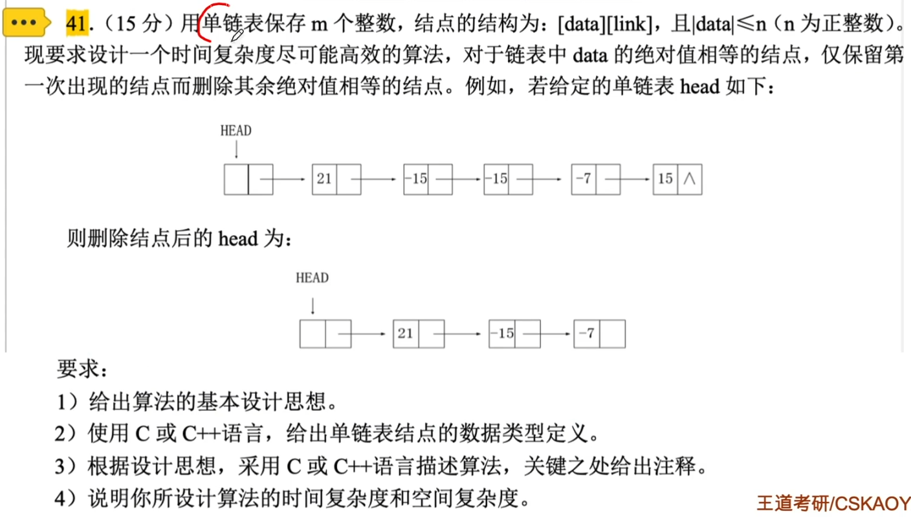
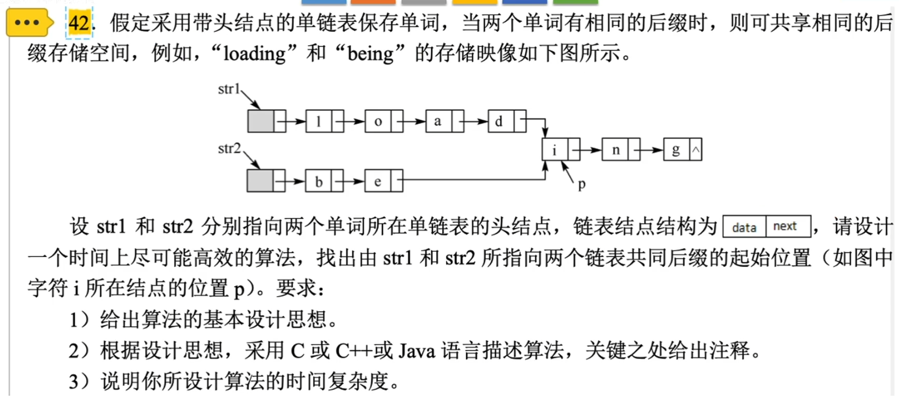
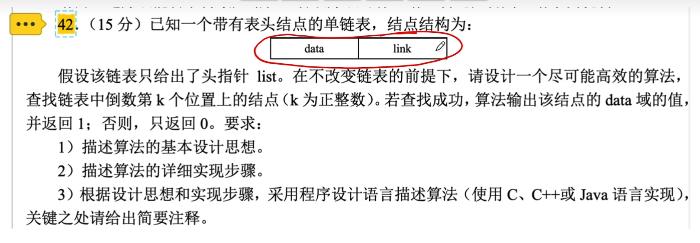
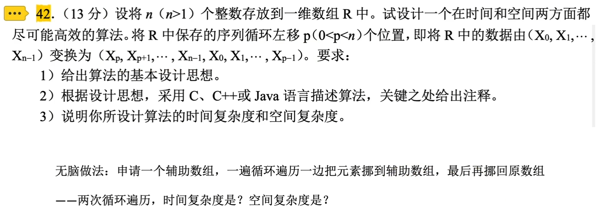

# 线性表的链式表示

### 单链表的基本操作

```c++
typedef struct LNode{   //定义单链表结点类型
    ElemType data;      //每个结点存放一个数据元素
    struct LNode *next; //指针指向下一个结点
}LNode, *LinkList;
```

1. 头插法建立单链表

   从一个空表开始，然后将新结点插入到当前链表的表头，即头结点之后，如图。

   

   采用头插法建立单链表的算法虽然简单，但读入数据的顺序与生成的链表中元素的顺序是相反的。每个结点插入的时间为O(1)，设单链表长为n，总的时间复杂度为O(n)。

   其核心代码如下：

   ```c++
   s->next=L->next; //①新结点的指针指向原链表的第一个结点
   L->next=s;       //②头结点的指针指向新结点，L为头指针
   ```

   注意：为不引起链表断链，图中①②的操作次序不能改变。

2. 尾插法建立单链表

   

   其核心代码如下：

   ```
   r->next=s; //原链表中的尾结点(r所指)的指针指向新结点
   r=s;       //r指向新的表尾结点
   ```

   附设了一个指向表尾结点的指针。时间复杂度和头插法相同，也为O(n)。

3. 单链表的插入

   插入操作是将值为x的新结点插入到单链表的第i个位置。先检查插入位置的合法性，然后找到待插入位置的前驱结点，即第i-1个结点，再在其后插入新结点。

   插入操作的核心代码如下：

   ```c++
   p=GetElem(L,i-1); //查找插入位置的前驱结点
   s->next=p->next;  //①s的指针指向p的下一结点
   p->next=s;        //②p的指针指向s
   ```

   

4. 单链表的删除

   删除操作是将单链表的第i个结点删除。先检查删除位置的合法性，然后查找表中第i-1个结点，即被删除的前驱结点，再将其删除。

   删除操作的核心代码如下：

   ```c++
   p=GetElem(L,i-1); //查找删除位置的前驱结点
   q=p->next;        //令q指向被删除结点
   p->next=q->next;  //将*q结点从链中“断开”
   ```

   







Key：单链表的遍历



### 单链表的考察形式

- 会用C语言定义链表结点
- 单链表的遍历
- 删除某结点
- 插入某结点
- 用“头插法”逆置单链表

