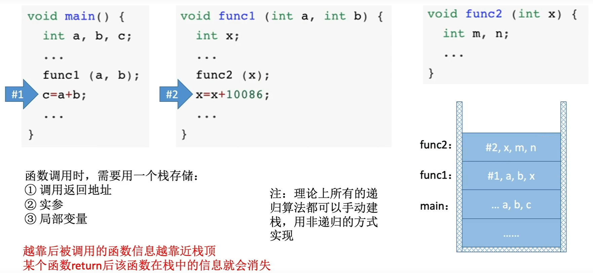
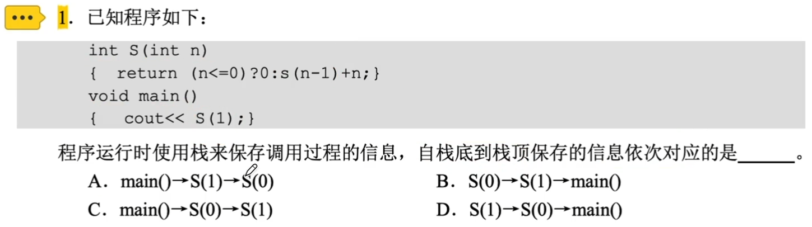
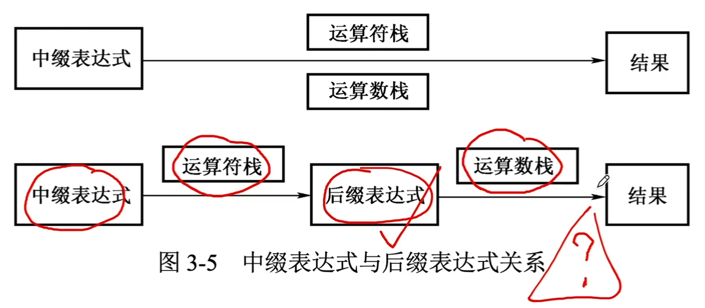
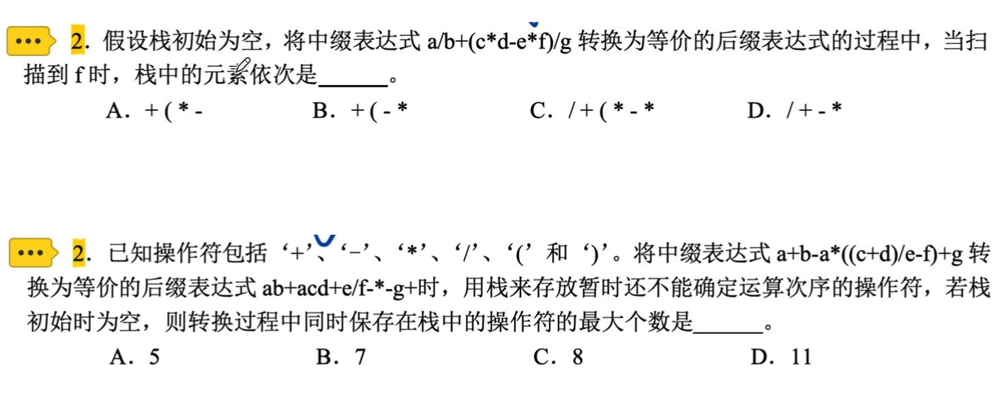
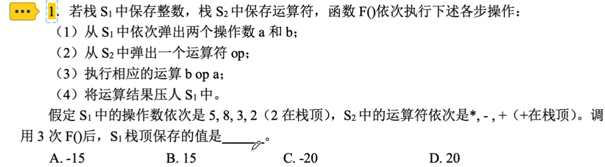

# 栈与队列的应用

### 队列的应用

1. 解决逐行或逐层的问题，如层序遍历二叉树。
2. 解决主机与外部设备之间速度不匹配的问题，如缓冲区。
3. 解决由多用户引起的资源竞争问题，如进程的就绪队列。

### 栈在递归中的应用

函数调用时，需要用一个栈存储：

1. 调用返回地址
2. 实参
3. 局部变量

注：理论上所有的递归算法都可以手动建栈，用非递归的方式实现。

越靠后被调用的函数信息越靠近栈顶

某个函数return后该函数在栈中的信息就会消失

### 栈的在表达式求值中的应用

Tips：前缀表达式在实际中的应用面不大，因此考频也更低

考察：中缀转后缀的详细过程

谨防：后缀表达式计算的详细过程 如：可考察扫描到某个位置时，栈的状态

难点&易遗忘：自己写一个中缀表达式

1. 如何用栈实现中缀转后缀？
2. 如何用栈实现后缀表达式求值？
3. 如何用栈实现中缀表达式求值？