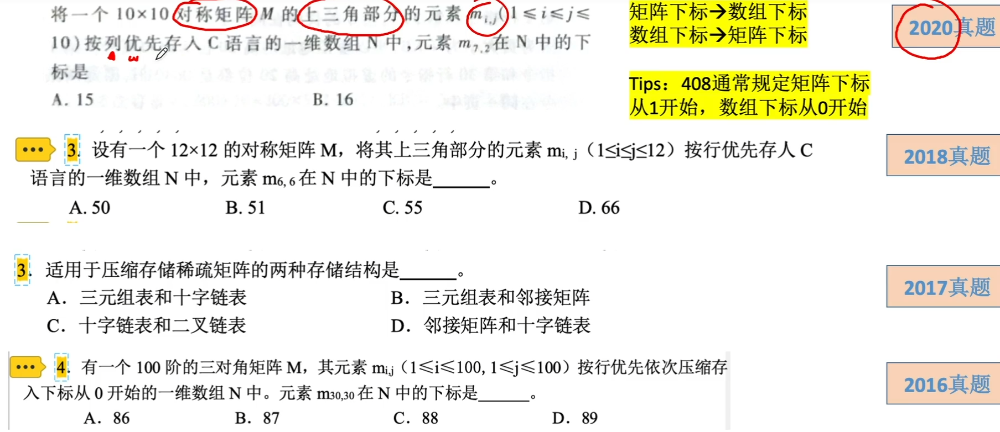
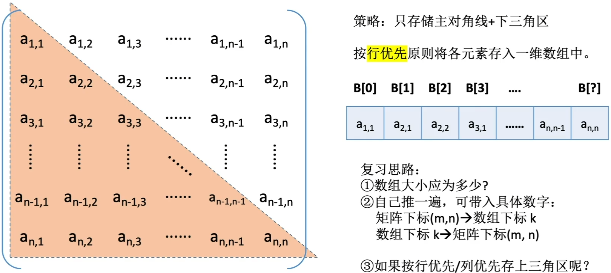
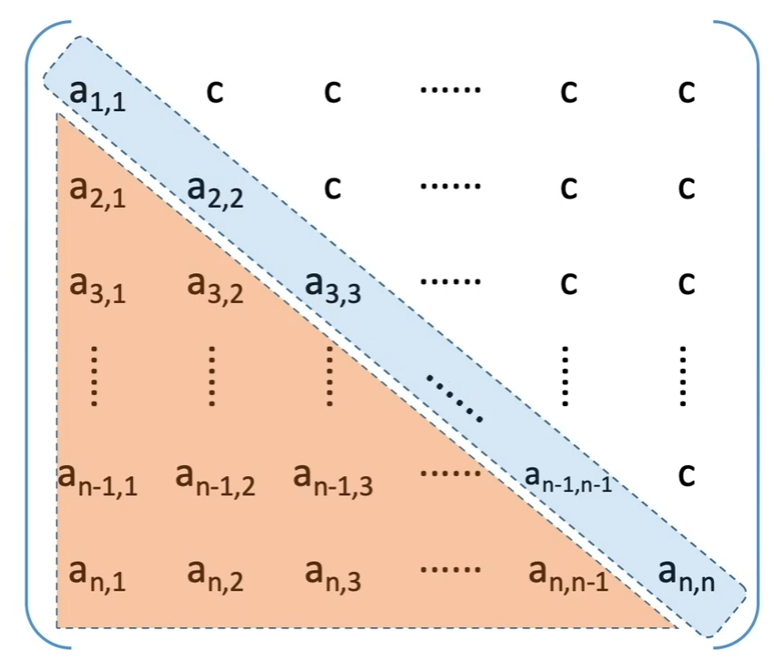
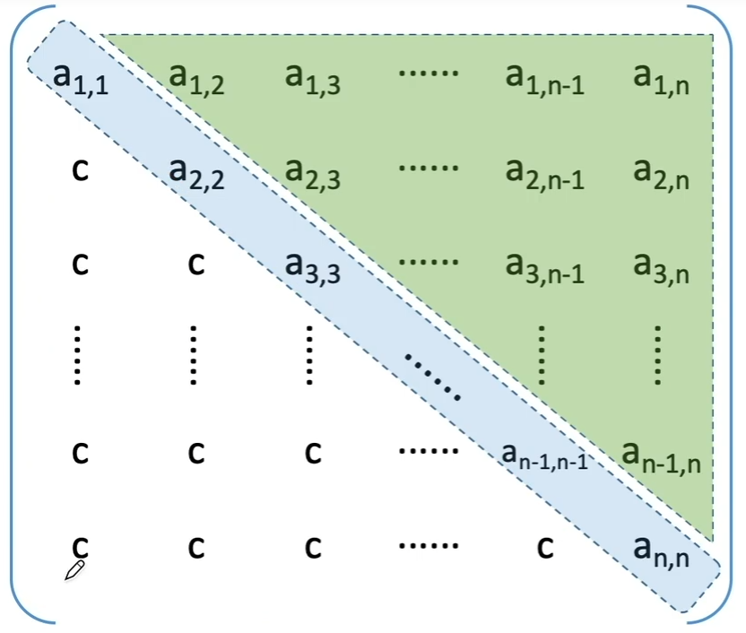
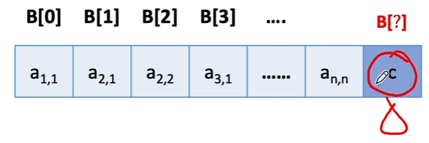
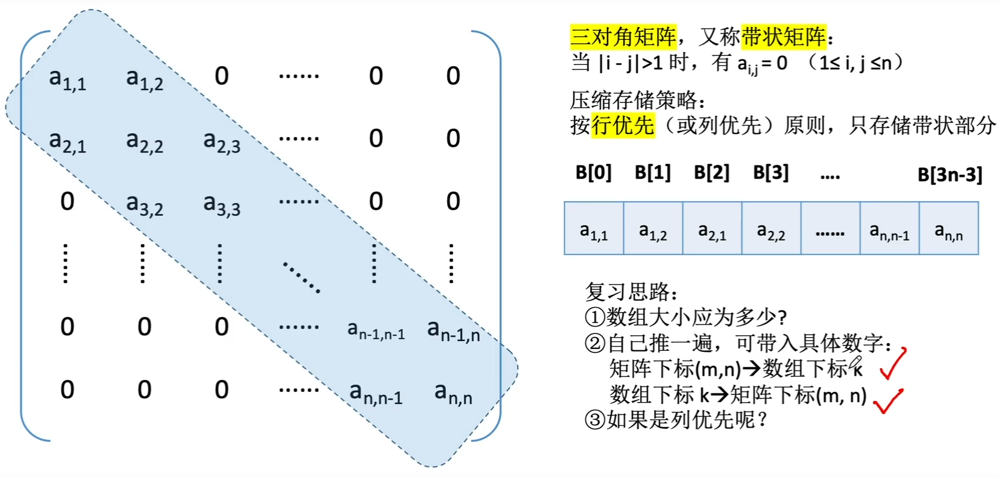
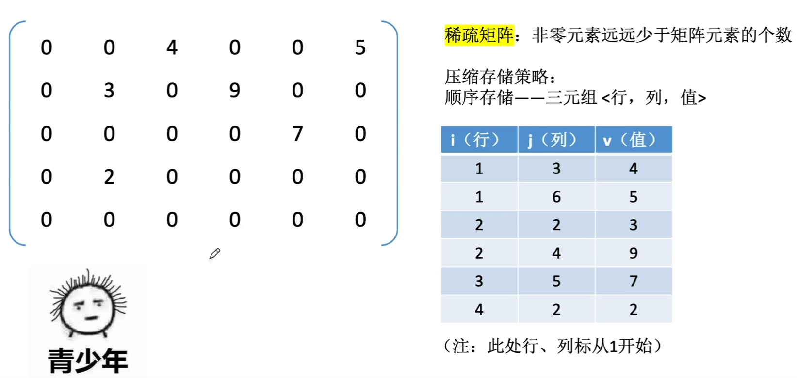
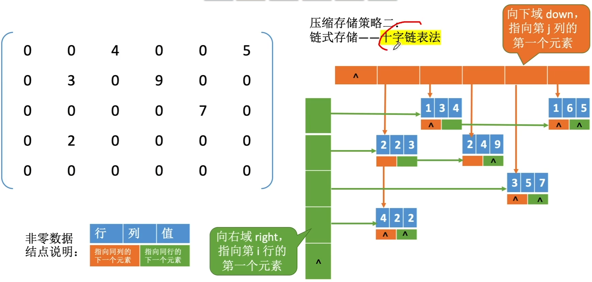
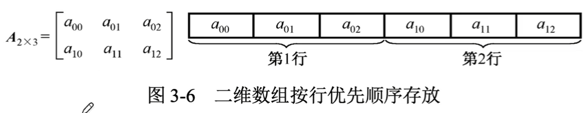
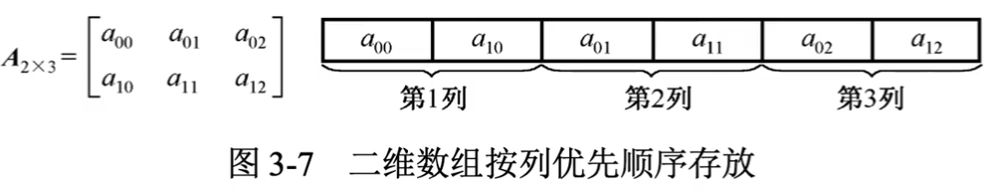

# 特殊矩阵的压缩存储+多维数组存储

### 特殊矩阵的压缩存储

### 对称矩阵的压缩存储

策略：只存储主对角线+下三角区

按行优先原则将各元素存入一维数组中。

复习思路：

1. 数组大小应为多少？

2. 自己推一遍，可带入具体数字

   矩阵下标(m, n)->数组下标k

   数组下标k->矩阵下标(m, n)

3. 如果按行优先/列优先存上三角区呢？

### 三角矩阵的压缩存储

下三角矩阵：除了主对角线和下三角区，其余的元素都相同

上三角矩阵：除了主对角线和上三角区，其余的元素都相同

压缩存储策略：按行优先原则将橙色区元素存入一维数组中。并在最后一个位置存储常量c

复习思路：

1. 数组大小应为多少？

2. 自己推一遍，可带入具体数字

   矩阵下标(m, n)->数组下标k

   数组下标k->矩阵下标(m, n)

3. 如果按列优先存储呢？

4. 如果存上三角区呢？

### 三对角矩阵的压缩存储

压缩存储策略：按行优先（或列优先）原则，只存储带状部分

### 稀疏矩阵的压缩存储

稀疏矩阵：非零元素远远少于矩阵元素的个数

压缩存储策略：顺序存储 三元组<行，列，值>

压缩存储策略二：链式存储 十字链表法

### 普通矩阵（多维数组）的存储

矩阵的存储

数组一般采用顺序存储，其所有元素在内存中占用一段连续的存储空间。对于二维数组，有两种映射方法：按行优先存储和按列优先存储。

例如数组A2x3，按行优先方式在内存中的存储形式如图所示。

例如数组A2x3，按列优先方式在内存中的存储形式如图所示。

常结合行优先遍历、列优先遍历考察”缺页“

