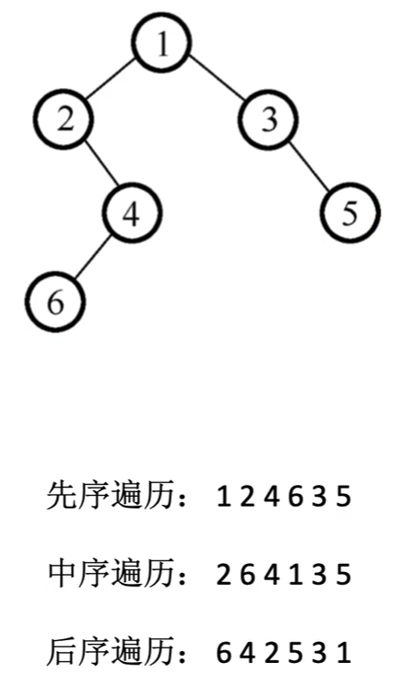
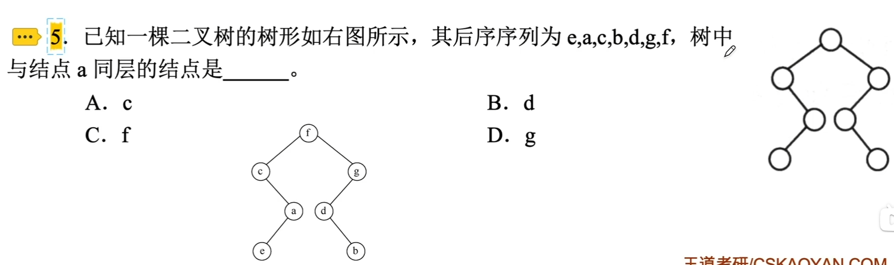
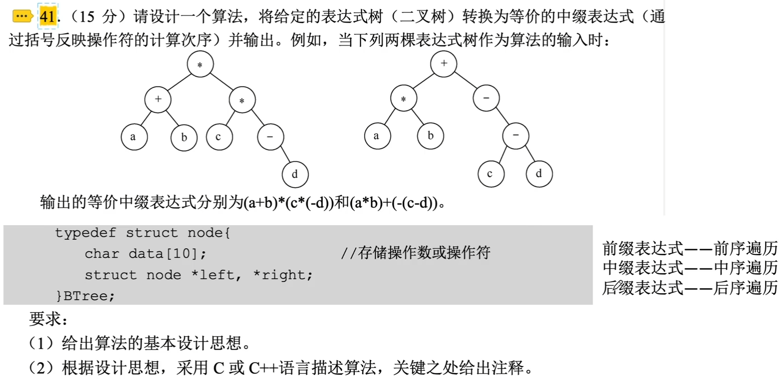
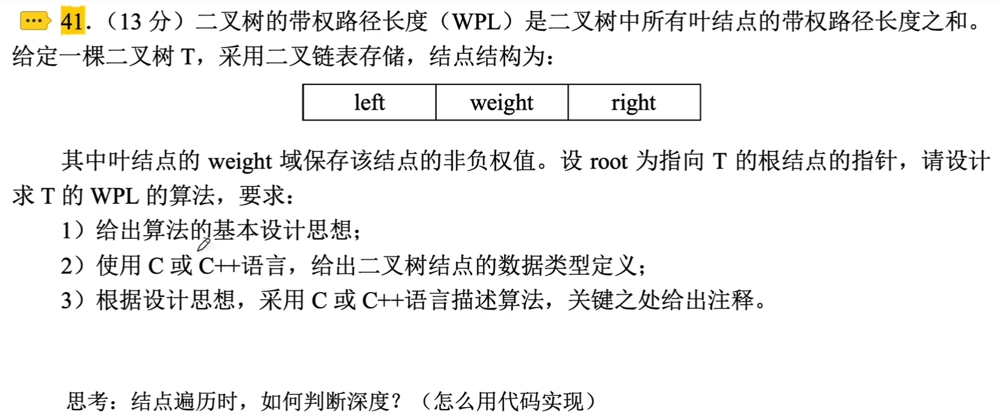
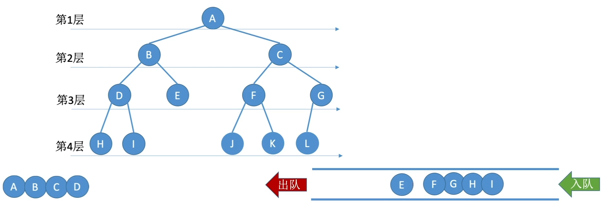

# 二叉树的遍历

先序遍历：根左右 NLR

中序遍历：左根右 LNR

后序遍历：左右根 LRN

### 由遍历序列构造二叉树

可以唯一确定一棵二叉树的序列组合（都需要中序序列）：

- 中序序列与前序序列
- 中序序列与后序序列
- 中序序列与层序序列

### 二叉树的遍历

### 二叉树的层序遍历

算法思想：

1. 初始化一个辅助队列
2. 根结点入队
3. 若队列非空，则队头结点出队，访问该结点，并将其左、有孩子插入队尾（如果有的话）
4. 重复3直至队列为空

