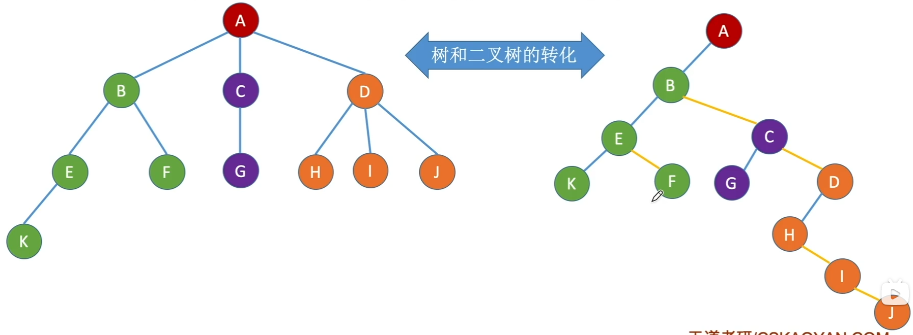
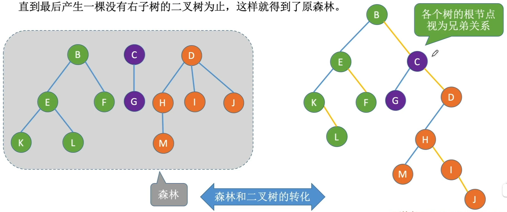
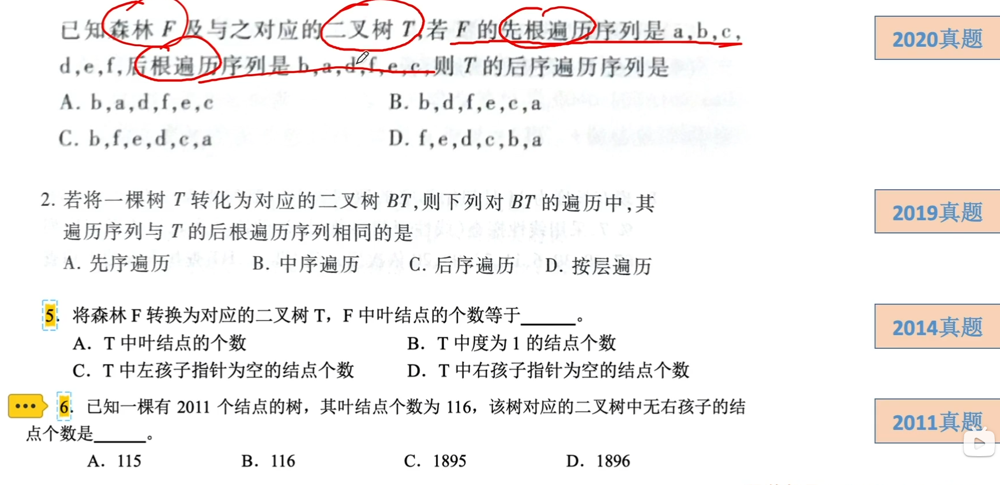

# 树森林二叉树的转换

### 树、森林与二叉树的转换

树转换为二叉树的规则：每个结点左指针指向它的第一个孩子结点，右指针指向它在树中的相邻兄弟结点。根结点没有兄弟，因此树转换而得的二叉树没有右子树。

二叉树转换为森林的规则：若二叉树非空，则二叉树根及其左子树为第一棵树的二叉树形式，二叉树根的右子树又可以看做是一个由除第一棵树外的森林转换成的二叉树，应用同样的方法，直到最后产生一棵没有右子树的二叉树为止，这样就得到了原森林。

| 树       | 森林                 | 二叉树   |
| -------- | -------------------- | -------- |
| 先根遍历 | 先序遍历（先根遍历） | 先序遍历 |
| 后根遍历 | 中序遍历（后根遍历） | 中序遍历 |

树、森林用孩子兄弟表示法即可呈现出二叉树的形态

