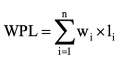
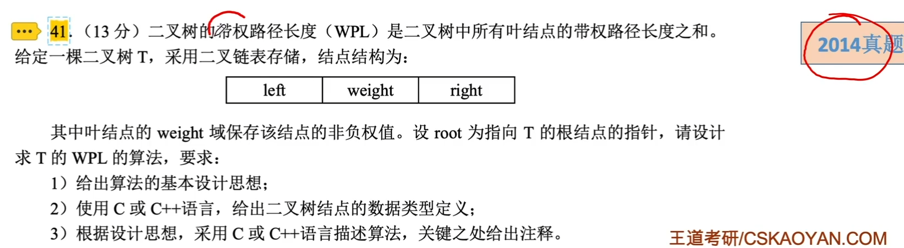
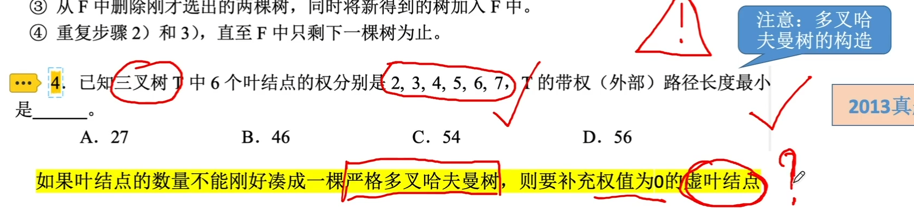
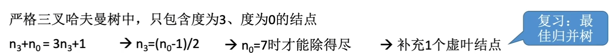
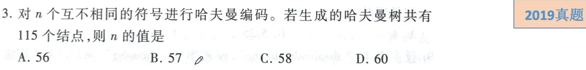
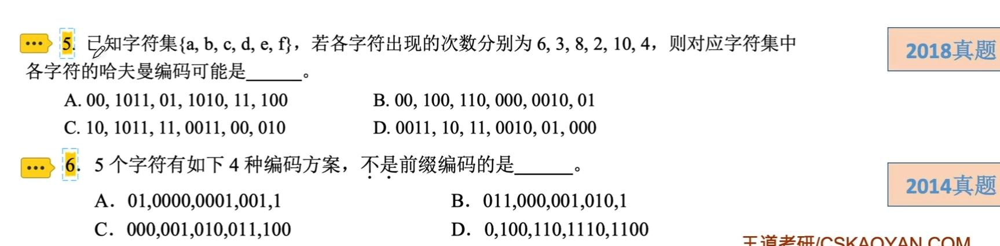
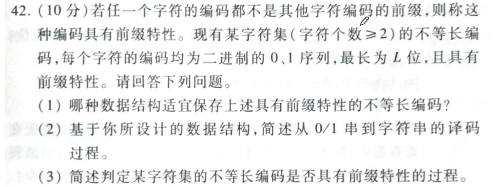

# 哈夫曼树和哈夫曼编码

### 哈夫曼树的定义

从树根结点到任意结点的路径长度（经过的边数）与该结点上权值的乘积称为该结点的带权路径长度。树中所有叶结点的带权路径长度之和称为该树的带权路径长度，记为

式中，wi是第i个叶结点所带的权值；li是该叶结点到根结点的路径长度。

在含有N个带权叶子结点的二叉树中，其中带权路径长度最小的二叉树称为哈夫曼树。

### 哈夫曼树的构造

给定N个权值分别为w1, w2, ..., wN的结点。通过哈夫曼算法可以构造出最优二叉树，算法的描述如下：

1. 将这N个结点分别作为N棵仅含一个结点的二叉树，构成森林F。
2. 构造一个新结点，并从F中选取两棵根结点，并从F中选取两棵根结点权值最小的树作为新结点的左、右子树，并且将新结点的权值置为左、右子树上根结点的权值之和。
3. 从F中删除刚才选出的两棵树，同时将新的到的树加入F中。
4. 重复步骤2和3，直至F中只剩下一棵树为止。

### 哈夫曼树的特点

1. 每个初始结点最终都成为叶结点，并且权值越小的结点到根结点的路径长度越大。
2. 构造过程中共新建了N-1个结点（双分支结点），因此哈夫曼树中结点总数为2N-1。
3. 每次构造都选择2棵树作为新结点的孩子，因此哈夫曼树中不存在度为1的结点。
4. 用n个叶子结点构造的哈夫曼树形态可能不唯一，但带权路径长度唯一。

### 哈夫曼编码

如果没有一个编码是另一个编码的前缀，则称这样的编码为前缀编码。利用哈夫曼树可以设计出总长度最短的二进制前缀编码。

形成哈夫曼编码过程：

1. 将每个待编码元素当作一个独立的结点，构造出对应的哈夫曼树。
2. 从根至该字符的路径上边标记的序列，其中边标记为0表示”转向左孩子“，标记为1表示”转向右孩子“。
3. 从根结点到待编码元素结点的路径形成的0、1序列就是哈夫曼编码。

