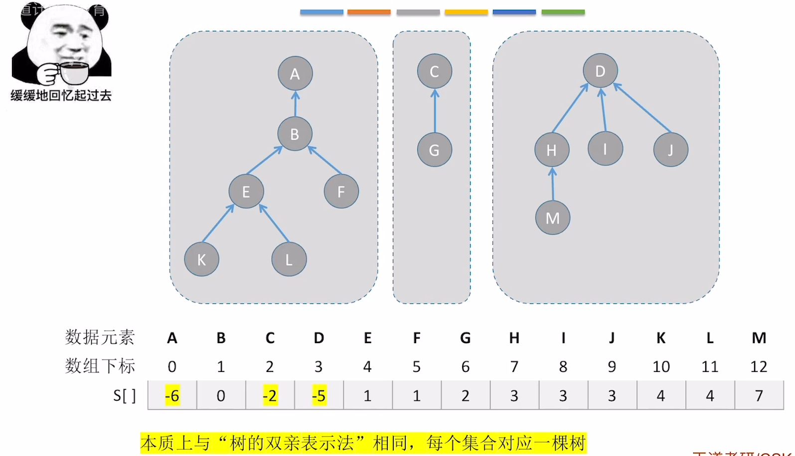
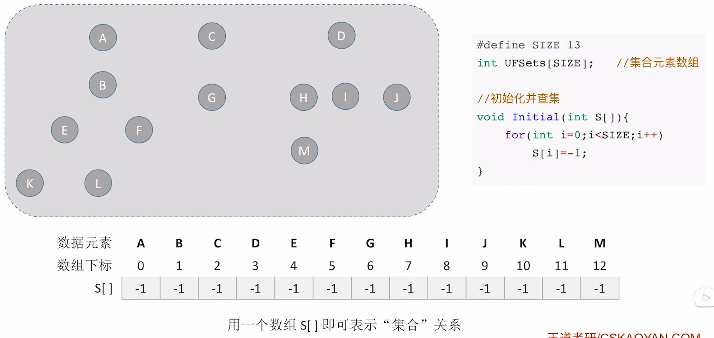
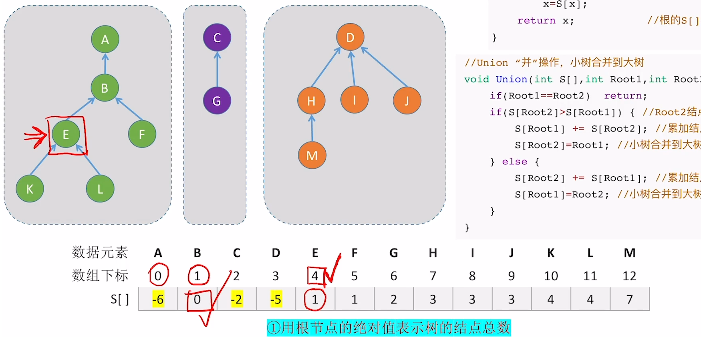
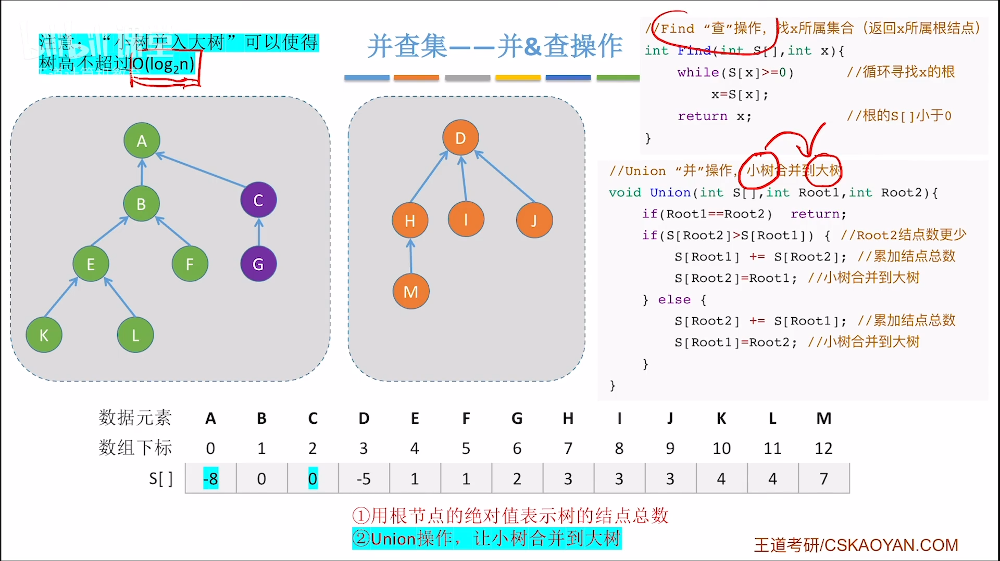
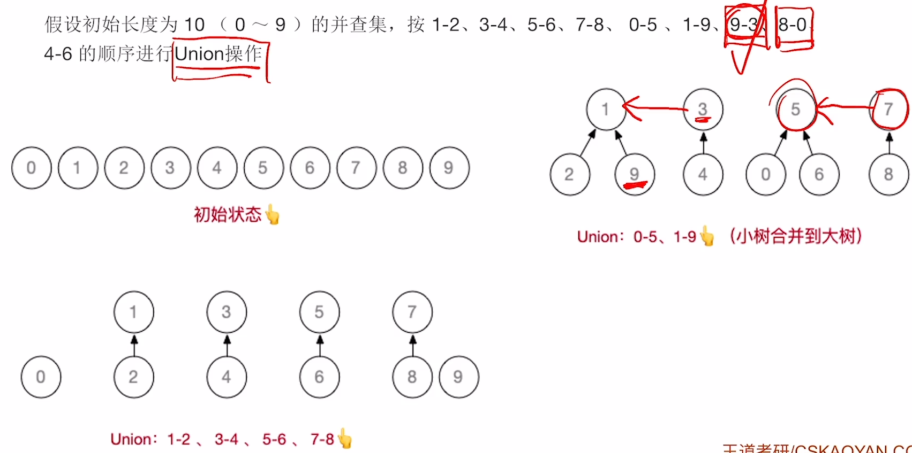
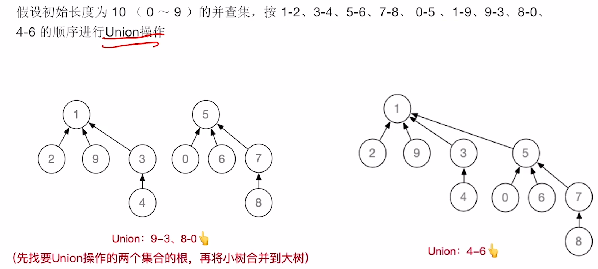
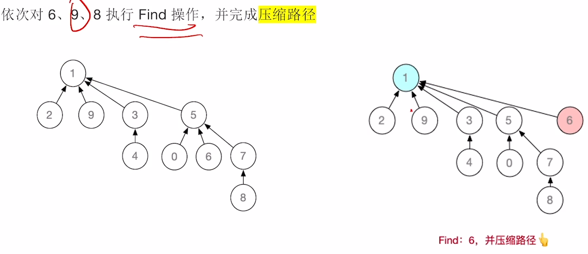
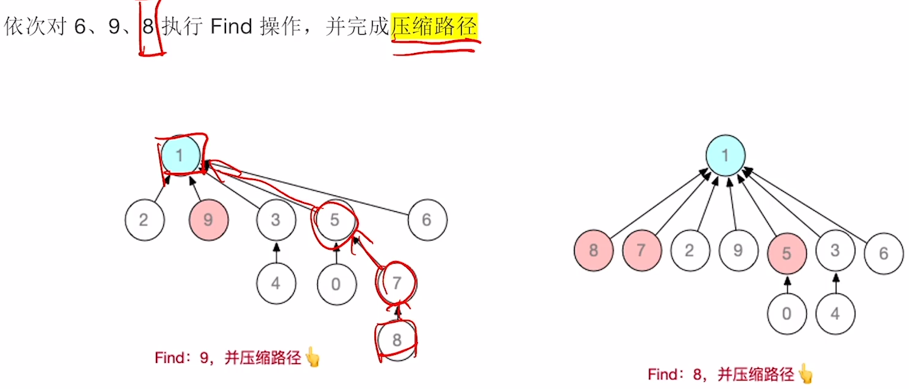
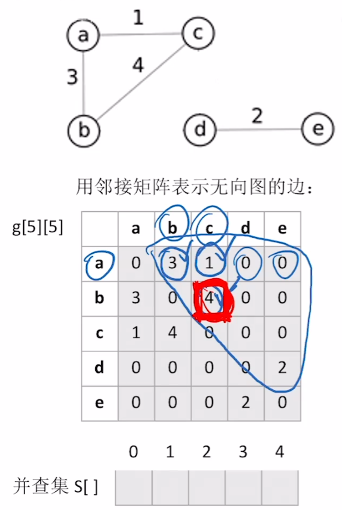
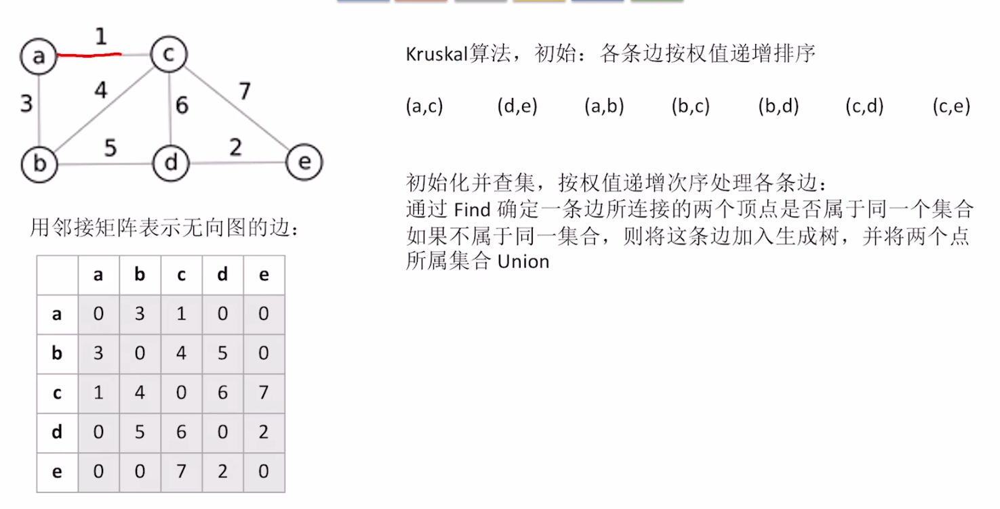

# 并查集



### 定义&初始化

```c++
#define SIZE 13
int UFSets[SIZE]; //集合元素数组

//初始化并查集
void Initial(int S[]){
    for(int i=0;i<SIZE;i++)
        S[i]=-1;
}
```



### 并&查操作

```c++
//Find “查”操作，找x所属集合（返回x所属根结点）
int Find(int S[], int x){
    while(S[x]>=0) //循环寻找x的根
        x=S[x];
    return x;      //根的S[]小于0
}
//Union “并”操作，小树合并到大树
void Union(int S[], int Root1, int Root2){
    if(Root1==Root2) return;
    if(S[Root2]>S[Root1]){ //Root2结点数更少
        S[Root1]+=S[Root2];//累加结点总数
        S[Root2]=Root1;//小树合并到大树
    }else{
        S[Root2]+=S[Root1];//累加结点总数
        S[Root1]=Root2;//小树合并到大树
    }
}
```





### 并查集怎么考？选择题

- 并查集是双亲表示法存储的树
- 若并查集中包含n个元素，则Find操作最坏时间复杂度为O(n)
- 为了提高并查集的查找效率，在进行Union操作时，可以让结点更少的树作为结点更多的树的子树
- 为了提高并查集的查找效率，可以采用“压缩路径”的方式优化Find操作
- 并查集可以用于实现克鲁斯卡尔算法求最小生成树
- 并查集用于判断无向图的连通性
- 并查集用于判断无向图中是否有环

### 并查集怎么考？应用题









### 拓展1：用并查集判断图的连通分量个数

遍历各条边，有边相连的两个顶点一定是连通的，将两个顶点所属集合“并”为一个集合

处理完所有边，即可将图划分为若干个连通分量

注：若连通分量个数=1，说明这个无向图“连通”

已经连通的子图中，但凡再多出一条边，这个子图就一定有环



Kruskal算法，初始：各条边按权值递增排序

初始化并查集，按权值递增次序处理各条边：

通过Find确定一条边所连接的两个顶点是否属于同一个集合如果不属于同一集合，则将这条边加入生成树，并将两个点所属集合Union。

