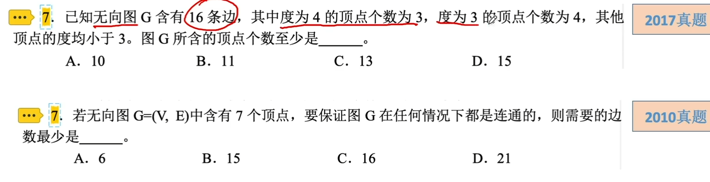

# 图的基本概念

### 图的基本概念及术语

| 基本概念                     | 定义                                                         |
| ---------------------------- | ------------------------------------------------------------ |
| 边、弧                       | 边是顶点的无序对，记为(v,w)或(w,v)。 弧是顶点的有序对，记为<v,w>，v称为弧尾，w称为弧头 |
| 无向图                       | 若E是无向边（简称边）的有限集合时，则图G为无向图             |
| 有向图                       | 若E是有向边（也称弧）的有限集合时，则图G为有向图             |
| 顶点的度、入度、出度         | 图中每个顶点的度定义为以该顶点为一个端点的边的数目。 对于无向图，顶点v的度是指依附于该顶点的边的条数，记为TD(v)。 对于有向图，顶点v的度分为入度和出度，入度是以v为终点的有向边的数目，记为ID(v)；而出度是以v为起点的有向边的数目，记为OD(v)。顶点v的度等于其入度和出度之和，即TD(v)=ID(v)+OD(v) |
| 连通、连通图、连通分量       | 在无向图中，若从顶点v到顶点w有路径存在，则称v和w是连通的。若图G中任意两个顶点都是连通的，则称图G为连通图，否则为非连通图。 无向图中的极大连通子图称为连通分量。 |
| 强连通、强连通图、强连通分量 | 在有向图中，若从顶点v到顶点w和从顶点w到顶点v之间都有路径，则称这两个顶点是强连通的。若图中任意一对顶点都是强连通的，则称此图为强连通图。 有向图中的极大强连通子图称为有向图的强连通分量。 |
| 完全图                       | 在无向完全图中，任意两个顶点都存在边，共有n(n-1)/2条边。 在有向完全图中，任意两个顶点之间都存在方向相反的两条弧，共有n(n-1)条有向边 |
| 子图                         | 设有两个图G=(V,E)和G’=(V',E')，若V'是V的子集，且E'是E的子集，则称G'是G的子图。 注意：不是任意V'，E'都能构成子图，前提是V'，E‘必须能构成图 |
| 生成树、生成森林             | 连通图的生成树是包含图中全部顶点的一个极小连通子图。 在非连通图中，连通分量的生成树构成了非连通图的生成森林。 |
| 路径、路径长度和回路         | 顶点vp到顶点vq之间的一条路径是指顶点序列vp,vi1,vi2,...,vim,vq。路径上边的数目称为路径长度。 第一个顶点和最后一个顶点相同的路径称为回路或环。 |
| 简单路径、简单回路           | 在路径序列中，顶点不重复出现的路径称为简单路径。 除第一个顶点和最后一个顶点之外，其余顶点不重复出现的回路称为简单回路。 |
| 稠密图、稀疏图               | 边数很少的图称为稀疏图，反之，称为稠密图。一般当图G满足\|E\|<\|V\|log\|V\|时，可以将G看成是稀疏图 |

