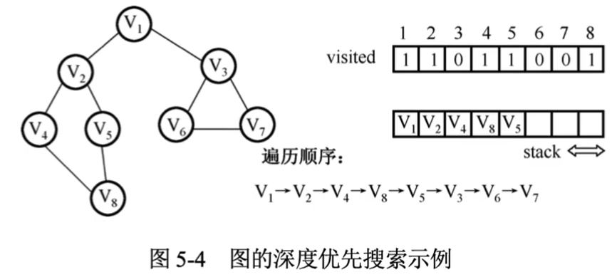
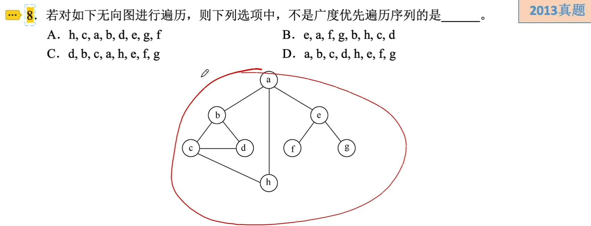
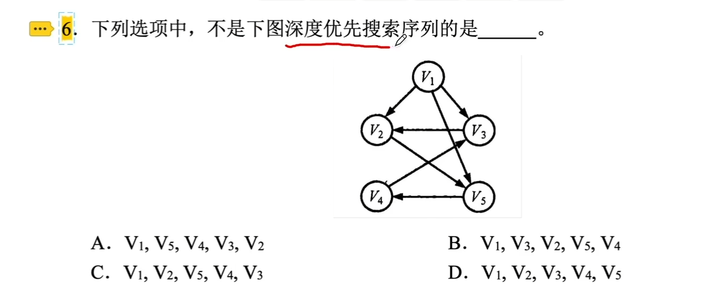
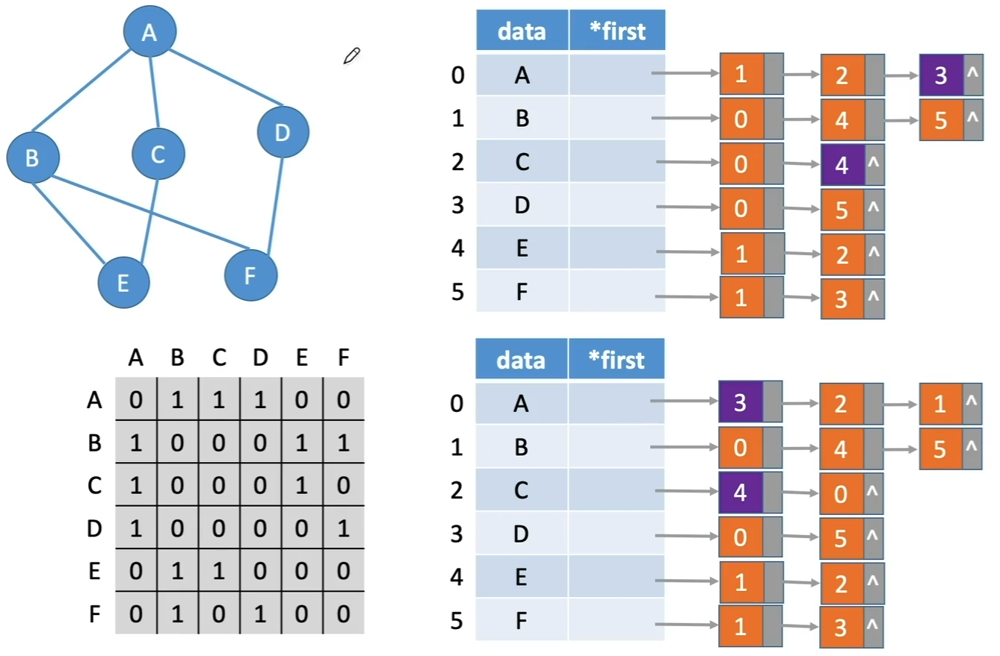

# 图的遍历

### 广度优先搜索（BFS）

类似于二叉树的层序遍历，尽可能广地搜索一个图。

1. 访问其实顶点v；
2. 依次访问v的为未访问过的邻接顶点w1,w2,...,wi；
3. 再从这些访问过的顶点出发，再访问它们所有未被访问过的邻接顶点，依此类推，直到图中所有和v连通的顶点都被访问过为止。
4. 另选一个未被访问过的顶点作为起始顶点v，重复123，直至所有顶点都被访问。

BFS算法的性能分析：

- BFS算法需要借助一个辅助队列，空间复杂度为O(|V|)
- 邻接矩阵表示时，算法总的时间复杂度为O(|V|^2)
- 邻接表表示时，算法总的时间复杂度为O(|V|+|E|)

### 深度优先搜索（DFS）

类似于树的先根遍历，尽可能“深”地搜索一个图

1. 访问图中某一其实顶点v，
2. 从v出发，访问于v邻接且未被访问的任一顶点w1，再访问与w1邻接且未被访问的任意顶点w2，重复该过程。
3. 当不能再继续向下访问时，一次退回到最近被访问的顶点，若它还有邻接顶点未被访问，则从该顶点开始重复2，直到图中所有顶点均被访问过为止。

DFS算法的性能分析：

- DFS算法是一个递归算法，需借助一个递归工作栈，空间复杂度为O(|V|)
- 邻接矩阵表示时，算法总的时间复杂度为O(|V|^2)
- 邻接表表示时，算法总的时间复杂度为O(|V|+|E|)

注意：对于同一个图，基于邻接矩阵的遍历所得到的DFS序列和BFS序列是唯一的；基于邻接表的遍历所得到的DFS序列和BFS序列是可能不唯一的。

