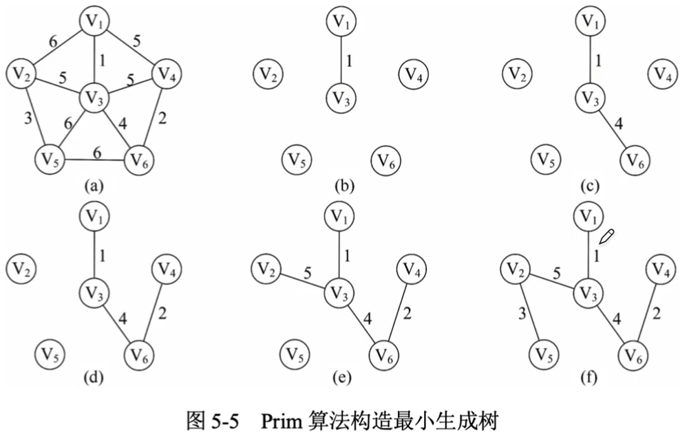
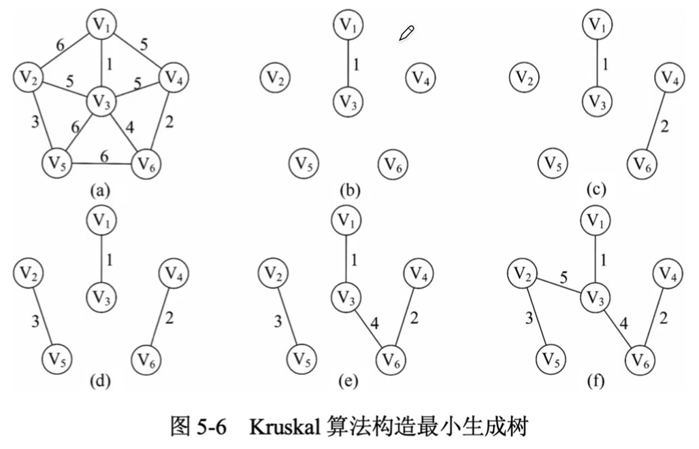
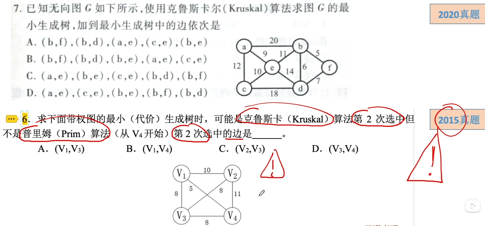
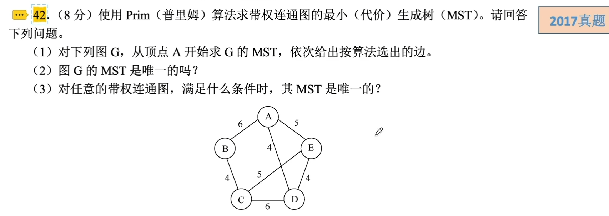
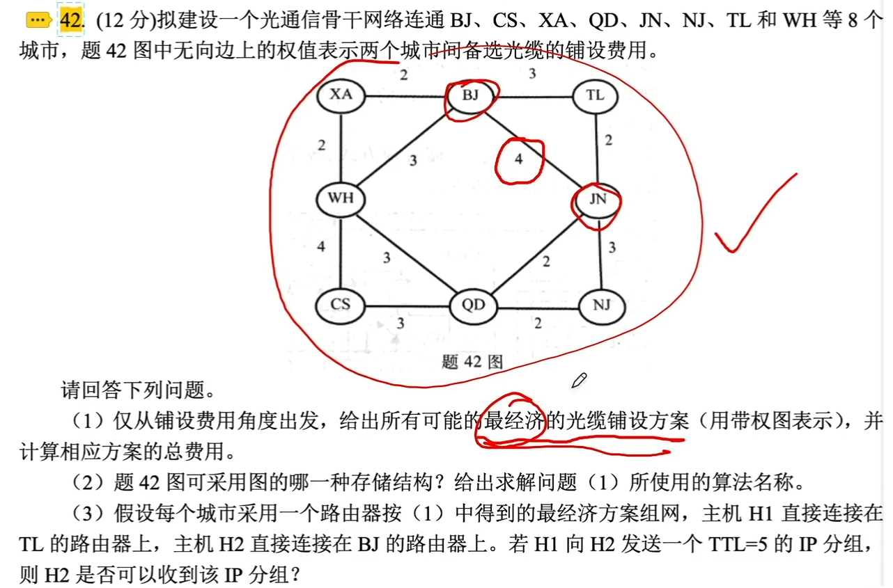

# 最小（代价）生成树

### 普里姆（Prim）算法

Prim算法的思想：

Prim算法的时间复杂度为O(|V|^2)，不依赖于|E|，适用于边稠密的图。

### 克鲁斯卡尔（Kruskal）算法

Kruskal算法的思想：

Kruskal算法的时间复杂度为O(|E|log2|E|)，适用于边稀疏而顶点较多的图。

### 最小生成树

所有生成树的集合中边的权值之和最小的那棵生成树，称为最小生成树。

最小生成树的性质：

- 最小生成树不是唯一的，即可能有多个最小生成树。
- 当图G中的各边权值互不相等时，G的最小生成树是唯一的。
- 最小生成树所对应的边的权值之和总是唯一的，而且是最小的。

