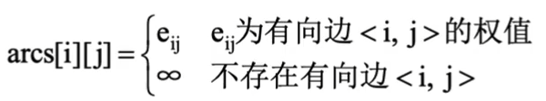
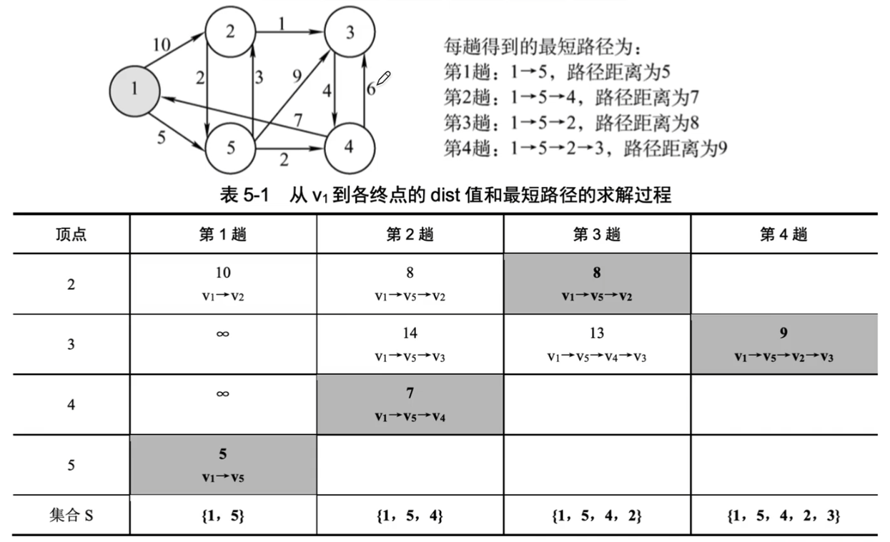
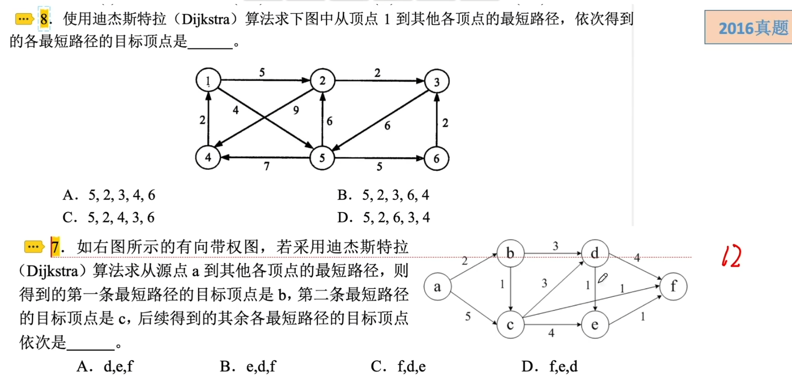
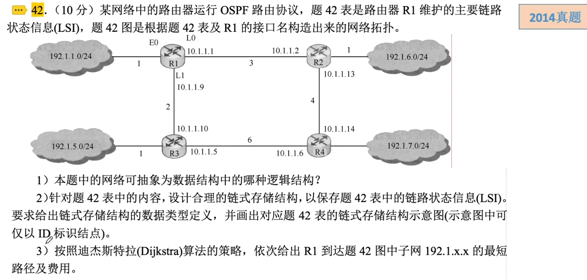
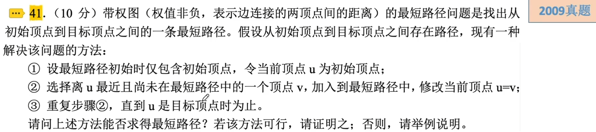
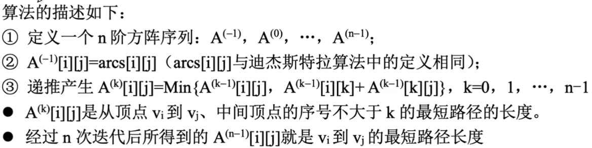
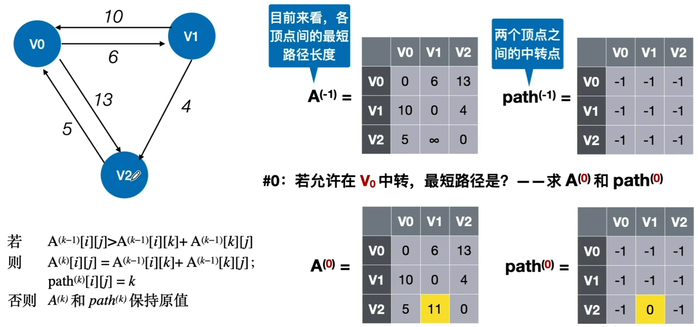

# 最短路径

### 最短路径问题

在带权图中，边上的权值表示路径长度；从一个顶点到另一个顶点的路径长度是路径上各边的权值之和。

- 单源最短路径问题：求从给定源点到其他各个顶点的最短路径长度。Dijkstra
- 点对点最短路径问题：求每一对顶点之间的最短路径长度。Floyd

### 迪杰斯特拉算法

用邻接矩阵arcs表示带权有向图

此外，设置辅助数组：

- dist[]：记录了从源点v0到其他各顶点当前的最短路径长度。

假设从顶点0出发，即v0=0。Dijkstra算法的步骤如下：

1. 集合S记录已求得的最短路径的顶点，初始为{0}，dist[i]初值为arcs\[0][i]。
2. 从顶点集合V-S中选出vj，满足dist[j]=Min{dist[i]|vi属于V-S}，vj就是i当前求得的一条从v0出发的最短路径的终点，令S=SU{j}。
3. 修改从v0出发到集合V-S上任一顶点vk可达的最短路径长度：如果dist[j]+arcs\[j][k]<dist[k]，则令dist[k]=dist[j]+arcs\[j][k]
4. 重复23操作共n-1次，直到所有顶点都包含在S中。

### Floyd算法求各顶点之间最短路径问题

Floyd算法的时间复杂度为O(|V|^3)

Floyd算法允许图中带负权值的边，但不允许有包含带负权值的边组成的回路。

### Floyd算法 考察性质的概率较大

|                | BFS算法                    | Dijkstra算法           | Floyd算法                    |
| -------------- | -------------------------- | ---------------------- | ---------------------------- |
| 无权图         | √                          | √                      | √                            |
| 带权图         | ×                          | √                      | √                            |
| 带负权值的图   | ×                          | ×                      | ×                            |
| 带负权回路的图 | ×                          | ×                      | ×                            |
| 时间复杂度     | O(\|V\|^2)或O(\|V\|+\|E\|) | O(\|V\|^2)             | O(\|V\|^3)                   |
| 通常用于       | 求无权图的单源最短路径     | 求带权图的单源最短路径 | 求带权图中各顶点间的最短路径 |

注：也可用Dijkstra算法求所有顶点间的最短路径，重复|V|次即可，总的时间复杂度是O(|V|^3)