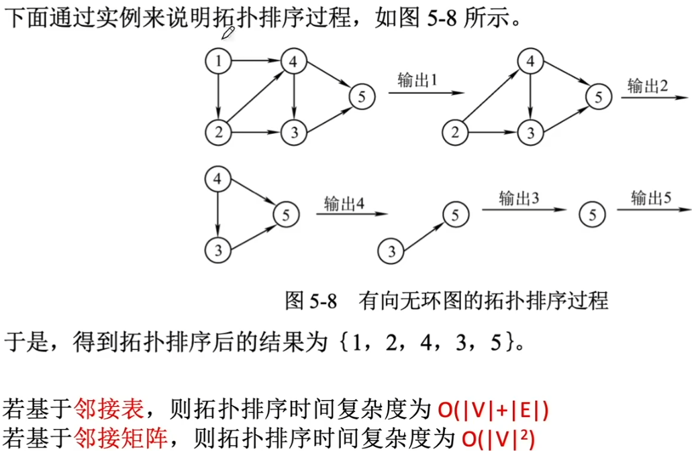
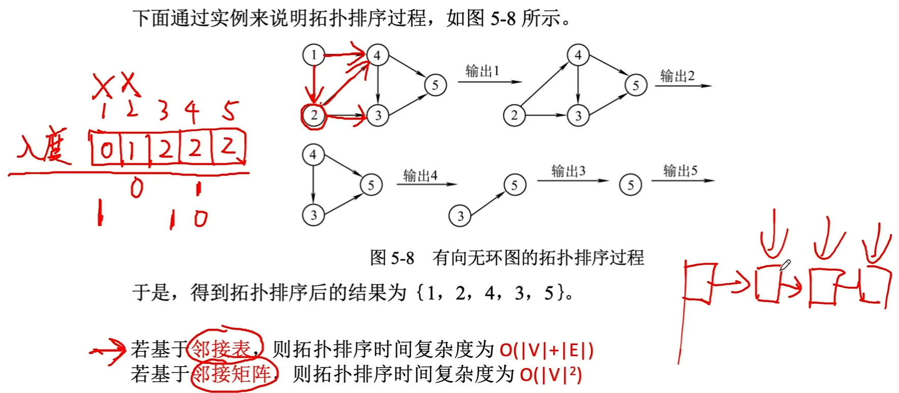
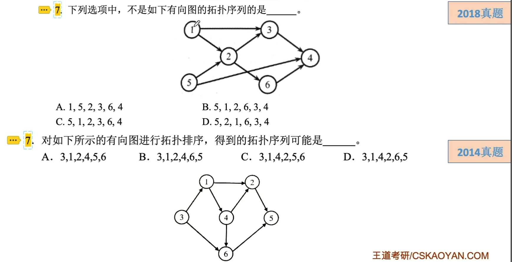

# 拓扑排序

### 拓扑排序

有向无环图的一个顶点组成的序列称为拓扑序列，当且仅当满足下列条件时。

1. 每个顶点出现且只出现一次。
2. 若顶点A在序列中排在顶点B的前面，则图中不存在顶点B到顶点A的路径。

每个有向无环图都有一个或多个拓扑序列。

拓扑排序的算法：

1.  从有向无环图中选择一个没有前驱的顶点并输出。
2. 从图中删除该顶点和所有以它为起点的有向边。
3. 重复1和2直到当前的图为空或当前图中不存在无前驱的顶点为止。而后一种情况则说明有向图中必然存在环。

