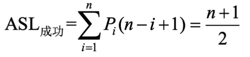
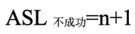
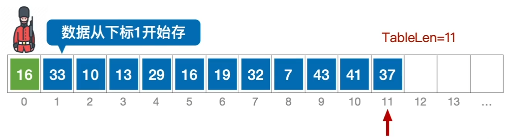
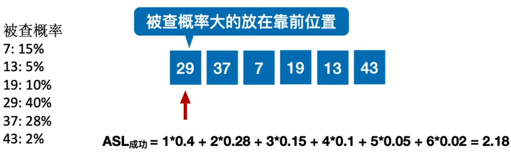
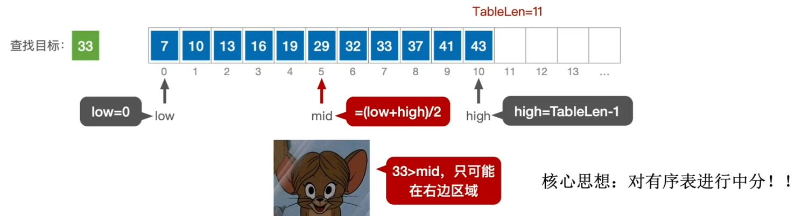
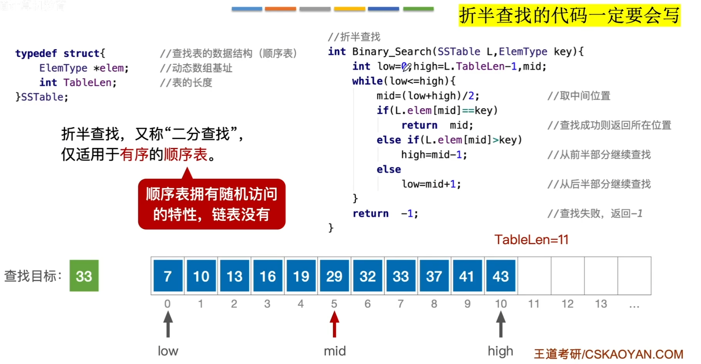
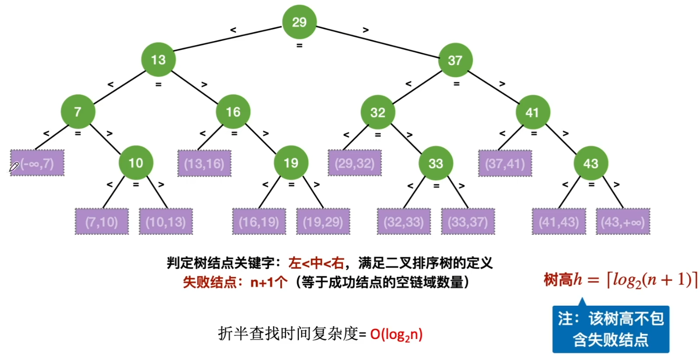
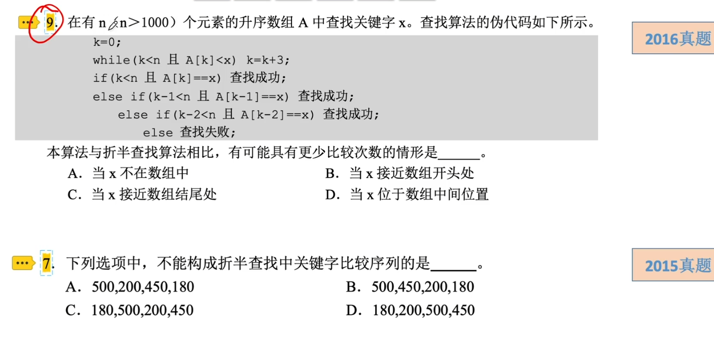

# 顺序查找法&折半查找法

### 顺序查找法

逐个比较查找表中的元素，直到找到目标元素或达到查找表的尽头为止，时间复杂度为O(n)。

查找成功时，在等概率的情况下，平均查找长度为

查找不成功时，平均查找长度为

注：如果不使用“哨兵”的实现方法，则ASL失败=n

注意：有序线性表的顺序查找在查找失败时的平均查找长度是不同的。

方法一：表中元素有序，可减少查找失败时的平均查找长度

方法二：按被查概率降序排列，可减少查找成功时的平均查找长度

### 折半查找法

又称二分查找法，它仅适用于有序的顺序表。折半查找的思想：

1. 若顺序表为空，查找失败；否则，执行2。
2. 将key与顺序表中间位置元素的关键字比较，若相等，查找成功；否则执行3。
3. 若key小于（大于）顺序表中间位置元素的关键字，则以中间元素的前半部分（后半部分）作为新的查找表，执行1。

描述折半查找过程的二叉树称为判定树，判定树的树高h=[log2 (n+1)]\(与完全二叉树相同)。表的中间结点是二叉树的根，左子表相当于左子树，右子表相当于右子树。

### 折半查找的判定树

