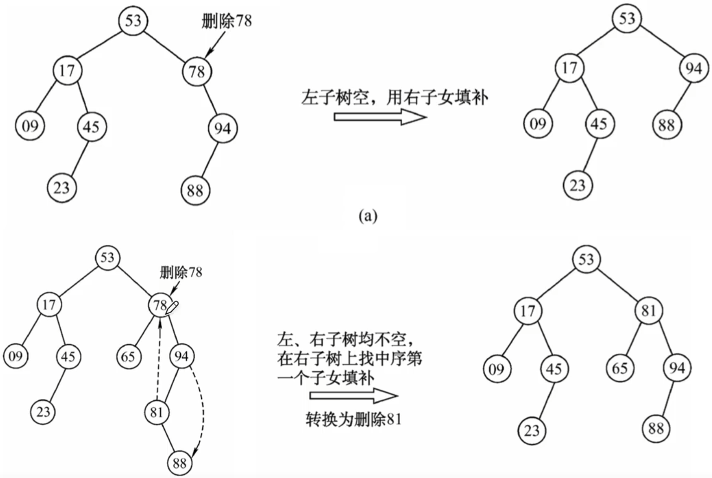
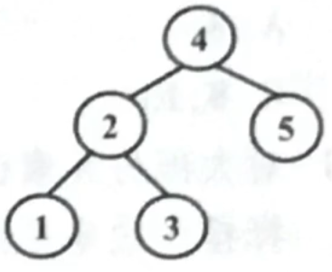

# 二叉排序树

### 二叉排序树的定义与特点

一棵二叉树或者是空二叉树，或者是具有如下性质的二叉树：

1. 左子树上所有结点的关键字（若存在）均小于根结点的关键字
2. 右子树上所有结点的关键字（若存在）均大于根结点的关键字
3. 左子树和右子树又各是一棵二叉排序树

二叉排序树的特点：

中序遍历二叉排序树，可以得到一个递增的有序序列。

在二叉排序树中删除后又插入同一结点，得到的二叉排序树与原来的不一定相同，但中序序列一定相同，因为在二叉排序树中插入的新结点均作为叶子结点。

左子树结点值<根结点值<右子树结点值

进行中序遍历，可以得到一个递增的有序序列

### 二叉排序树的查找

二叉排序树的查找过程（若二叉排序树非空）：

1. 将给定值与根结点的关键字比较，若相等，则查找成功。
2. 将根结点的关键字大于给定关键字值时，在根结点的左子树中查找。
3. 否则在根结点的右子树中查找。

查找失败的平均查找长度ASL

最好情况下，平均时间复杂度：O(log2 n)

最坏情况下，平均时间复杂度：O(n)

### 二叉排序树的插入

二叉排序树的插入过程（与查找过程类似）：

1. 若原二叉排序树为空，则直接插入结点
2. 若关键字k小于根结点关键字，则插入到左子树中
3. 若关键字k大于根结点关键字，则插入到右子树中

由此可见，插入的新节点一定是某个叶结点。

### 二叉排序树的删除

1. 如果被删除结点x是叶结点，则直接删除
2. 若结点x只有一棵左子树或右子树，则让x的子树成为x父结点的子树，替代x的位置。
3. 若结点x有左、右两棵子树，则令x的中序后继（或前驱）替代x，然后从二叉排序树中删去这个直接后继（或直接前驱），这样就转换成了第一或第二种情况。

**2020** 下列给定的关键字输入序列中，不能生成如下二叉排序树的是 B

A 4,5,2,1,3

B 4,5,1,2,3

C 4,2,5,3,1

D 4,2,1,3,5

**2014** 在任意一棵非空二叉排序树T1中，删除某结点v之后形成二叉排序树T2，再将v插入T2形成二叉排序树T3。下列关于T1与T3的叙述中，正确的是 C

1 若v是T1的叶结点，则T1与T3不同

2 若v是T1的叶结点，则T1与T3相同

3 若v不是T1的叶结点，则T1与T3不同

4 若v不是T1的叶结点，则T1与T3相同

A 1，3

B 1，4

C 2，3

D 2，4

**2011** 对于下列关键字序列，不可能构成某二叉排序树中一条查询路径的序列是 A

A 95,22,91,24,94,71

B 92,20,91,34,88,35

C 21,89,77,29,36,38

D 12,25,71,68,33,34