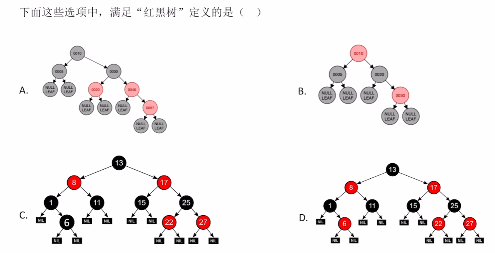
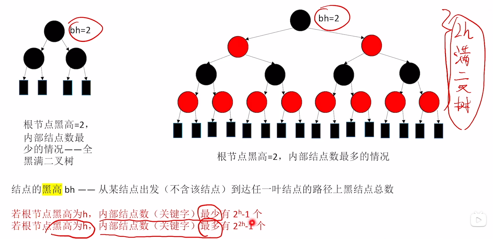
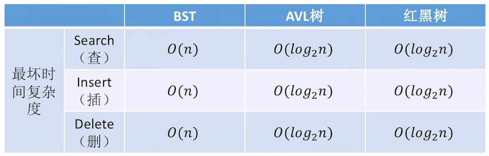
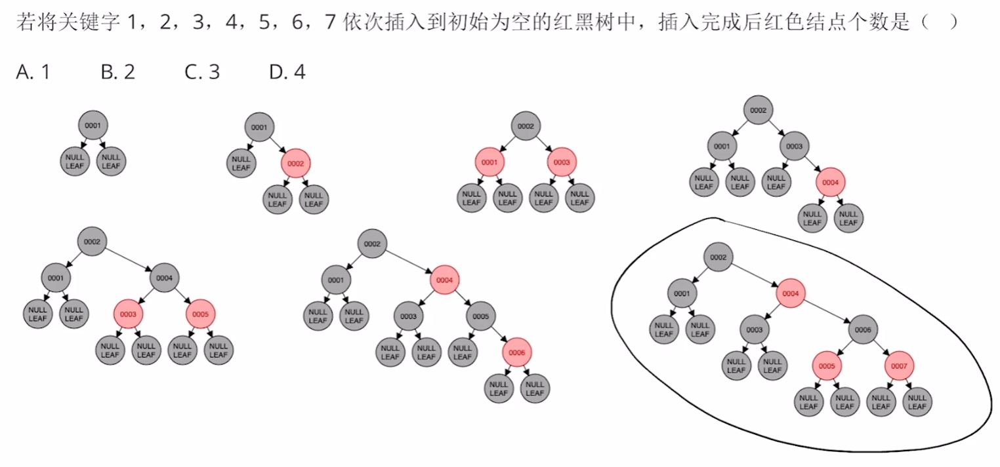
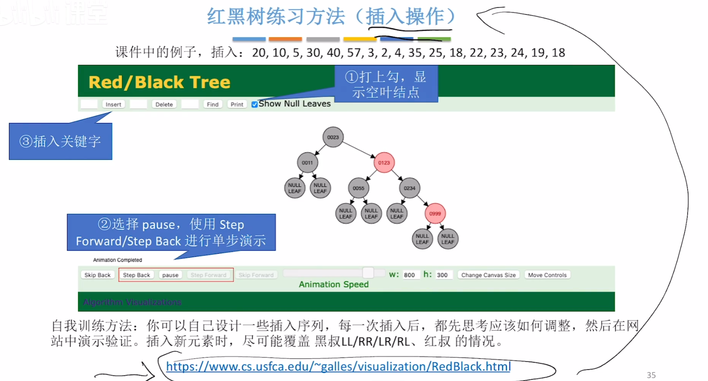

# 红黑树

### 命题重点 选择题

1. 考定义、性质
2. 考简单的插入操作

### 红黑树的定义

红黑树是二叉排序树 左子树结点值<=根结点值<=右子树结点值

与普通BST相比，有什么要求

1. 每个结点或是红色的，或是黑色的
2. 根结点是黑色的
3. 叶结点（外部结点、NULL结点、失败结点）均是黑色的。相应地，包含关键字地结点可称为“内部结点”。
4. 不存在两个相邻的红节点（即红结点的父结点和孩子结点均是黑色）
5. 对每个结点，从该结点到任一叶结点的简单路径上，所含黑结点的数目相同

```c++
struct RBnode{      //红黑树的结点定义
    int key;        //关键字的值 
    RBnode* parent; //父结点指针
    RBnode* lChild; //左孩子指针
    RBnode* rChild; //右孩子指针
    int color;      //结点颜色，如：可用0/1 表示黑/红，也可使用枚举型enum表示颜色
}
```

左根右，根叶黑。

不红红，黑路同。



### 红黑树怎么考？选择题：定义、性质

- 红黑树是一种特殊的二叉查找树
- 红黑树中的某棵子树（如果有的话），也一定是二叉查找树
- 红黑树中的某棵子树（如果有的话），不一定是红黑树
- 非空红黑树的结点要么是红色，要么是黑色
- 在一棵红黑树中，如果有一个结点是红的，那么它的孩子结点（如果有的话）一定是黑的
- 红黑树的查找路径上，不允许出现两个连续的红结点
- 红黑树的查找路径上，红结点的数量不会超过一半
- 红黑树中，任何一个结点的左右子树高度之差不超过2倍
- 在一棵红黑树中，如果所有结点都是黑的，那么它的形态一定是满二叉树
- 若红黑树根结点黑高度h，则内部结点数（含关键字的结点）最少有2^h-1个
- 若红黑树根结点黑高度h，则内部结点数（含关键字的结点）最多有2^2h-1个
- 包含n个关键字的红黑树，高度不超过O(long2 n)
- 红黑树与AVL树的查找、插入、删除操作，最坏时间复杂度数量级相同
- 红黑树比AVL树更适用于插入、删除操作频繁的应用场景

### 与“黑高”相关的推论





### 红黑树怎么考？选择题：简单的插入

- 先查找，确定插入位置（原理同二叉排序树），插入新结点
- 新结点是根 染为黑色
- 新结点非根 染为红色
  - 若插入新结点后依然满足红黑树定义，则插入结束
  - 若插入新结点后不满足红黑树定义，需要调整，使其重新满足红黑树定义。如何调整：看新结点叔叔的脸色
    - 黑叔：旋转+染色
      - LL型：右单旋，父换爷+染色
      - RR型：左单旋，父换爷+染色
      - LR型：左、右双旋，儿换爷+染色
      - RL型：右、左双旋，儿换爷+染色
    - 红叔：染色+变新
      - 叔父爷染色，爷变新结点

黑叔转，再染色。

红叔染，爷变新。





红黑树

左根右，根叶黑。

不红红，黑路同。

黑叔转，再染色。

红叔染，爷变新。