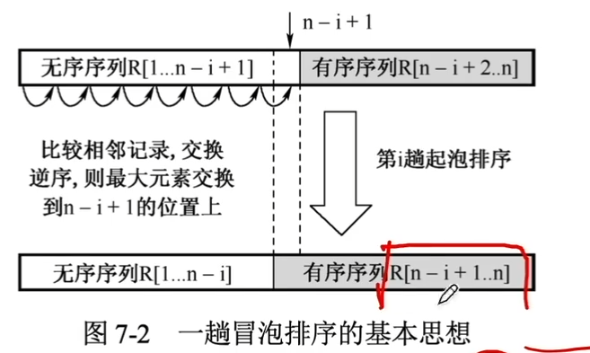
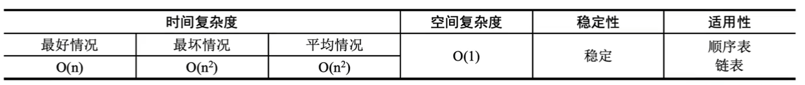
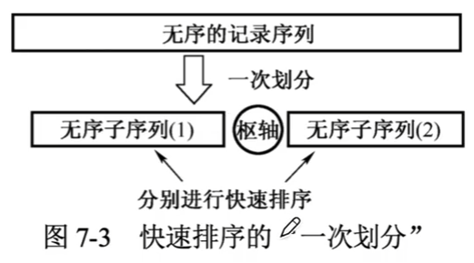
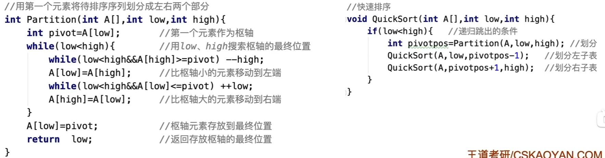
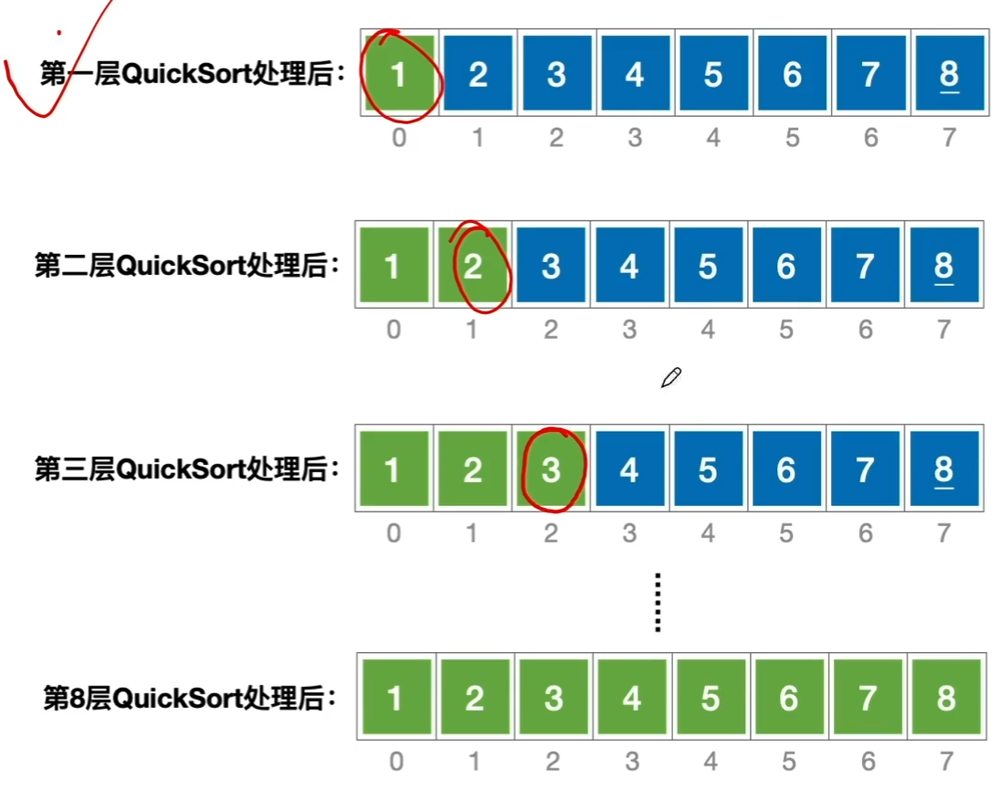
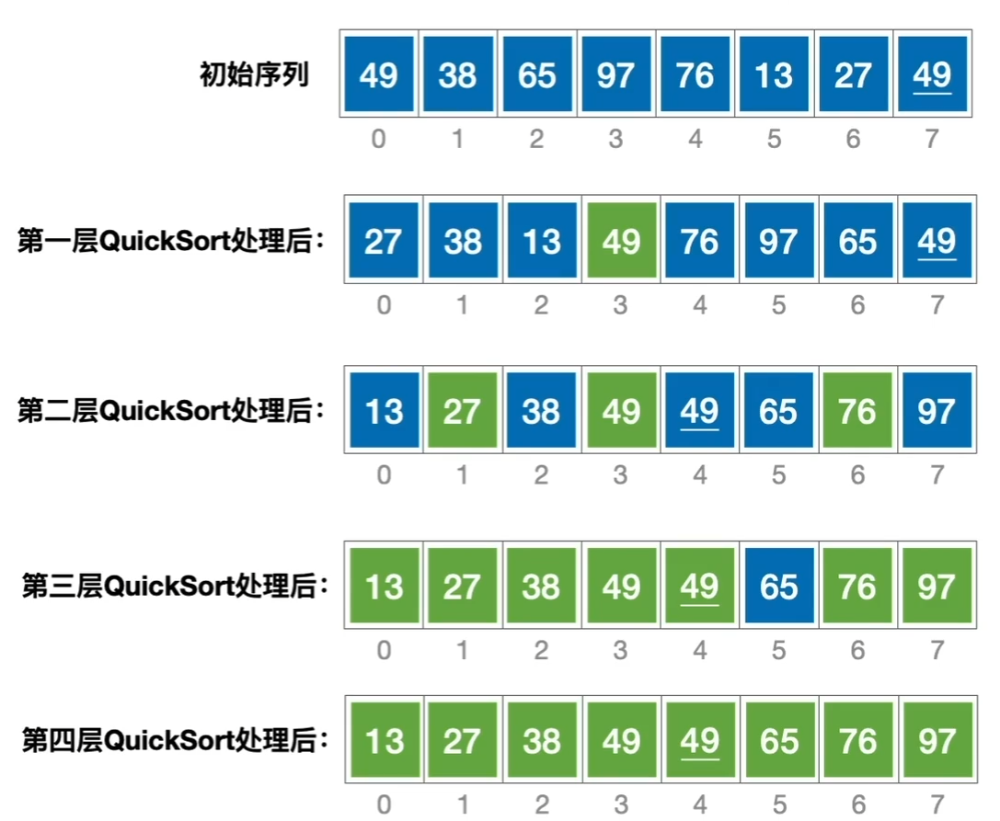
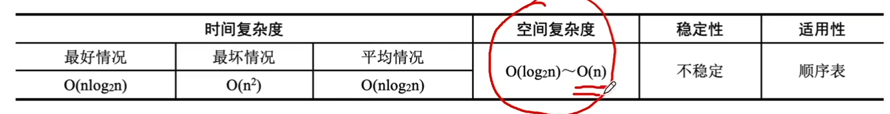
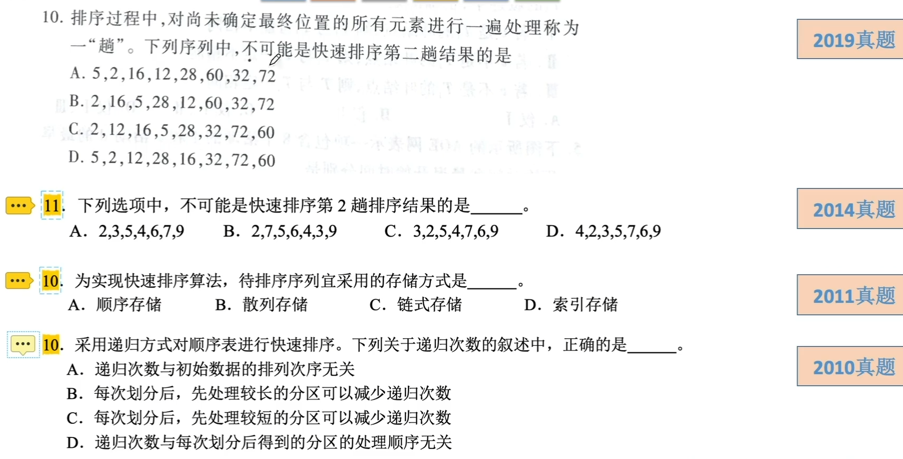

# 交换排序

### 冒泡排序

从后往前（或从前往后）两两比较相邻元素的值，若为逆序，，则交换它们，直到序列比较完，称为一趟冒泡如图所示。最多n-1趟冒泡可完成排序。

冒泡排序的阶段性特征是，每完成一轮冒泡排序，都会有至少一个新的元素出现在它最终应该出现的位置上。

冒泡排序的性能：

### 快速排序

选择一个枢轴元素，在完成一趟划分之后，将待排序序列分割成两部分。左侧元素的关键字小于等于数周元素的关键字；右侧元素的关键字大于等于枢轴元素的关键字。再分别对两部分元素重复上述过程，直到整个序列有序，如图所示。

特性：每完成一趟排序，都会有至少一个新的元素出现在它最终应该出现的位置上

最坏情况：每趟快速排序选择的枢轴元素划分很不均匀 排序趟数O(n)

每趟只确定了一个元素的最终位置

最好情况：每趟快速排序选择的枢轴元素划分很均匀 排序趟数O(log2 n)

每趟可确定多个元素的最终位置

快速排序的性能：

