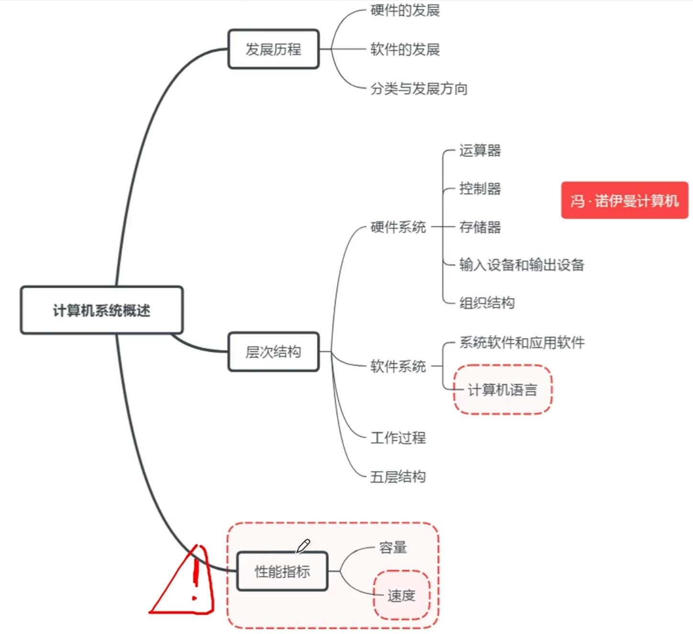
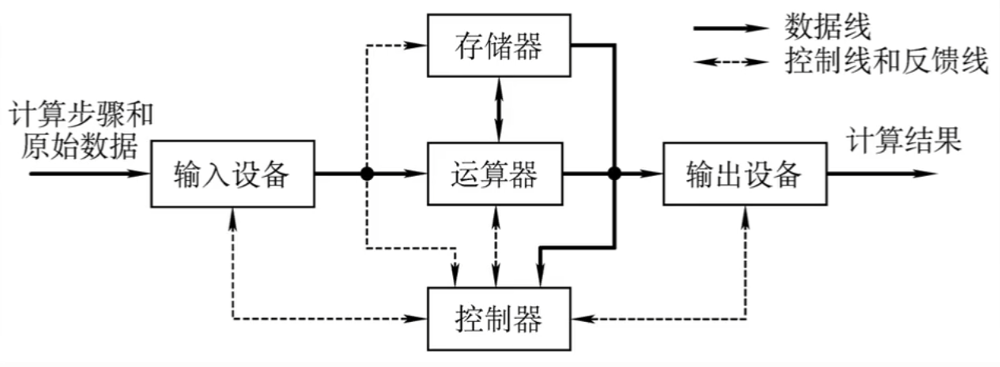
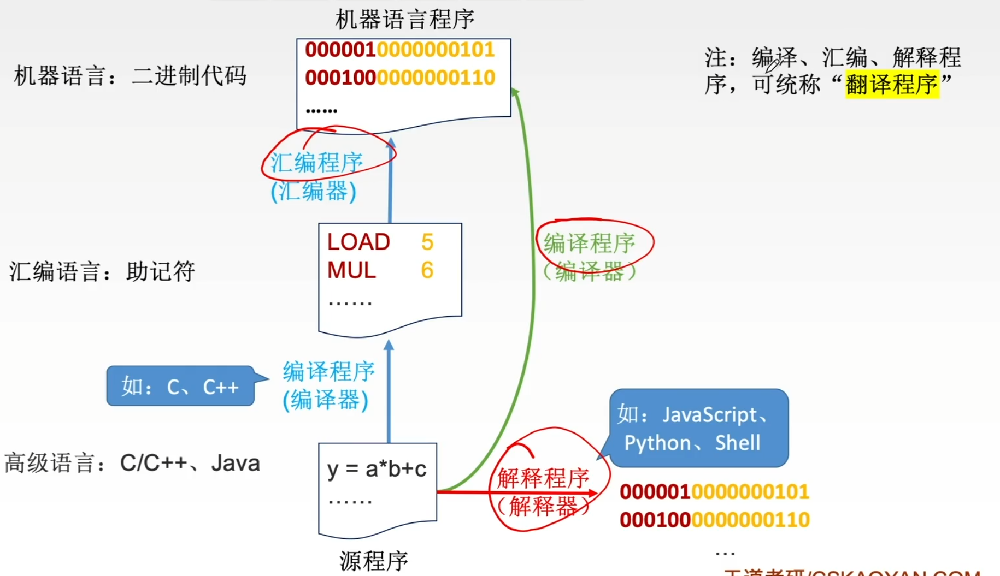

# 计算机系统层次结构

### 计算机系统概述

### 命题重点

1. 冯诺依曼计算机的特点，计算机语言的分类及特点，计算机的5大功能部件，MAR和MDR，计算机的层次结构。
2. 指令字长、机器字长和存储字长，影响计算机性能的因素，计算机性能指标的计算：CPI、主频、时钟周期、CPU执行时间、MFLOPS、MIPS。

### 冯诺依曼计算机

”存储程序“：将指令以代码的形式事先先输入到计算机主存储器中，然后按其在存储器中的首地址执行程序的第一条指令，以后就按照该程序的规定顺序执行其他指令。

1. 硬件系统由五大部件组成
2. 指令和数据以二进制形式存放在存储器中，并可按地址寻址。
3. 指令在存储器内按顺序存放。
4. 指令由操作码和地址码组成
5. 早期的冯诺依曼以运算器为中心

**2018** 冯诺依曼计算机中数据采用二进制编码表示，其主要原因是

1. 二进制的运算规则简单
2. 制造两个稳态的物理器件较容易
3. 便于用逻辑门电路实现算术运算

A 12

B 13

C 23

D 123

**2009** 冯诺依曼计算机中指令和数据均以二进制形式存放在存储器中，CPU区分它们的依据是

A 指令操作码的译码结果

B 指令和数据的寻址方式

C 指令周期的不同阶段

D 指令和数据所在的存储单元

### 三个级别的语言

1. 机器语言。由二进制编码组成，机器语言是计算机唯一可以直接识别和执行的语言。
2. 汇编语言。用英文单词或其缩写代替二进制的指令代码，更容易为人们记忆和理解。汇编语言程序必须经过汇编操作，将其转换为机器语言后，才能在计算机硬件上执行。
3. 高级语言。高级语言（如C、C++、Java等）需要经过编译程序编译成汇编语言程序，然后经过汇编操作得到机器语言程序，或者直接由高级语言程序翻译成机器语言程序。

**2016** 把高级语言源程序转换为机器级目标代码文件的程序是

A 汇编程序

B 链接程序

C 编译程序

D 解释程序

**2015** 计算机硬件能够直接执行的是

1. 机器语言程序
2. 汇编语言程序
3. 硬件描述语言程序

A 1

B 12

C 13

D 123