# 定点数的表示与运算

### 无符号数的表示

无符号整数指整个机器字长的全部二进制位均为数值位，没有符号位，相当于数的绝对值。在C语言中对应unsigned short、unsigned int和unisnged long 类型。

无符号数加法运算的结果通常保留低n位，舍弃高位。这样会产生两种结果：

1. 保留的低n位不能正确表达运算结果。此时，意味着运算结果超出了计算机所能表示的范围，有效数值进到了第n+1位，则称发生了”溢出“现象
2. 保留的低n位能正确表达计算结果，即高位的舍去不影响运算结果。

短字长无符号数向长字长无符号数扩展时，只需在高位补0即可。

思考：无符号数减法怎么运算？

eg. 4bit 无符号数 2-4 0010-0100

两个无符号数相减时，可能向更高位借位，导致PSW中的进位/借位标志位CF=1

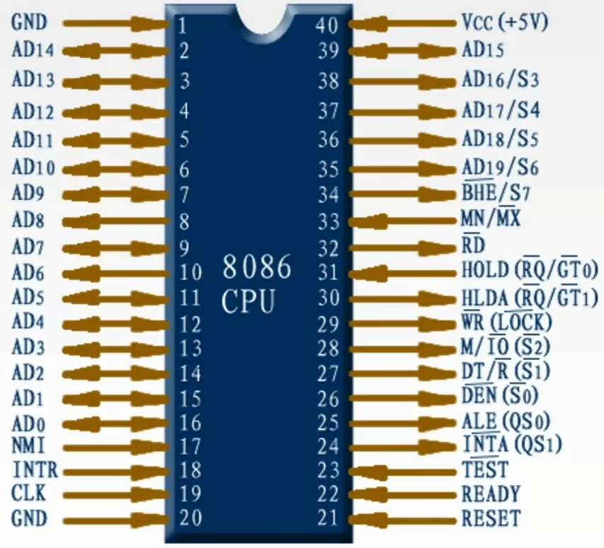

条件码

- OF Overflow Flag

  溢出标志。溢出时位1，否则置0。

- SF Sign Flag

  符号标志。结果为负时置1，否则置0。

- ZF Zero Flag

  零标志，运算为0时ZF位置1，否则置0。

- CF Carry Flag

  进位/借位标志，进位/借位时置1，否则置0。

- AF Auxiliary carry Flag

  辅助进位标志，记录运算时第3位（半个字节）产生的进位置。有进位时1，否则置0。

- PF Parity Flag

  奇偶标志。结果操作数中1的个数位偶数时置1，否则置0。

控制标志位：

- DF Direction Flag

  方向标志，在串处理指令中控制信息的方向。

- IF Interrupt Flag

  中断标志。

- TF Trap Flag

  陷阱标志

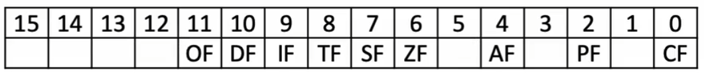

- NMI：不可屏蔽中断请求信号。常用于处理电源掉电紧急情况。
- INTR：可屏蔽中断请求信号。

### 有符号数的表示

有符号数的机器表示主要有原码、补码和反码

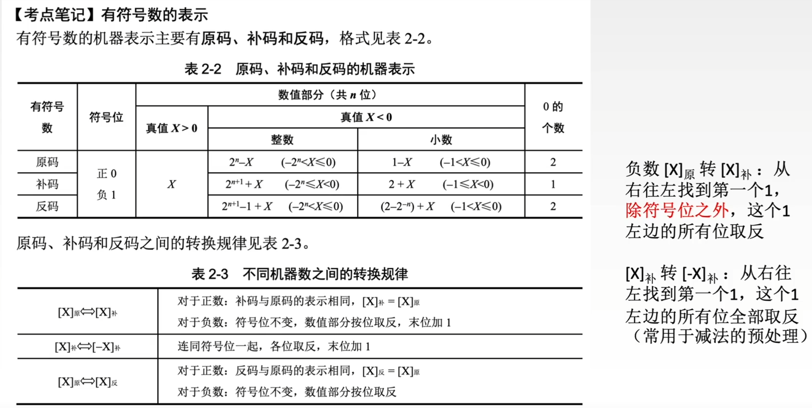

### C语言中的整数数据类型

C语言中的整型数据就是定点整数，一般用补码表示。

根据位数的不同，可以分为字符型(char)、整型(int)、短整型(short或short int)、长整型(long 或 long int)和无符号数（加上修饰符unsigned）

| 类型         | 所占位数 | 数的范围               |
| ------------ | -------- | ---------------------- |
| char         | 8        | -128~127               |
| short        | 16       | -32768~32767           |
| int          | 32       | -2147483648~2147483647 |
| unsigned int | 32       | 0~4294967295           |
| long         | 32       | -2147483648~2147483647 |

32位编译器中定义8B整型可用 long long

64位编译器 int 4B, long 8B 

### 定点整数的符号扩展

| 正负 | 定点数     | 扩展方法                                                     |
| ---- | ---------- | ------------------------------------------------------------ |
| 正数 | \          | 原符号位移动到新符号位上，新表示形式的所有附加位都用0进行填充 |
| 负数 | 源码       | 原符号位移动到新符号位上，新表示形式的所有附加位都用0进行填充 |
|      | 反码、补码 | 原符号位移动到新符号位上，新表示形式的所有附加位都用1进行填充 |

符号扩展的方法根据机器数的不同而不同。原码负数的符号扩展方法与正数相同，只不过此时符号位为1而已。补码负数的符号扩展方法：原有形式的符号位移动到新形式的符号位上，新表示形式的所有附加位都用1进行填充。

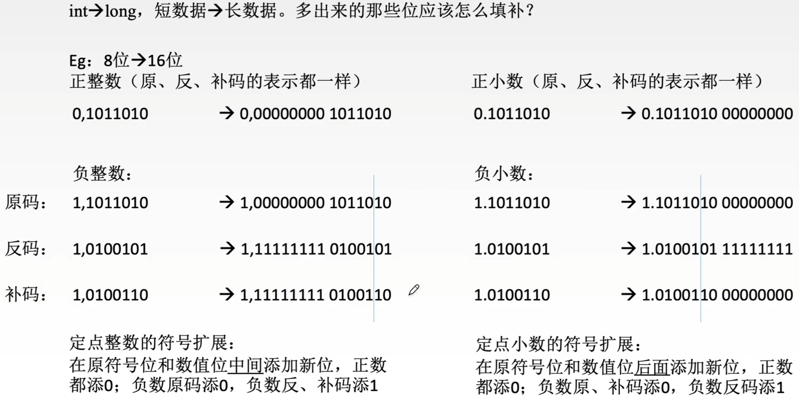

### 有符号数和无符号数的转换

C语言中的整型数据通常用补码表示，int型变量的最高位是符号位，为1时表示负数，为0时表示正数。如果一个无符号数小于32768则最高位为0，赋给一个int型变量后，得到与原值相同的正数。如果一个无符号数大于等于32768则最高位为1，赋给一个int型变量后，就得到一个负整数。反之，当一个负整数赋给一个unsigned型变量时，得到的无符号数时一个大于32768的值。

因此，由有符号型数据转化为等长的unsigned型数据时，符号位解释为数据的一部分，也就是说，负数转化为无符号数时数值将发生变化。同理，由unsigned转化为有符号型数据时最高位解释为符号位，也可能发生数值的变化。

**2016** 有如下C语言程序段

short si = -32767;

unsigned short usi = si;

执行上述两条语句后，usi的值为

A -32767

B 32767

C 32768

D 32769

### 补码的加减运算

补码加减运算的特点如下（n+1位）：

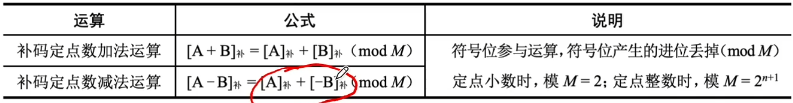

### 溢出的定义和判断

溢出是指运算结果超出了数的表示范围。仅当两个符号相同的数相加，或两个符号相异的数相减才可能产生溢出。补码加/减运算的溢出判断方法如下表。

| 方法           | 溢出判断条件                                                 |
| -------------- | ------------------------------------------------------------ |
| 单符号位法     | 参加操作的两个数符号相同，结果又与原操作数符号不同，表示结果溢出 |
| 双符号位法     | 运算结果的两个符号位相同，表示未溢出 运算结果的两个符号位不同，表示溢出，最高位符号位代表真正的符号 |
| 符号位和进位法 | 若符号位的进位与最高数位的进位相同，表示没有溢出，否则表示溢出 |

**2014** 若x=103, y=-25，则下列表达式采用8位定点补码运算实现时，会发生溢出的是

A x+y

B -x+y

C x-y

D -x-y

**2010** 假定有4个整数用8位补码分别表示r1=FEH, r2=F2H, r3=90H, r4=F8H，若将运算结果存放在一个8位寄存器中，则下列运算会发生溢出的是

A r1xr2

B r2xr3

C r1xr4

D r2xr4

算术移位：（符号位不参与移动）

逻辑移位：所有位参与移动，无论左移、右移，都是添0

**2018** 整数x的机器数为1101 1000，分别对x进行逻辑右移1位和算术右移1位操作，得到的机器数各是

A 1110 1100、1110 1100

B 0110 1100、1110 1100

C 1110 1100、0110 1100

D 0110 1100、0110 1100

# 扩展

计算机硬件如何做无符号整数的加法：从最低位开始，按位相加，并往更高位进位

计算机硬件如何做无符号整数的减法：

1. ”被减数“不变，”减数“全部位按位取反、末位+1，减法变加法
2. 从最低位开始，按位相加，并往更高位进位

计算机硬件如何做带符号数补码的加法：从最低位开始，按位相加（符号位参与运算），并往更高位进位

计算机硬件如何做带符号数补码的减法：

1. ”被减数“不变，”减数“全部位按位取反、末位+1，减法变加法
2. 从最低位开始，按位相加，并往更高位进位

计算机硬件如何做定点小数补码的加法：从最低位开始，按位相加（符号位参与运算），并往更高位进位

计算机硬件如何做定点小数补码的减法：

1. ”被减数“不变，”减数“全部位按位取反、末位+1，减法变加法
2. 从最低位开始，按位相加，并往更高位进位 

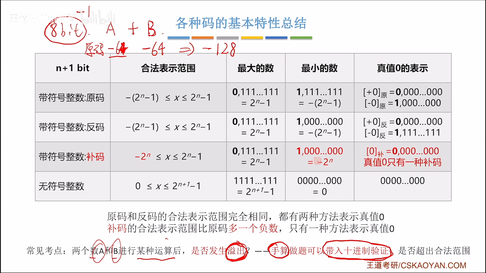

移码：补码的基础上将符号位取反。注意：移码只能用于整数

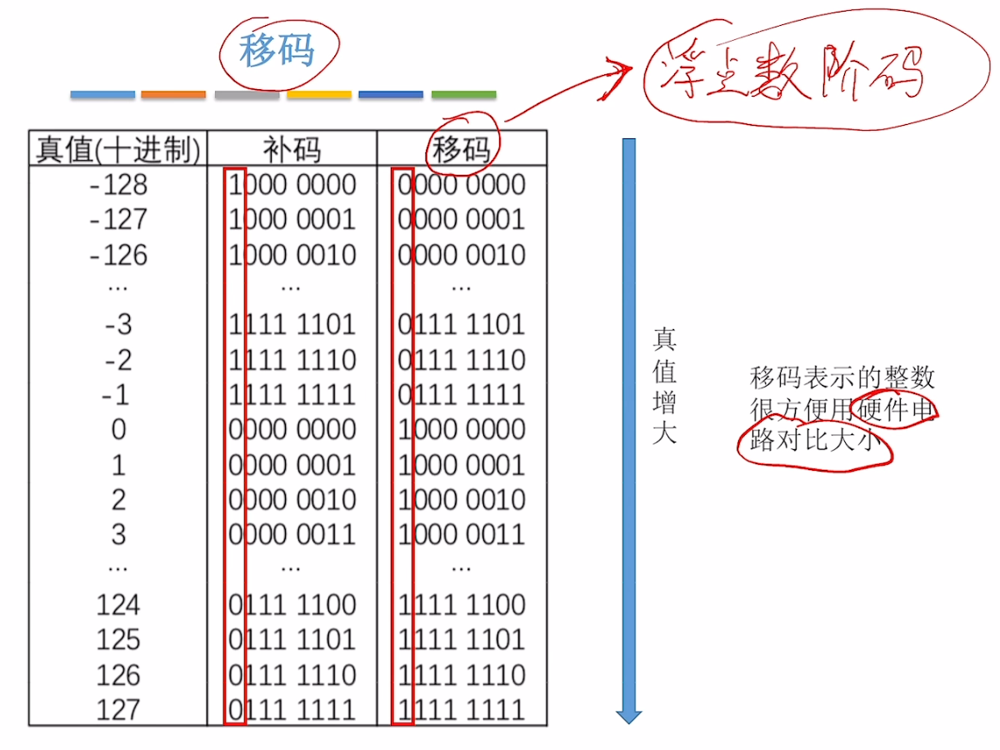

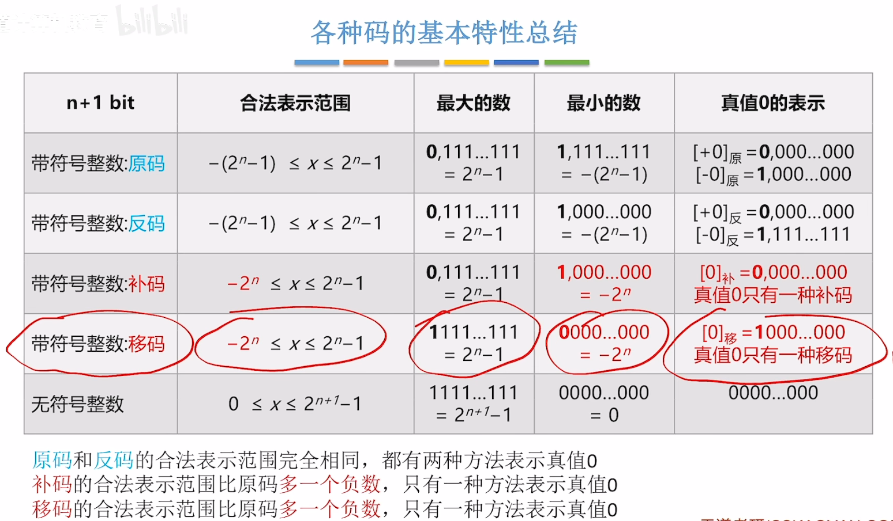

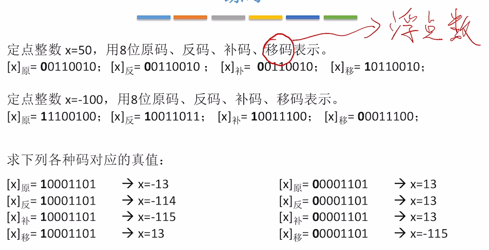

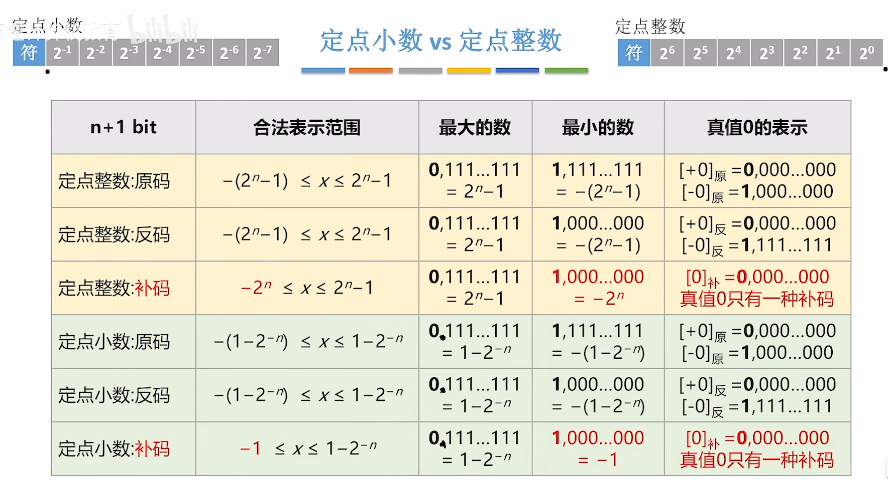

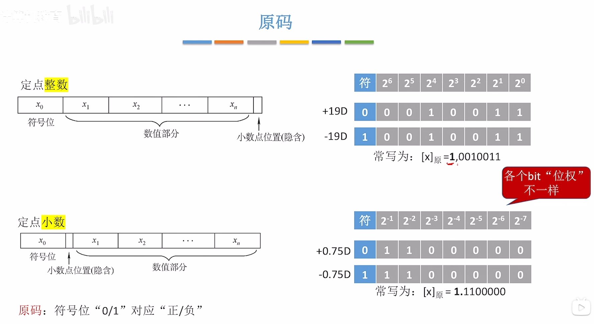