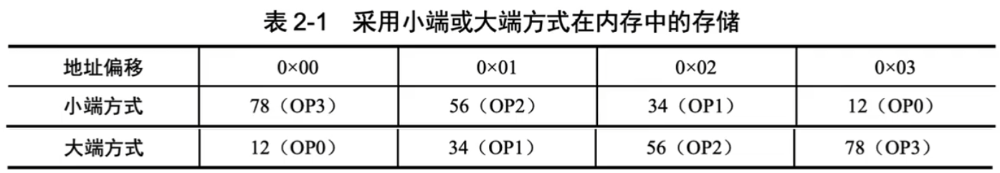
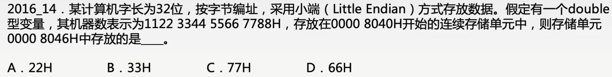
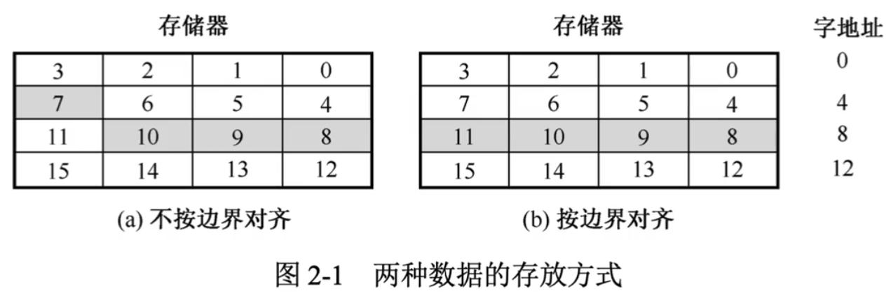
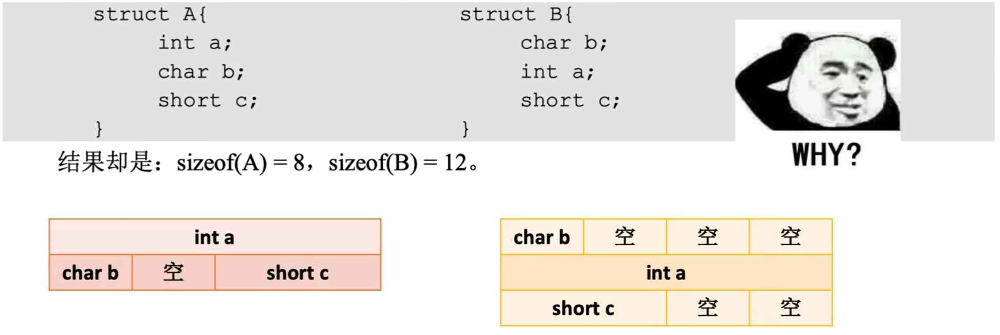
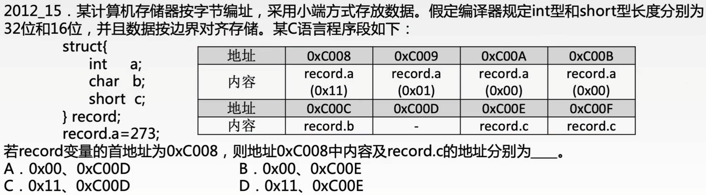

# 数据的对齐和大小端存储

### 数据存储的小端方式与大端方式

现代计算机多采用字节编址方式。对于占用多个存储单元的某些类型数据，如int float double等，有两种不同的存储方式：大端方式和小端方式。

- 小端方式：先存储低位字节，后存储高位字节。
- 大端方式：先存储高位字节，后存储低位字节。

例如，将一个32位的整数0x12345678存放到一个int变量中，这个int变量采用大端或小端方式在内存中的存储见下表。为了简单起见，这里使用OP0表示一个32位数据的最高字节，使用OP3表示一个32位数据最低字节。

小端方式和大端方式的区别是字中的字节的存储顺序不同，而字的存储顺序是相同的。采用大端方式进行数据存放符合人类的正常思维。

### 边界对齐方式

假设存储字长为32位，可按字节、半字、字寻址。在对准边界的32位字长的计算机中，半字地址是2的整数倍，字地址是4的整数倍，当所存数据不能满足此要求时，可填充一个或多个空白字节。这样无论所存的数据是字节、半字还是字，均可一次访存取出。

当数据不按边界对齐方式存储时，一个字的数据可能在两个存储字中，此时需要两次访存，并对高低字节的为止进行调整后才能取得一个字，影响了系统的效率。

### C语言中struct存储的边界对齐问题

在C语言struct中，存储对齐有几个重要条件：

1. 每个成员按其类型的方式对齐，char的对齐值为1，short为2，int为4，单位字节。
2. struct长度必须是成员中最大的对齐值的整数倍（不够就补空字节），以便在处理数组时保证每一项都边界对齐。

两个例子（32bit，x86环境，gcc编译器）

### 命题重点

1. 数据存储的大小端方式，数据按边界存储，C语言中结构体的边界对齐问题。
2. C语言中各种机器数（unsigned char short int long float double）的表示，类型转换，类型转换时导致数据的误差变化或溢出（超出表示范围）
3. 定点数（补码、原码、反码）的原理、特点及表示范围，补码原码的加减运算，C语言中的隐式类型转换，溢出的概念及判断。
4. 移码表示法，IEEE754浮点数的原理、格式，隐含尾数最高位，表示范围，浮点数的加减运算及溢出判断。