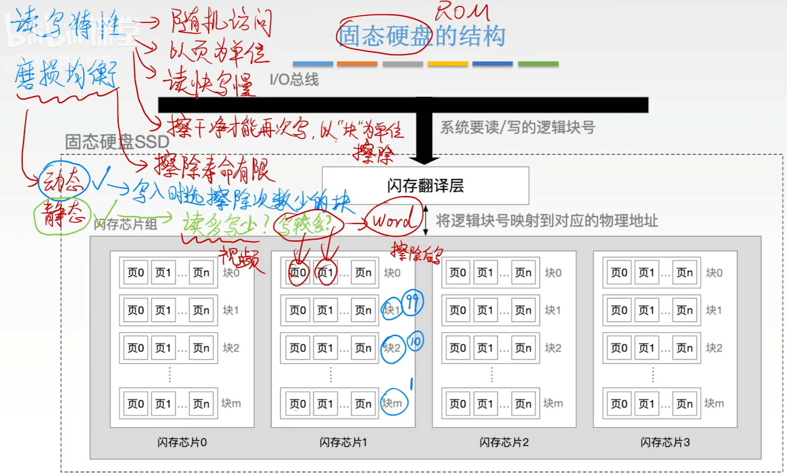
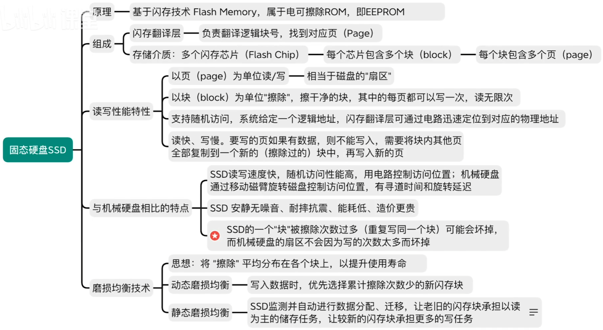

# 固态硬盘

### 读写特性

- 以“页”为单位进行读/写，读快写慢，支持随机访问。
- 以“块”为单位进行擦除，擦除干净后，块中的每一页可以被写一次，读无限次

### 磨损均衡技术

- 一个块的可擦除次数有限，因此对一个块写越多，磨损越大，需要追求“磨损均衡”

- 动态磨损均衡

  写入数据时，优先使用擦除次数少的块

- 静态磨损均衡

  SSD空闲时，将数据块按读写特性进行迁移，老旧的块用于存储读多写少的数据、较新的块用于存储写多的数据。

- 闪存翻译曾负责地址映射：逻辑块号→物理块号

