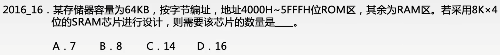

# 主存储器与CPU的连接

### 存储器扩展与芯片选择

| 扩展方式 | 定义                                               |
| -------- | -------------------------------------------------- |
| 位扩展   | 对字长进行扩展，使其数据位数与CPU的数据线相等      |
| 字扩展   | 增加存储器中字的数量，位数不变                     |
| 字位扩展 | 字和位同时扩展，既增加存储字的数量，又增加存储字长 |

合理地选择存储芯片（RAM或ROM）是存储器扩展的第一步。

芯片数=容量/单片芯片容量

### 存储器与CPU的连接

1. 合理选择存储芯片

   通常选用ROM存放系统程序，选用RAM组成用户区。

2. 地址线的连接

   CPU地址线的低位与存储芯片的地址线相连，以选择芯片中的某一单元（字选）；CPU地址线的高位在扩充存储芯片时用，以选择存储芯片（片选）。

3. 数据线的连接

   比较CPU的数据线数与存储芯片的数据线数。相等时，可直接相连；不等时，必须对存储器芯片扩位，使其数据位数与CPU的数据线数相等。

4. 读/写命令线的连接

   CPU读/写命令线一般可直接与存储芯片的读/写控制端相连。

5. 片选线的连接

   片选信号的产生分为线选法和译码片选法。

