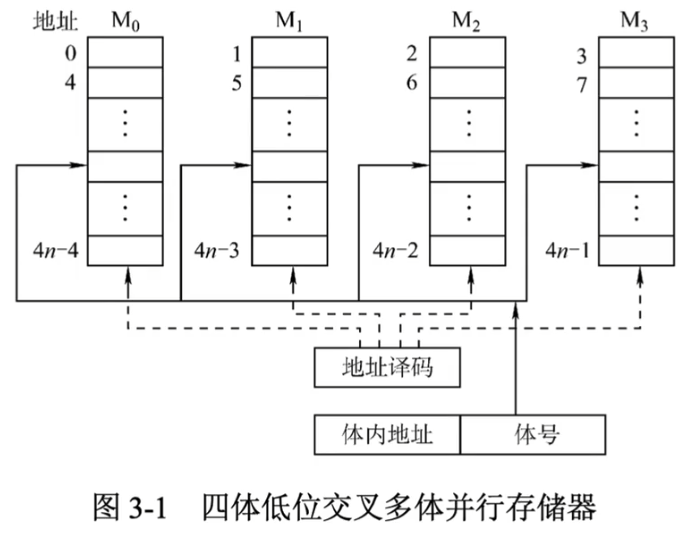
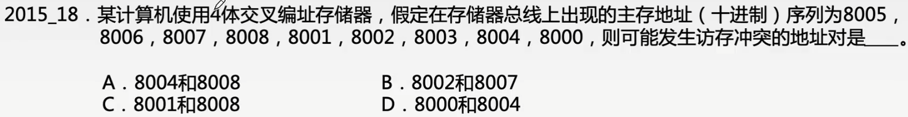

# 低位交叉存储器

### 低位交叉多体并行存储器

低位交叉多体并行存储器的特点有：

1. 每个模块都有相同的容量和存取速度
2. 各模块都有独立的读写控制电路、地址寄存器和数据寄存器
3. 低位地址为体号，高位地址为体内地址。
4. 程序连续存放在相邻体中。

采用低位交叉后，可以在不改变每个模块存取周期的前提下，采用流水线的方式并行存取，提高存储器的带宽。设模块字长等于数据总线宽度，模块存取一个字的存取周期为T，总线传送周期为r，为保证流水线不间断，则存储器交叉模块数应大于
$$
m=T/r
$$
式中，m称为交叉存取度。

每经过r时间延迟后启动下一个模块，对比连续存取m个字所需时间如下：

| 存储器编制方式 | 低位交叉编址 | 顺序方式编址 |
| -------------- | ------------ | ------------ |
| 所需的时间     | T+(m-1)r     | mT           |

