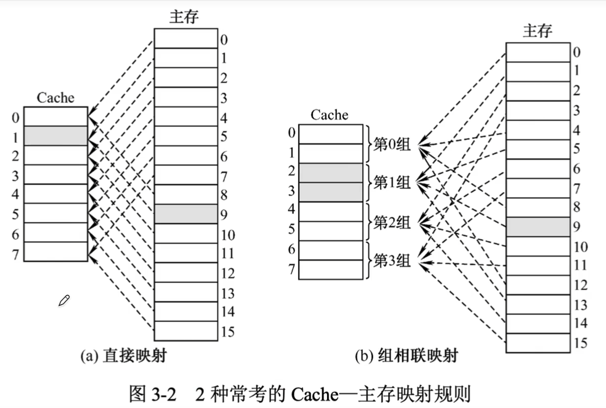
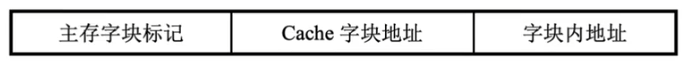
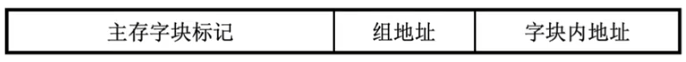
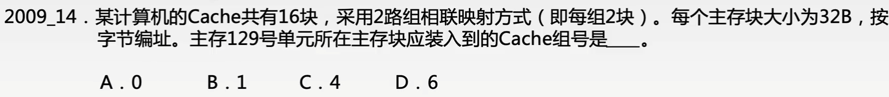

# 高速缓存存储器（Cache）

### Cache存储系统

CPU欲访问的信息已在Cache中的比率称为Cache的命中率。设一个程序执行期间，Cache的总命中次数为Nc。访问主存的总次数为Nm，则命中率H为
$$
H=N_c/(N_c+N_m)
$$
设tc为命中时的Cache访问时间，tm为未命中时的访问时间，则Cache-主存系统的平均访问时间Ta为
$$
T_a=Ht_c+(1-H)t_m
$$
Cache系统的访问效率为
$$
e=t_c/T
$$

### Cache与主存的映射方式

地址映射是指把主存地址空间映射到Cache地址空间，也就是把存放在主存中的程序按照某种规则装入Cache中。这里仅介绍常考的两种方式。

1. 直接映射方式

   主存的一个数据块只能装入到Cache中的唯一位置

   映射关系：
   $$
   j=i\ mod\ 2^c
   $$
   式中，j是Cache的块号；i是主存的块号；2^c是Cache的总块数。

   地址结构为

   

2. 组相联映射方式

   主存的一个数据块可以装入一组内任何一个位置。

   映射关系：
   $$
   j=i\ mod\ Q
   $$
   式中，j是Cache的组号；i是主存的块号；Q是Cache的组数。

   地址结构为

   

### Cache替换策略

在采用全相联映射和组相联映射方式时，从主存向Cache传送一个新块，当Cache中的目标空间已被站满时，就需要使用替换算法置换Cache行。

| Cache替换策略         | 替换方法                               | 是否依据局部性原理 |
| --------------------- | -------------------------------------- | ------------------ |
| 随机法（RAND）        | 随机地确定替换的Cache块                | 否                 |
| 先进先出法（FIFO）    | 选择最早调入的行进行替换               | 否                 |
| 近期最少使用法（LRU） | 选择近期内长久未访问过的存储行换出     | 是                 |
| 最不经常使用法（LFU） | 将一段时间内被访问次数最少的存储行换出 | 是                 |

###  Cache写策略

1. 全写法（写直通法）write-through

   当CPU对Cache写命中时，必须把数据同时写入Cache和主存。当某一块需要替换时，不必把这一块写回主存，将新调入的块直接覆盖即可。这种方法实现简单，能随时保持主存数据的正确性。缺点是增加了访存次数，降低了Cache的效率。

2. 写回法 write-back

   当CPU对Cache写命中时，只修改Cache的内容，而不立即写入主存，只有当此块被换出时才写回主存。这种方法减少了访存次数，但存在不一致的隐患。

