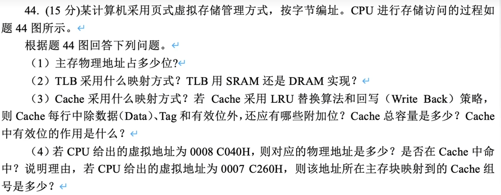

# 虚拟存储器

### 快表TLB

依据程序执行的局部性原理，在一段时间内总是经常访问某些页，把这些页对应的页表项存放在高速缓冲器组成的快表（TLB）中，把存放主存中的页表称为慢表（Page）。

查找时，快表和慢表同时进行，若快表中有此逻辑页号，则能很快找到对应的物理页号，送入实主存地址寄存器，并使慢表的查找作废，大大提高了虚存的效率。

注意：TLB是Page的一个很小的副本，所以若TLB命中则Page一定命中。

### 页式虚拟存储器

以页为基本单位的虚拟存储器称为页式虚拟存储器。虚拟空间与主存空间都被划分成同样大小的页，主存的页称为实页，虚存的页称为虚页。把虚拟地址分为两个字段：虚页号和页内地址。虚地址到实地址之间的变换是由页表来实现的。页表是一张存放在主存中的虚页号和实页号的对照表，记录着程序的虚页调入主存时被安排在主存中的位置。

页表基址寄存器存放当前运行程序的页表的起始地址，它和虚页号拼接成页表项地址，每个页表项记录了与某个虚页对应的虚页号、实页号和装入位等信息。若装入位为“1”，则表示该页面已在主存中，将对应的实页号和虚地址中的页内地址拼接就得到了完整的实地址；若装入位为“0”，则表示该页面不在主存中，于是要启动I/O系统，把该页从辅存调入主存后再供CPU使用。页式虚拟存储器的地址变换过程如图所示。 

由上述转换过程可知，CPU访存时，先要查页表，为此需要访问一次主存。若不命中，还要进行页面替换和页表修改，则访问主存的次数就更多了。

### 命题重点

1. 存储器的分类与特点，易失性，存取方式等，特别是DRAM、SRAM、ROM和Flash Memory等各自的性质。
2. 字扩展，位扩展，存储器扩展的芯片选择、连线、地址分配等。
3. 低位交叉存储器的性能分析。
4. Cache的性能分析，Cache容量的计算，2路组相联映射和直接映射的原理和地址结构，Cache替换算法与命中分析，Cache块与主存块的关系。
5. TLB与页表的关系，页表的分析，虚地址和实地址的转换。
6. 磁盘存储器相关的参数和计算。