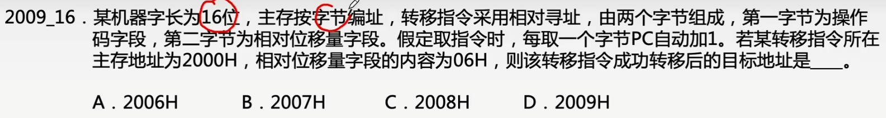

# 指令格式和寻址方式

### 指令的格式

为了区分各种数据寻址方式，在指令字中设一个字段，用来指明属于哪种寻址方式。

操作数的位数决定了指令的条数，寻址特征和形式地址A共同决定了可寻址的范围。

- 若为立即寻址，则形式地址A的位数决定了数的范围。
- 若为直接寻址，则形式地址A的位数决定了可寻址的范围。
- 若为寄存器寻址，则形式地址A的位数决定了通用寄存器的最大数量。
- 若为寄存器间接寻址，则寄存器字长决定了可寻址的范围。

### 指令的寻址方式

### 数据寻址

### 直接寻址

直接寻址：指令字中的形式地址A就是操作数的真实地址EA，即EA=A。

一条指令的执行：取指令访存1次，执行指令访存1次，暂不考虑存结果，共访存2次。

### 间接寻址

间接寻址：指令的地址字段给出的形式地址不是操作数的真正地址，而是操作数有效地址所在的存储单元的地址，也就是操作数地址的地址，即EA=(A)。

一条指令的执行：取指令访存1次，执行指令访存2次，暂不考虑存结果，共访存3次。

### 寄存器寻址

寄存器寻址：在指令字中直接给出操作数所在的寄存器编号，即EA=Ri，其操作数在由Ri所指的寄存器内。

一条指令的执行：取指令访存1次 执行指令访存0次 暂不考虑存结果 共访存1次

### 寄存器间接寻址

寄存器间接寻址：寄存器Ri中给出的不是一个操作数，而是操作数所在主存单元的地址，即EA=(Ri)。

一条指令的执行：取指令访存1次 执行指令访存1次 暂不考虑存结果 共访存2次

### 隐含寻址

隐含寻址：不是明显地给出操作数的地址，而是在指令中隐含着操作数的地址。

### 立即寻址

假设指令字长=机器字长=存储字长，操作数为3

立即寻址：形式地址A就是操作数本身，又称为立即数，一般采用补码形式。#表示立即寻址特征。

一条指令的执行：取指令访存1次 执行指令访存0次 咱不考虑存结果 共访存1次

### 基址寻址

基址寻址：将CPU中基址寄存器（BR）的内容加上指令格式中的形式地址A，而形成操作数的有效地址，即EA=(BR)+A

### 变址寻址

变址寻址：有效地址EA等于指令字中的形式地址A与变址寄存器IX的内容相加之和，即EA=(IX)+A，其中IX可为变址寄存器（专用），也可用通用寄存器作为变址寄存器。

注：变址寄存器是面向用户的，在程序执行过程中，变址寄存器的内容可由用户改变（作为偏移量），形式地址A不变（作为基地址）。

优点：在数组处理过程中，可设定A为数组的首地址，不断改变变址寄存器IX的内容，便可很容易形成数组中任一数据的地址，特别适合编制循环程序。

### 相对寻址

相对寻址：把程序计数器PC的内容加上指令格式中的形式地址A而形成操作数的有效地址，即EA=(PC)+A，其中A是相对于PC所指地址的位移量，可正可负，补码表示。

优点：操作数的地址不是固定的，它随着PC值的变化而变化，并且与指令地址之间总是相差一个固定值，因此便于程序浮动（一段代码在程序内部的浮动）。

相对寻址广泛应用于转移指令。

无条件转移指令：JMP形式地址

转移类指令通常采用相对寻址，因此执行该指令的结果是PC = PC + 形式地址。

其中，形式地址用补码表示，可正可负。而原本PC应该指向转移指令的后一条指令。

### 各种条件转移指令

