# 程序的机器级代码表示

### 编译器、汇编器、链接器

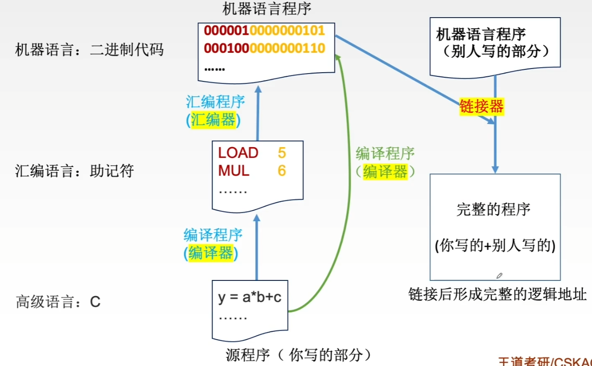

### 汇编语言指令总结

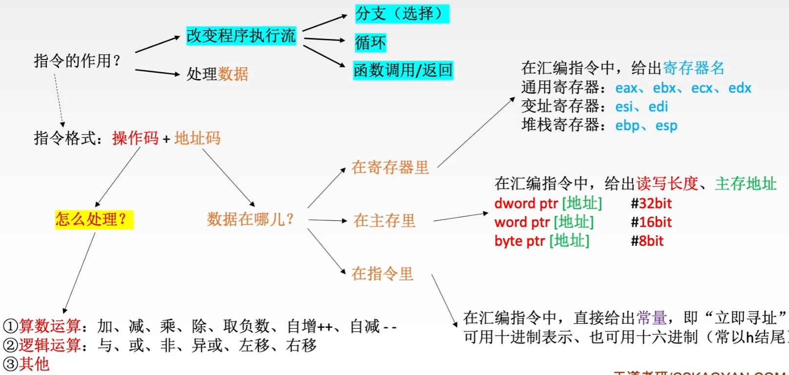

## 常见的算术运算指令

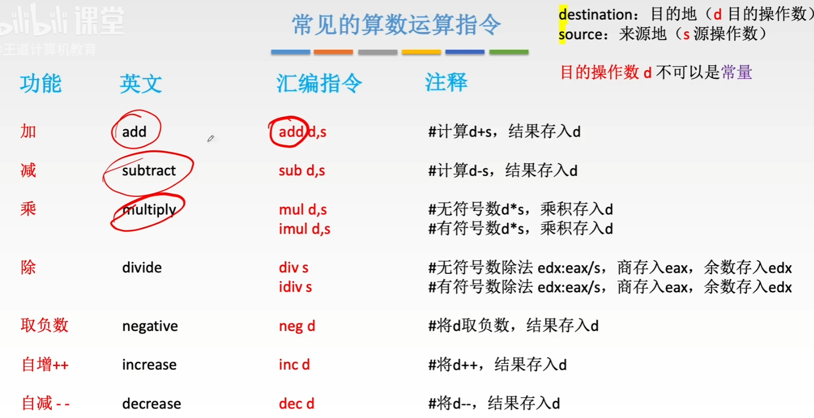

### 常见的逻辑运算指令

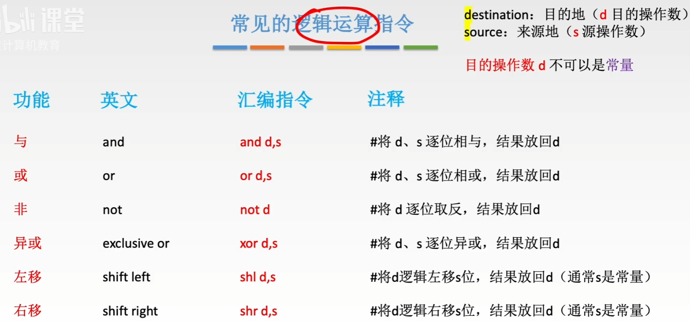

### 其他指令

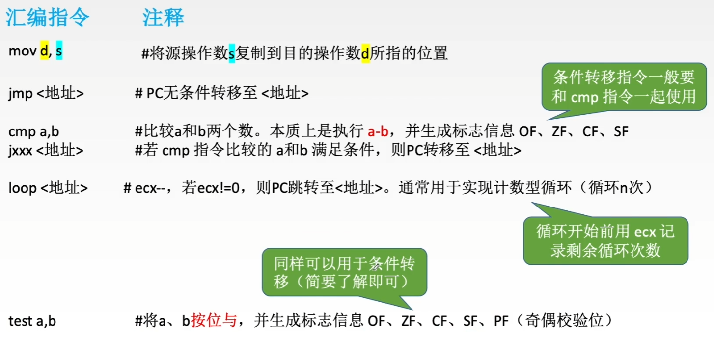

### if-else分支结构常见代码框架

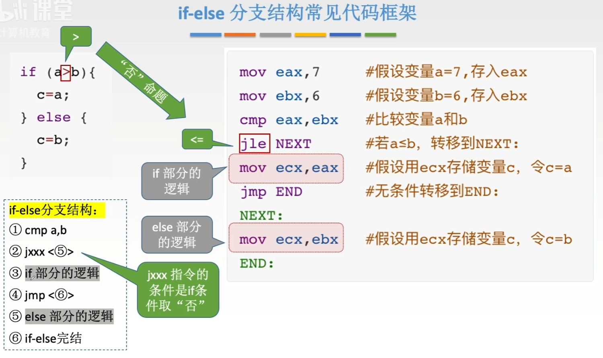

### for/while循环结构常见代码框架

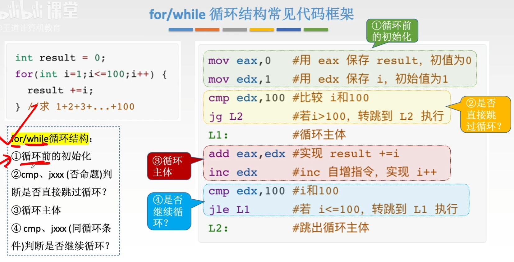

### 补充：loop指令实现循环

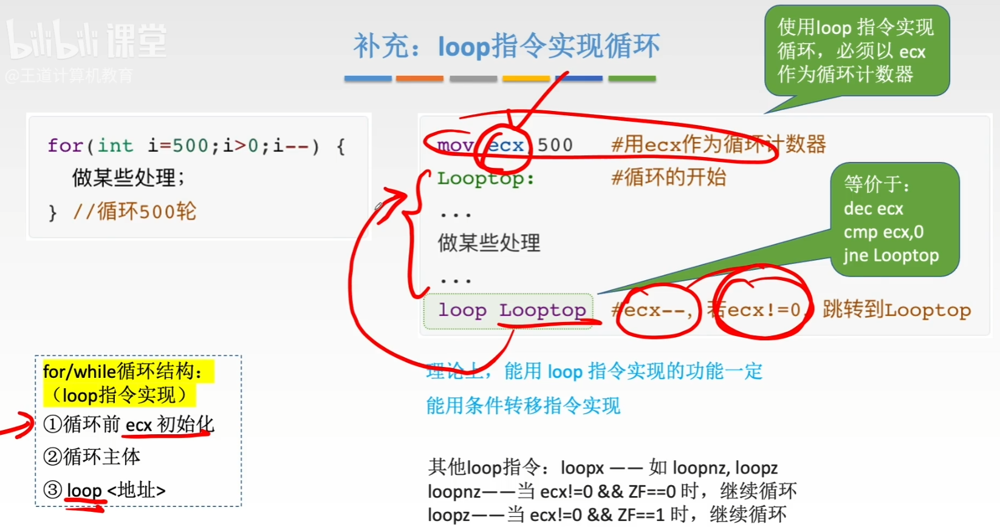

### 函数调用相关指令

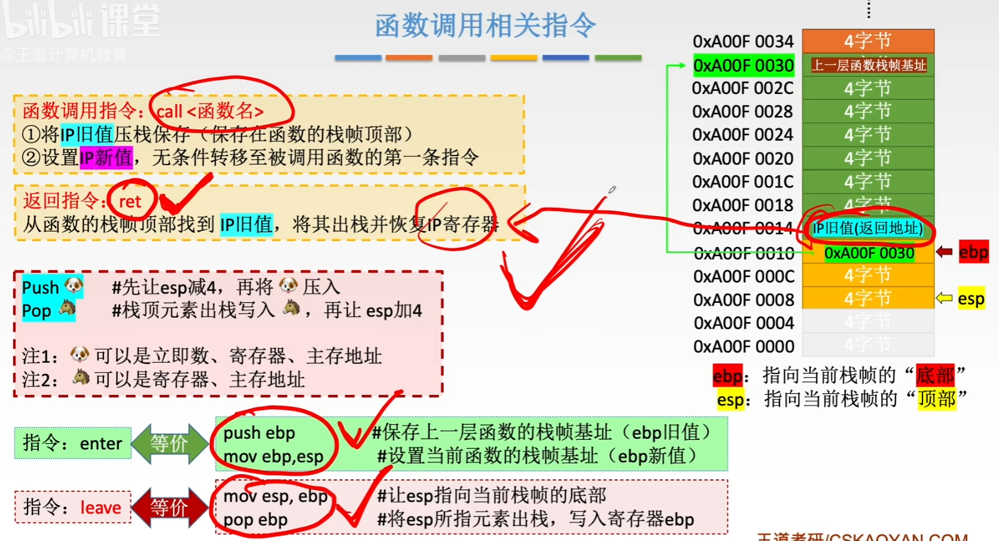

### 栈帧的内部结构

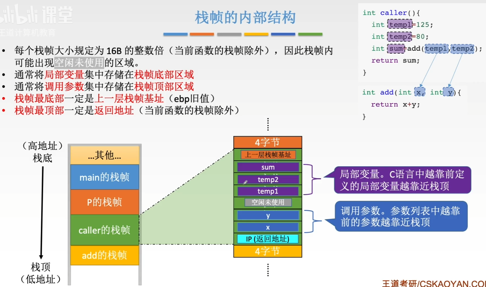

### 函数调用常见框架

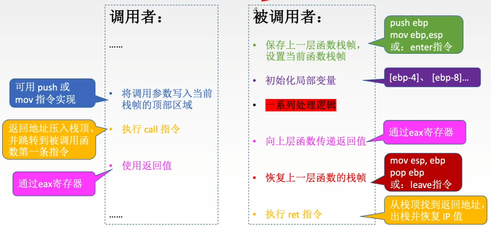

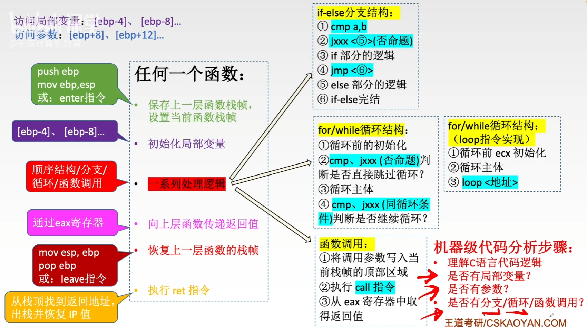

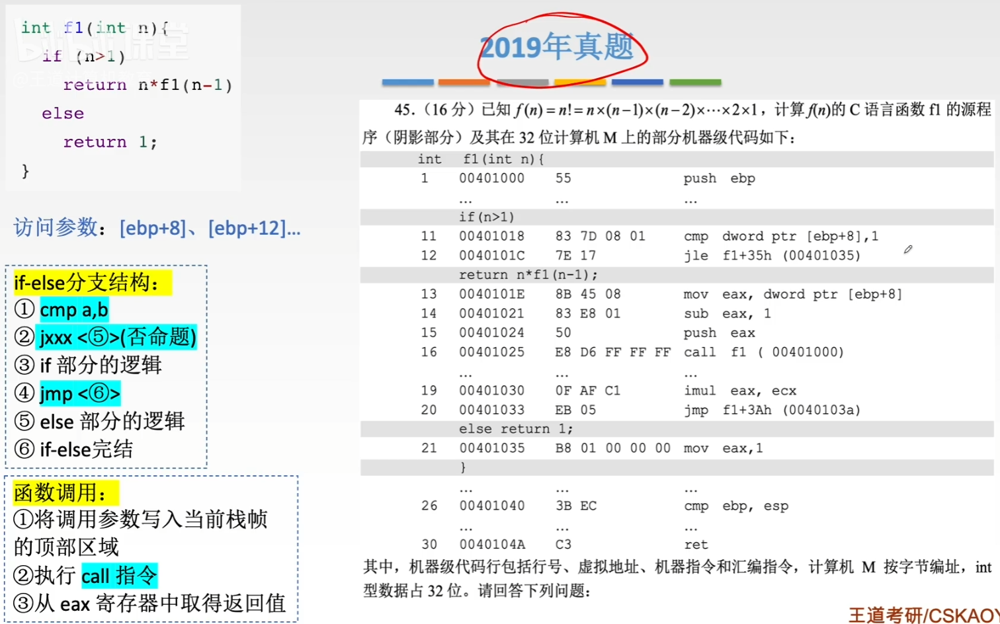

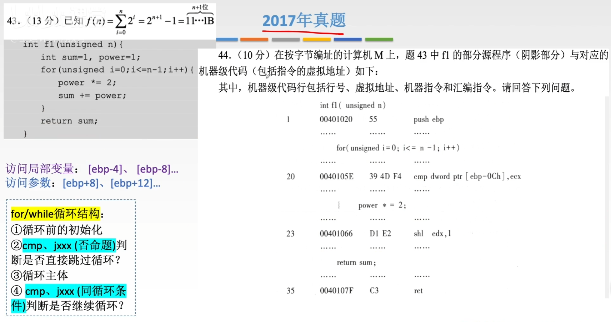