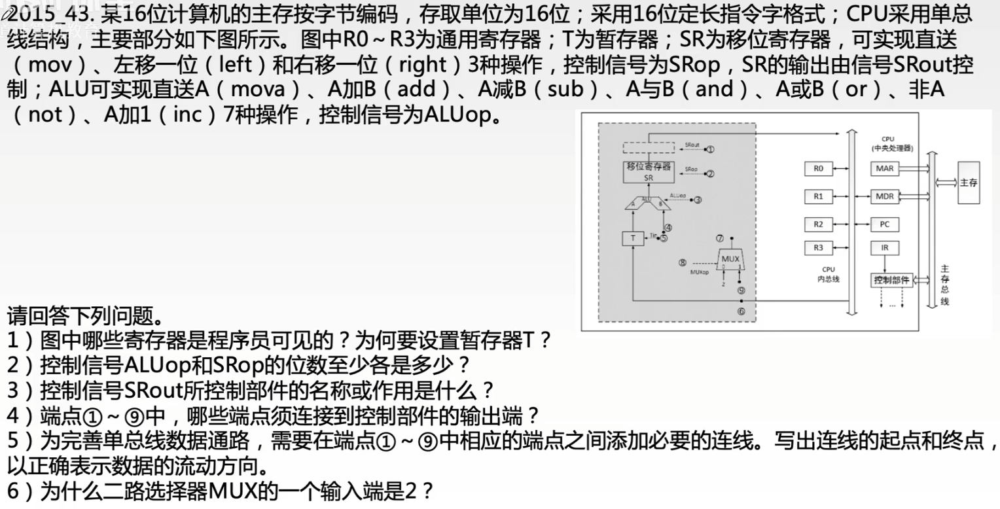

# CPU的功能和基本结构

### CPU的基本结构

CPU主要由运算器与控制器两大部分组成：

1. 运算器：执行算术运算、逻辑运算，对数据进行加工和处理；
2. 控制器：执行指令，指令的执行是由控制器发出的一组微操作实现的。

运算器与控制器的组成结构如下所示。

| 运算器                | 控制器               |
| --------------------- | -------------------- |
| 算术逻辑单元 ALU      | 程序计数器 PC        |
| 暂存寄存器 DR         | 指令寄存器 IR        |
| 累加寄存器 ACC        | 指令译码器           |
| 通用寄存器组          | 存储器地址寄存器 MAR |
| 程序状态字寄存器 PSWR | 存储器数据寄存器 MDR |
| 移位器                | 时序系统             |
| 计数器                | 微操作信号发生器     |

| 分类       | 寄存器                | 功能                                                 |
| ---------- | --------------------- | ---------------------------------------------------- |
| 用户可见   | 通用寄存器组          | 存放操作数和地址信息；作为基址寄存器、变址寄存器等   |
|            | 程序状态字寄存器 PSWR | 保留由逻辑运算指令或测试指令的结果建立的各种状态信息 |
|            | 程序计数器 PC         | 指出下一条指令在主存中的存放地址                     |
|            | 累加寄存器 ACC        | 暂时存放ALU运算的结果信息，用于实现加法运算          |
| 用户不可见 | 指令寄存器 IR         | 保存当前正在执行的那条指令                           |
|            | 暂存寄存器 DR         | 暂存从主存读来的数据                                 |
|            | 存储器地址寄存器 MAR  | 存放所要访问的主存单元的地址                         |
|            | 存储器数据寄存器 MDR  | 存放向主存写入的信息或从主存中读出的信息             |

