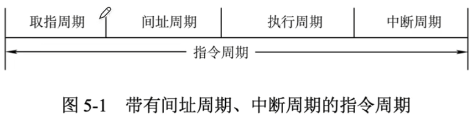
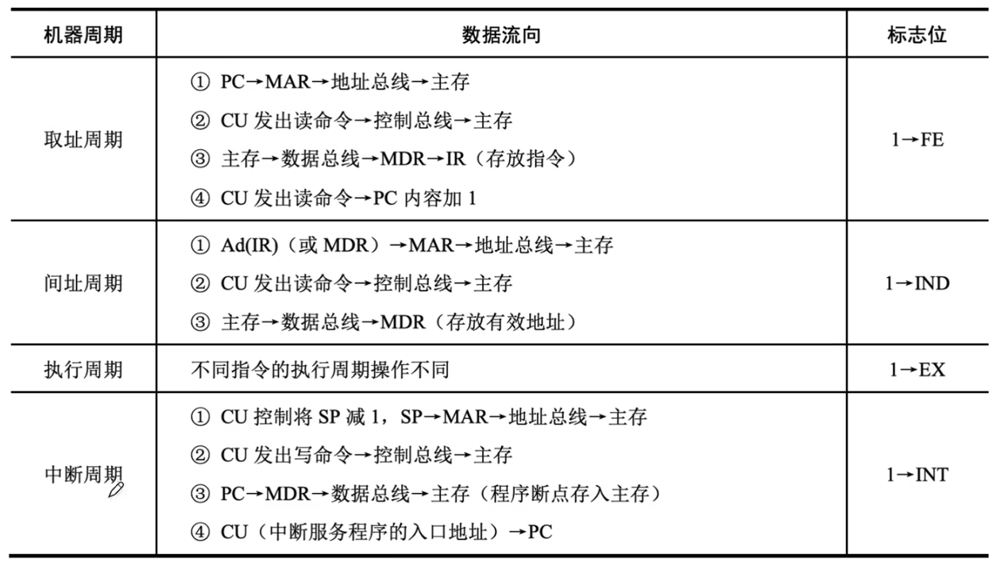
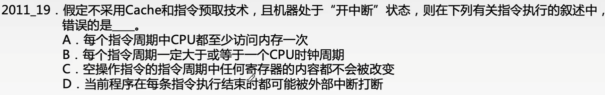

# 指令执行过程

### 指令周期

指令周期是指从取指令、分析取数到执行完该指令所需的全部时间。指令周期通常包含若干个机器周期，每个机器周期完成一个基本操作。一个机器周期又包含若干时钟周期（也称节拍，它是CPU操作的最基本单位）。一个完整的指令周期如图所示。

上述4个周期都可能有CPU访存，只是目的不同。取指周期是为了取指令，间址周期是为了取有效地址，执行周期是为了取操作数，中断周期是为了保存程序断点。

### 指令执行过程

