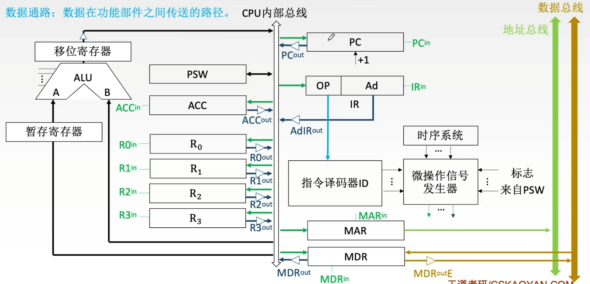
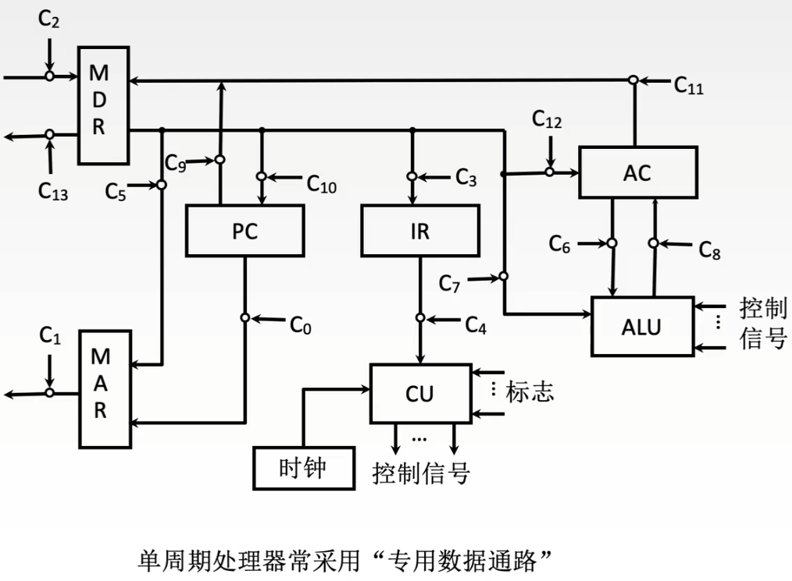
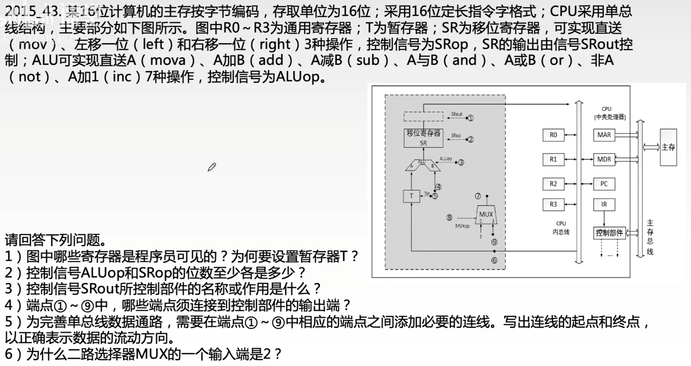
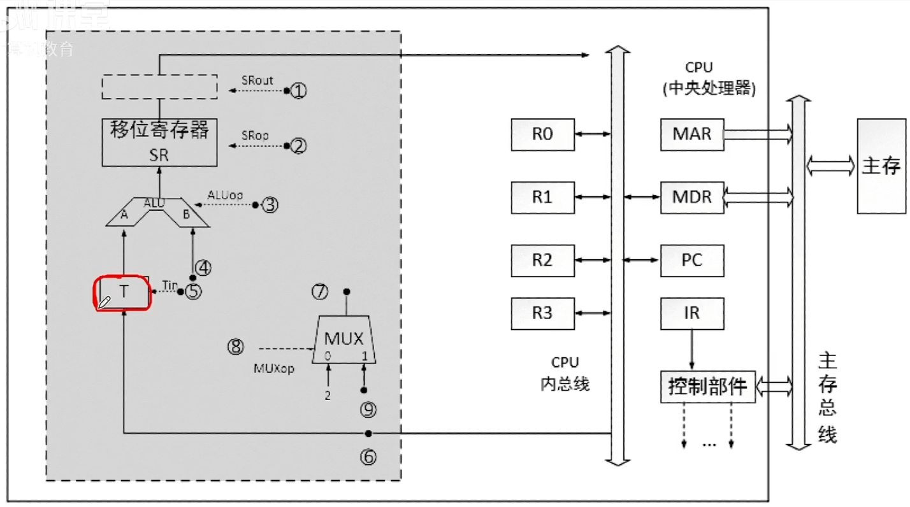

# 数据通路的功能和基本结构

### 数据通路

数据通路是CPU中逻辑运算单元ALU、控制单元CU及寄存器之间的连接线路。

控制器在实现一条指令的功能时，总要把每条指令分解成一系列时间上先后有序的最基本、最简单的微操作，即微操作序列。微操作序列是与CPU的内部数据通路密切相关的，不同的数据通路就有不同的微操作序列。

一般在给出CPU的结构及数据通路框图之后，再写出对应指令的微操作序列。如果CPU内部采用单总线结构，还要考虑总线冲突的问题，相应的微操作控制信号必须给出的数据通路结构一致，且时序上要有先后顺序。

### 数据通路（单总线结构）

### 专用数据通路方式

