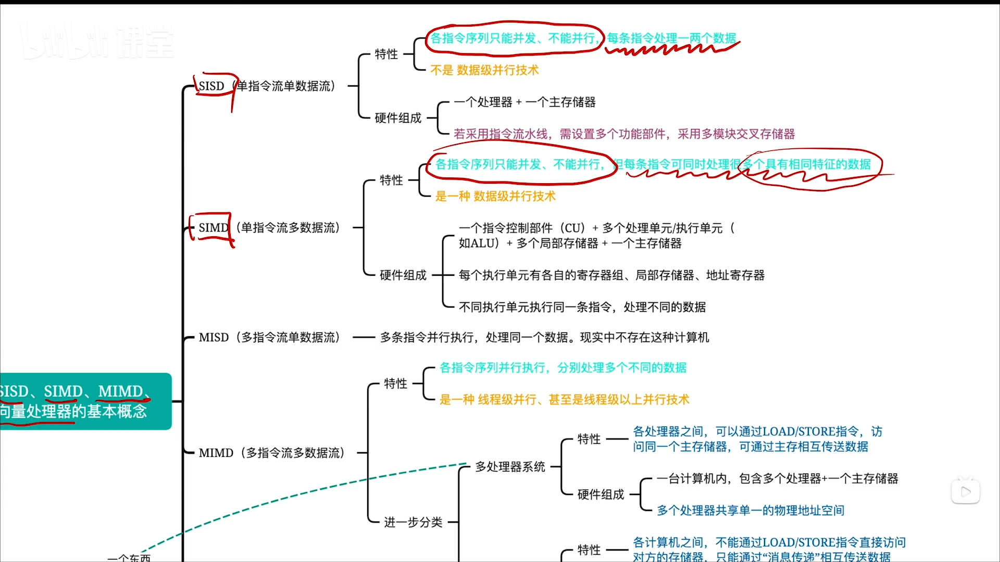
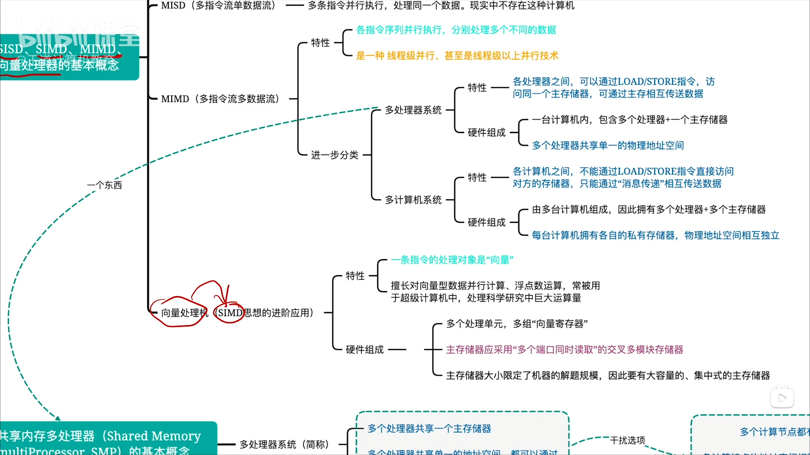
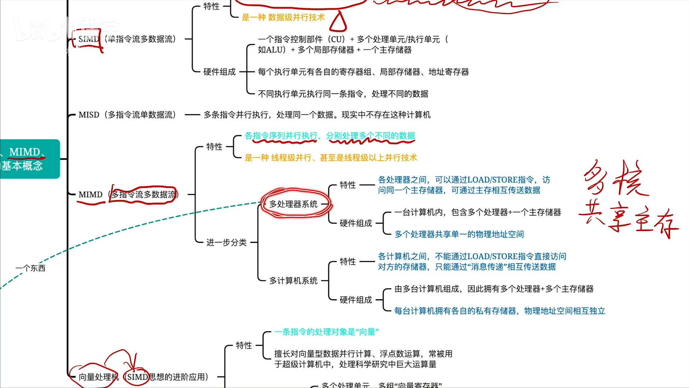
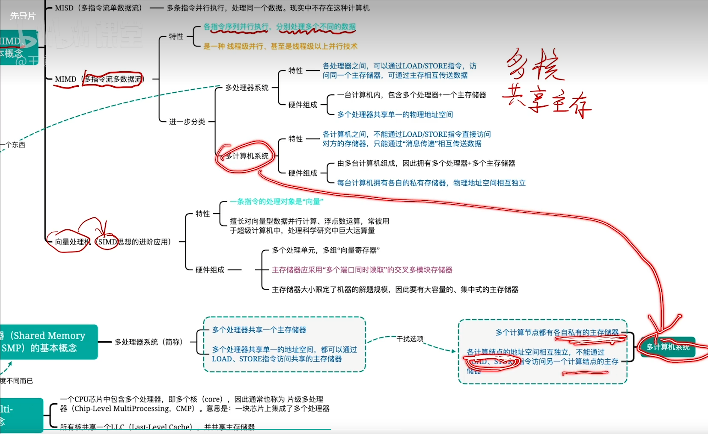
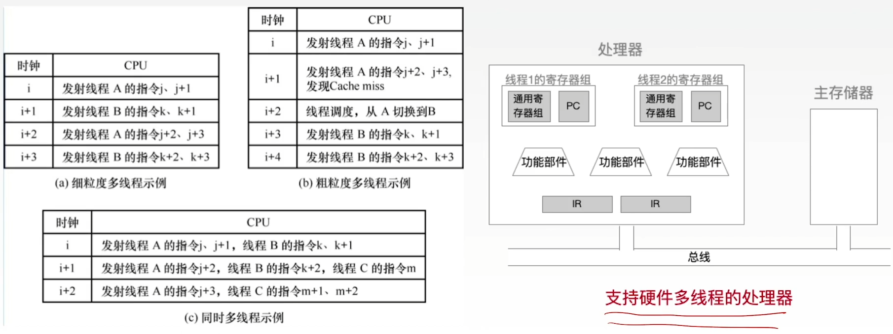
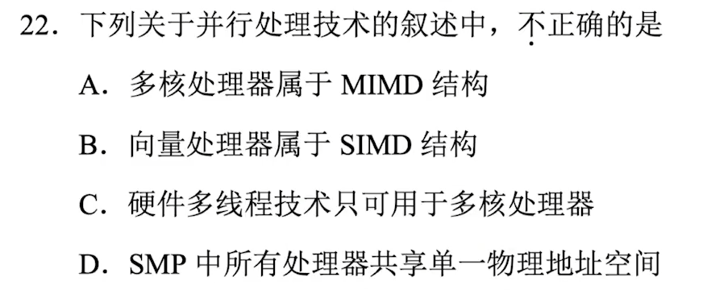

# 多处理机的基本概念

### 多处理器的基本概念

- SISD、SIMD、MIMD、向量处理器的基本概念

- 共享内存多处理器(Shared Memory multiProcessor, SMP)的基本概念

- 多核处理器(multicore)的基本概念

### 三种硬件多线程

|              | 细粒度多线程                                           | 粗粒度多线程                                                 | 同时多线程（SMT）                      |
| ------------ | ------------------------------------------------------ | ------------------------------------------------------------ | -------------------------------------- |
| 指令发射     | 轮流发射各线程的指令 （每个时钟周期发射一个线程） | 连续几个时钟周期，都发射同一线程的指令序列，流水线阻塞时，切换另一个线程 | 一个时钟周期内，同时发射多个线程的指令 |
| 线程切换频率 | 每个时钟周期切换一次线程                               | 只有流水线阻塞时才切换一次线程                               | NULL                                   |
| 线程切换代价 | 低                                                     | 高，需要重载流水线                                           | NULL                                   |
| 并行性       | 指令级并行，线程间不并行                               | 指令级并行，线程间不并行                                     | 指令级并行，线程级并行                 |

单核CPU，也可以实现三种硬件多线程

