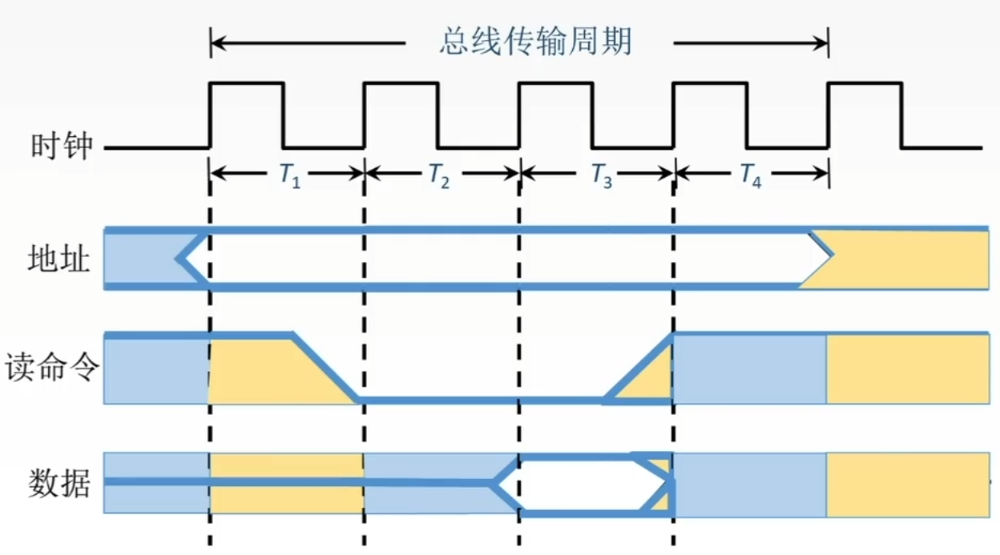
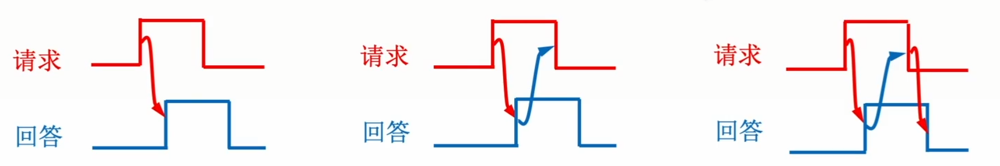
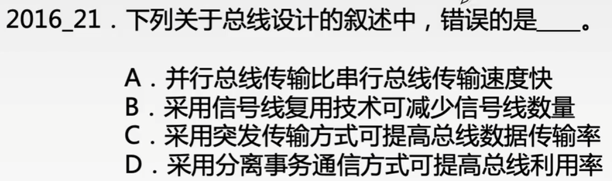

# 总线的概念与分类

### 命题重点

1. 总线的分类、特点，各类总线上传输的内容。
2. 总线的性能指标，传输周期，时钟周期，时钟频率，总线宽度，总线带宽等。
3. 3中总线异步定时方式的性质。

### 总线分类

总线是一组能为多个部件分时共享的公共信息传送线路。

按功能划分，计算机系统中总线可以分为以下3类。

| 总线类型 | 定义                                                         |
| -------- | ------------------------------------------------------------ |
| 片内总线 | 是CPU芯片内部寄存器与寄存器之间、寄存器与ALU之间的公共连接线 |
| 系统总线 | 计算机系统内各功能部件（CPU、主存、I/O接口）之间相互连接的总线 |
| 通信总线 | 用于计算机系统之间或计算机系统与其他系统之间信息传送的总线   |

### 系统总线

系统总线按传送信息内容的不同，又可分为以下3类。

| 类型     | 传输内容                                                     |
| -------- | ------------------------------------------------------------ |
| 数据总线 | 双向传输总线。它既可以把CPU的数据传送到存储器或输入输出接口等其他部件，也可以将其他部件的数据传送到CPU。位数与机器字长、存储字长有关。 数据的含义是广义的，可以是真正的数据，也可以是指令代码或状态信息，甚至可以是控制信息，因此数据总线上传送的并不一定仅仅是真正意义上的数据。 |
| 地址总线 | 单向传输总线。用来指出数据总线上的源数据或目的数据所在的主存单元或I/O端口的地址。位数与存储单元的个数有关 |
| 控制总线 | 传输控制信息，包括CPU送出的控制命令和主存（或外设）返回CPU的反馈信号 |

有的地方，会按连接部件不同，分为：

1. 处理及总线：连接CPU-北桥芯片
2. 主存总线：连接主存-北桥芯片
3. I/O总线：连接各种I/O控制器-南桥芯片

按数据传输方式，分为：

1. 并行总线
2. 串行总线

### 总线的两种基本定时方式

1. 同步通信方式

   在同步通信方式中，系统采用一个统一的时钟信号来协调发送和接收双方的传送定时关系。时钟产生相等的时间间隔，每个间隔构成一个总线周期。在一个总线周期中，发送方和接收方可以进行一次数据传送。因为采用统一的时钟，每个设备发送或接收信息都在固定的总线传输周期中，一个总线的传送周期结束，下一个总线传输周期开始。

   

2. 异步通信方式

   在异步通信方式中，没有统一的时钟，也没有固定的时间间隔，完全依靠传送双方相互制约的“握手”信号来实现定时控制。主设备提出交换信息的“请求”信号，经接口传送到从设备；从设备接到主设备的请求后，通过接口向主设备发出“回答“信号。

   根据”请求“和“回答”信号的撤销是否互锁、又分为不互锁、半互锁、全互锁三种类型。

   

