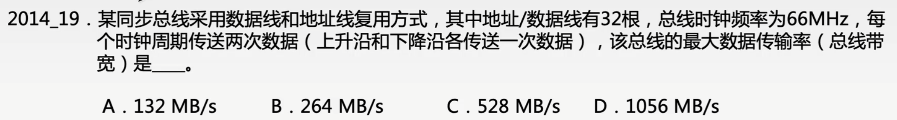
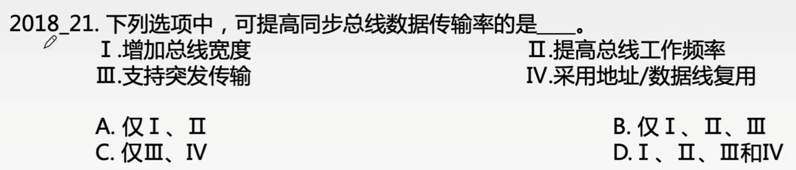

# 总线的性能指标

### 总线性能指标

| 性能指标     | 定义                                                         |
| ------------ | ------------------------------------------------------------ |
| 总线时钟周期 | 总线时钟周期就是机器的时钟周期（总线由CPU控制）              |
| 总线时钟频率 | 总线时钟频率是总线时钟频率周期的倒数，即机器的时钟频率       |
| 总线传输周期 | 总线传输周期是指一次总线操作所需要的时间，包含若干个总线时钟周期 |
| 总线工作频率 | 总线工作频率是总线传输周期的倒数                             |
| 总线宽度     | 总线上能够同时传输的数据位数，通常是指数据总线的根数         |
| 总线带宽     | 单位时间内总线上可传输数据的位数 总线带宽=总线宽度x总线工作频率 |

### 猝发（突发）传输方式

常规传输：一次传输一个地址和一个数据。

促发（突发）传输：在一个总线周期中，可以传输多个存储地址连续的数据，即一次传输一个地址和一批地址连续的数据。

（注：猝发传输常用于 主存-Cache之间的“块”传输）

通常，主存总线可以支持猝发传输方式

有的总线采用信号线复用技术：一种信号线在不同的事件传输不同的信息。可以使用较少的线传输更多的信息，从而节省了空间成本。

