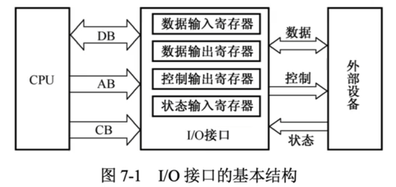
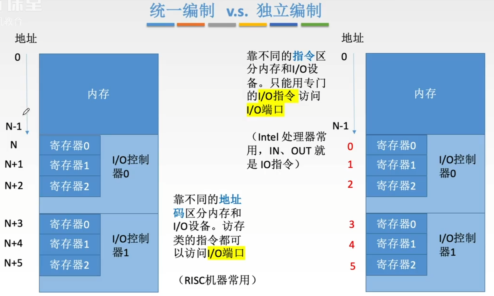

# 外部设备

### 显示器的主要参数

| 参数指标             | 说明                                                         |
| -------------------- | ------------------------------------------------------------ |
| 分辨率               | 显示器所能表示的像素个数                                     |
| 灰度级 颜色深度 | 黑白显示器中像素点亮暗的差别：灰度级为8位，可显示256种亮度的像素 彩色显示器中像素点颜色的不同：色深为8位，可显示256中颜色的像素 |
| 刷新频率             | 单位时间内扫描整个屏幕内容的次数                             |
| 显示存储器           | 一帧图像存储在刷新存储器中，其存储容量由图像分辨率和灰度级决定 VRAM 容量 = 分辨率 x 灰度级位数 VRAM 带宽 = 分辨率 x 灰度级位数 x 刷新频率（帧频） |

假定一台计算机的显示存储器用DRAM芯片实现，若要求显示分辨率位1600x1200，颜色深度位24位，帧频位85Hz，现存总带宽的50%用来刷新屏幕，则需要的现存总带宽至少约为
$$
1600*1200*24*85/50\%=7833.5Mbit/s
$$

# I/O 接口（端口）

### I/O 接口（端口）的基本结构

I/O 接口是主机和外设之间的交接界面

| I/O 总线类型 | 说明                                            | 单双向 |
| ------------ | ----------------------------------------------- | ------ |
| 数据线       | I/O 与主机之间数据代码的传送线                  | 双向   |
| 地址线       | 又称设备选择线，用于主机选中具体的外部设备      | 单向   |
| 控制线       | 由CPU发出的用来控制外设的信号，如控制外设的启停 | 单向   |

### I/O 端口的编址

| 编址方式 | 定义                                                         | 特点                                                         |
| -------- | ------------------------------------------------------------ | ------------------------------------------------------------ |
| 统一编址 | 把 I/O 端口当作存储器的单元进行地址分配，采用统一的访存指令访问 I/O 端口 | 优点 不需要专门的 I/O 指令 还可使端口有较大的编址空间 缺点 占用了存储器地址，使内存容量变小 执行速度较慢 |
| 独立编址 | I/O 端口地址与存储器地址无关，独立编址 CPU 需要设置专门的 I/O 指令访问端口 | 优点 程序编制清晰，便于理解 缺点 I/O 指令少，一般只能对端口进行操作 增加了控制的复杂性 |

I/O 指令实现的数据传送通常发生在 D

A. I/O 设备和 I/O 端口之间

B. 通用寄存器和 I/O 设备之间

C. I/O 端口和 I/O 端口之间

D. 通用寄存器和 I/O 端口之间

下列有关I/O接口的叙述中，错误的是 D

A. 状态端口和控制端口可以合用同一个寄存器

B. I/O 接口中 CPU 可访问的寄存器称为 I/O 端口

C. 采用独立编址方式时，I/O 端口地址和主存地址可能相同

D. 采用统一编址方式时，CPU 不能用访存指令访问 I/O 端口