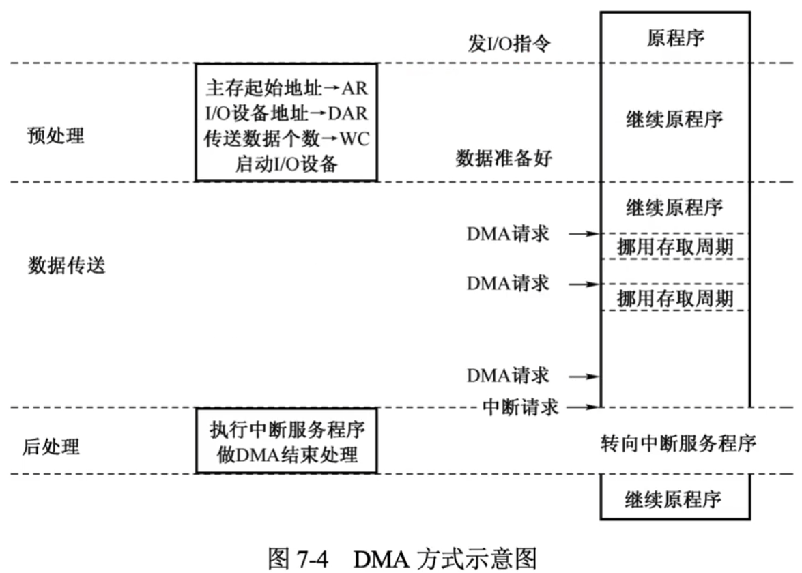

# DMA方式

### DMA方式

DMA方式在外设与内存之间开辟一条“直接数据通道”，信息传送时DMA控制器从CPU完全接管对总线的控制，信息不再经过CPU，降低了CPU在数据传送时的开销。由于数据传送不再经过CPU，也就不需要保护、恢复CPU现场等烦琐操作。

### DMA的传送方式

当I/O设备与CPU同时访问主存时，可能发生冲突，为了有效地使用主存，DMA控制器与CPU通常采用以下3种方法使用主存。

1. 停止CPU访问主存。要求CPU放弃对相关总线的使用权
2. DMA和CPU交替访存。将一个CPU周期分为两个周期，一个供DMA访存，一个供CPU访问。这种方式的总线使用权是通过分时控制的。
3. 周期挪用。DMA挪用一个或几个存取周期

显然，外部设备（I/O控制器）需要使用系统总线时，其优先级高于CPU，若得不到即时响应，则传输的数据可能会丢失，将导致无法挽回的后果。

### DMA的传送过程

DMA的数据传送过程分为预处理、数据传送和后处理3个阶段。以周期挪用方式（单字为单位的）的传送过程如图。

对于DMA这类题，基本的解题步骤为：计算每秒产生DMA的次数，每次DMA的时钟周期数，每秒用于DMA处理的总开销，DMA占CPU的总时间等。

**2013_22** 下列关于中断I/O方式和DMA方式比较的叙述中，错误的是 D

A 中断I/O方式请求的是CPU处理时间，DMA方式请求的是总线使用权

B 中断响应发生在一条指令执行结束后，DMA响应发生在一个总线事务完成后

C 中断I/O方式下数据传送通过软件完成，DMA方式下数据传送由硬件完成

D 中断I/O方式适用于所有外部设备，DMA方式仅适用于快速外部设备

**2018_43** 假定计算机的主频为500MHz，CPI为4。现有设备A和B，其数据传输率分别为2MB/s和40MB/s，对应I/O接口中各有一个32位数据缓冲寄存器。请回答下列问题，要求给出计算过程。

（1）若设备A采用定时查询I/O方式，每次输入/输出都至少执行10条指令。设备A最多间隔多长时间查询一次才能不丢失数据？CPU用于设备A输入/输出的时间占CPU总时间的百分比至少是多少？
$$
\frac{32bit}{2MB} = 2\mu s
$$

$$
\begin{align}
\frac{1s}{2\mu s} &= 5*10^5\\
5*10^5*10*4 &= 2*10^7\\
\frac{2*10^7}{500M} &= 4%
\end{align}
$$

（2）在中断I/O方式下，若每次中断响应和中断处理的总时钟周期数至少为400，则设备B能否采用中断I/O方式？为什么？
$$
\frac{4B}{40MB/s}<400*\frac{1}{500M}s
$$
（3）若设备B采用DMA方式，每次DMA传送的数据块大小1000B，CPU用于DMA预处理和后处理的总时钟周期为500，则CPU用于设备B输入/输出的时间占CPU总时间的百分比最多是多少？
$$
\frac{\frac{40MB}{1000B}*500}{500M}=0.4\%
$$