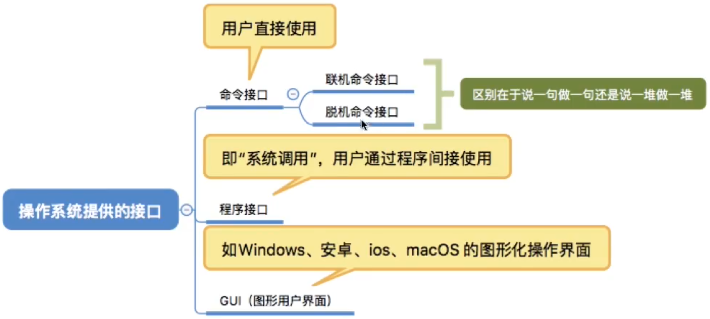

# 操作系统概述

### 操作系统的概念、特征和功能

#### 并行性与并发性

并行性和并发性是既相似又有区别的两个概念。并行性是指两个或多个事件在同一时刻发生，并发性是指两个或多个事件在同一时间间隔内发生。

在多道程序环境下，一段时间内，宏观上有多道程序在同时执行，而在每一时刻，单处理机环境下实际仅能有一道程序执行，故微观上这些程序还是在分时地交替执行。操作系统的并发性是通过分时得以实现的。

