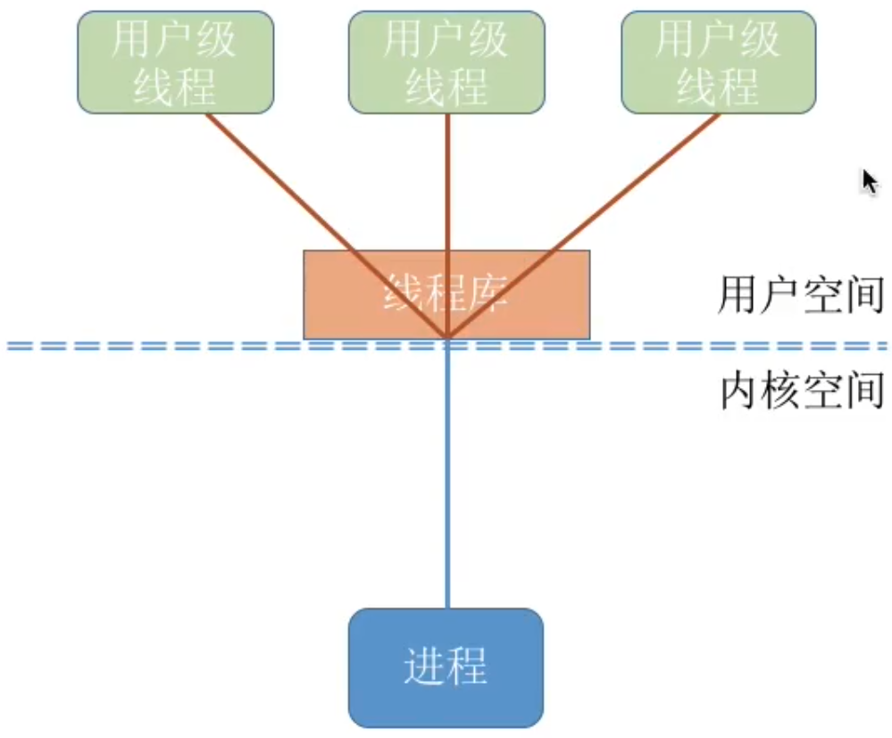
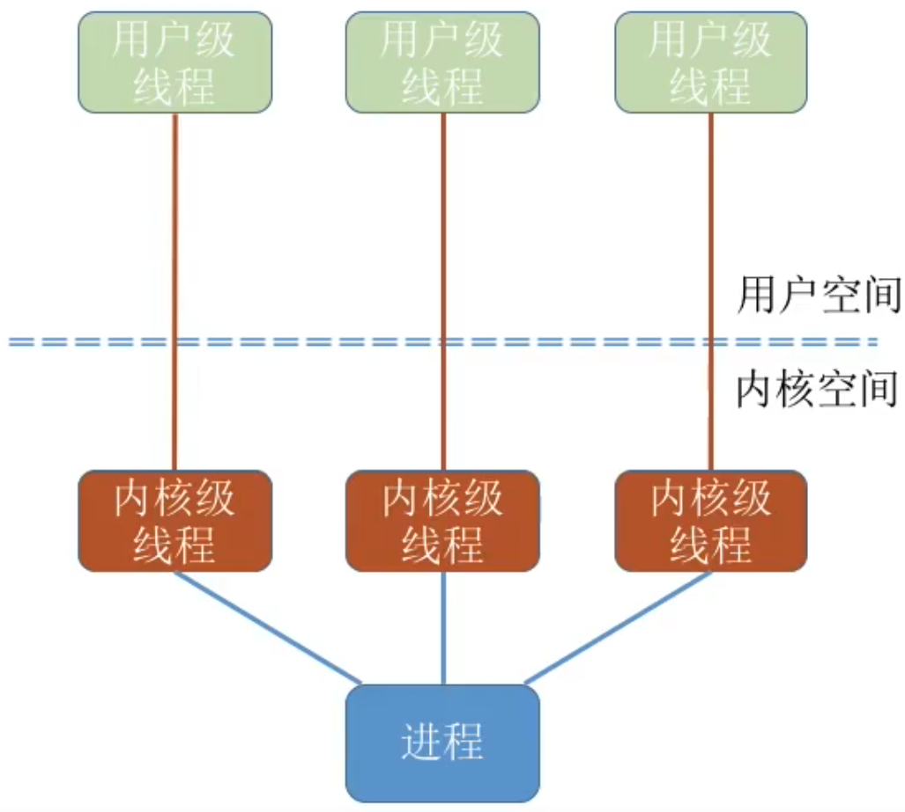
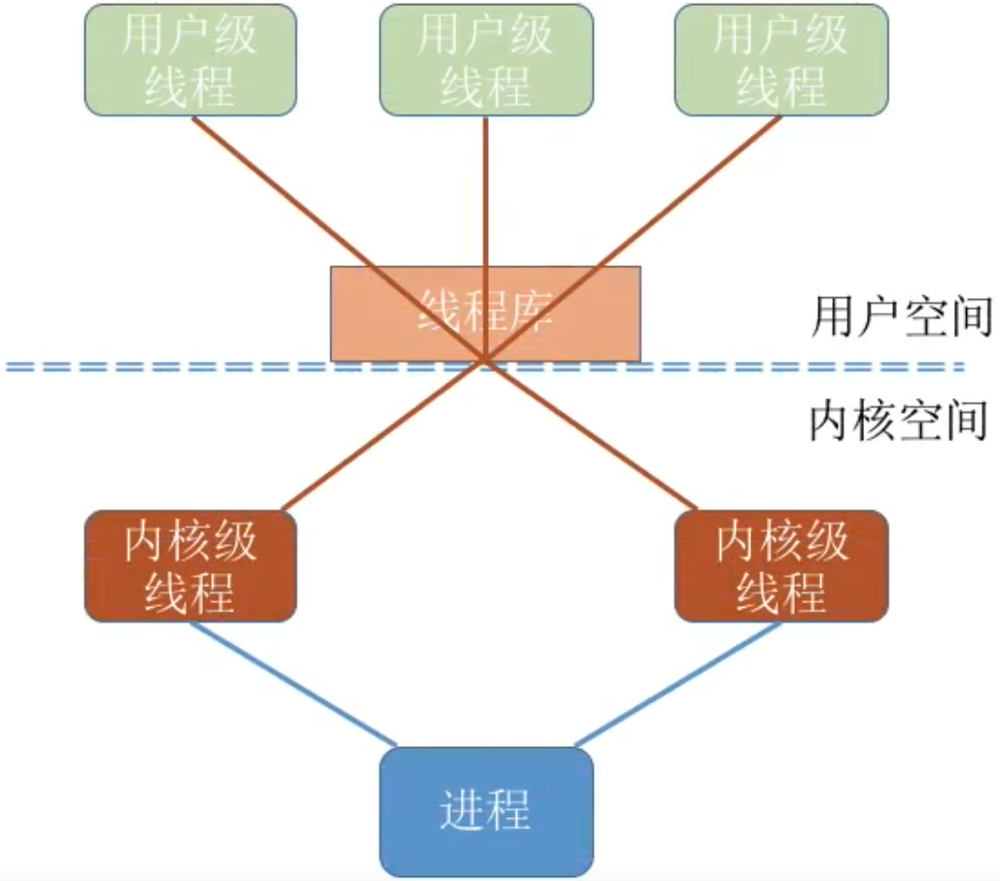

# 进程与线程

### （进程管理）命题重点

1. 进程和线程的比较，内核支持线程和用户级线程。
2. 进程的状态变化，进程的创建与终止，进程的阻塞与唤醒。
3. 作业运行的顺序与甘特图，处理机调度的时机，各种调度算法的特点，特别是高响应比优先调度和多级反馈队列调度算法的原理。
4. 进程的并发执行，临界区互斥的软件实现方法，信号量机制的原理，掌握经典的同步互斥问题并能灵活应用。
5. 死锁的判断、安全序列，银行家算法。

### 进程与线程的比较

|          | 进程                                                         | 线程                                                         |
| -------- | ------------------------------------------------------------ | ------------------------------------------------------------ |
| 映像组成 | 由程序段、相关数据点和PCB组成。                              | 共享其隶属进程的进程映像，仅拥有线程ID、寄存器集合和堆栈等。 |
| 并发性   | 在没有引入线程的系统中，进程是独立运行的基本单位。           | 线城市独立运行的基本单位，一个进程可以拥有一个或多个线程。 线程运行的独立性是指线程之间独立运行，但线程不能脱离进程运行。 |
| 资源分配 | 进程是资源分配和拥有的基本单位。                             | 线程自己基本不拥有系统资源，但它可访问所属进程所拥有的全部资源。 |
| 调度     | 在没有引入线程的操作系统中，晋城市独立调度和分配的基本单位。 | 引入线程后的操作系统中，线程是独立调度和分派的基本单位。     |
| 通信     | PV操作；共享存储；消息传递；管道通信。                       | 同一进程的各线程直接读写进程数据段。不同进程的线程之间通信属于进程间通信。 |
| 系统开销 | 进程切换时涉及当前CPU环境的保存及新进程CPU环境的设置，开销较大。 | 线程切换时只需保存和设置少量寄存器内容，开销很小。           |
| 地址空间 | 进程的地址空间之间互相独立                                   | 同一进程的各线程间共享进程的地址空间                         |

### 用户级线程vs内核级线程

#### 用户级线程(User-Level Thread, ULT)

用户级线程由应用程序通过线程库实现。所有的线程管理工作都由应用程序负责（包括线程切换）

用户级线程中，线程切换可以在用户态下即可完成，无需操作系统干预。

在用户看来，是有多个线程。但是在操作系统内核看来，并意识不到线程的存在。（用户级线程对用户不透明，对操作系统透明）

可以这样理解，”用户级线程“就是”从用户视角看能看到的线程“

#### 内核级线程(Kernel-Level Thread, KLT, 又称”内核支持的线程“)

内核级线程的管理工作由操作系统内核完成。线程调度、切换等工作都由内核负责，因此内核级线程的切换必然需要在核心态下才能完成。

可以这样理解，”内核级线程“就是”从操作系统内核视角看能看到的线程“

在同时支持用户级线程和内核线程的系统中，可采用二者组合的方式：将n个用户级线程映射到m个内核级线程上(n>=m)

重点：操作系统只”看得见“内核级线程，因此只有内核级线程才是处理机分配的单位。

例如：上图模型中，该进程由两个内核级线程，三个用户级线程，在用户看来，这个进程中有3个线程。但即使该进程在一个4核处理机的计算机上运行，也最多只能被分配到两个核，最多只能有两个用户线程并行执行。

#### 内核支持线程和用户级线程

| 线程 | 用户级线程                                                   | 内核支持线程                                                 |
| ---- | ------------------------------------------------------------ | ------------------------------------------------------------ |
| 定义 | 存在于用户空间中。线程的创建、撤销、同一进程的线程之间的切换等功能都在用户空间实现。内核不知道用户级线程的存在。 | 实在内核的支持下运行的。线程的创建、撤销和切换等都在内核空间实现。内核根据线程控制块感知线程的存在。 |
| 优点 | 线程切换不需要转换到内核空间（对同一进程的线程而言），从而节省了开销。 调度算法可以是进程专用的。 用户级线程的实现与操作系统平台无关，对于线程管理的代码都属于用户程序。 | 在多处理器系统中，内核能够同时调度同一进程中多个线程并行执行； 一个线程被阻塞了，内核可以调度该进程中的其他线程或其他进程中的线程运行； 内核本身也可以采用多线程技术，可以提高系统的执行速度和效率。 |
| 缺点 | 当一个线程被阻塞，同一进程内的所有线程都会被阻塞。 多线程应用不能利用多处理器系统的优点。内核以进程为单位分配CPU，因此同一时刻一个进程中仅有一个线程能执行。 | 同一个进程中，线程切换时，需要从用户态转到内核态进行，系统开销较大。 |

