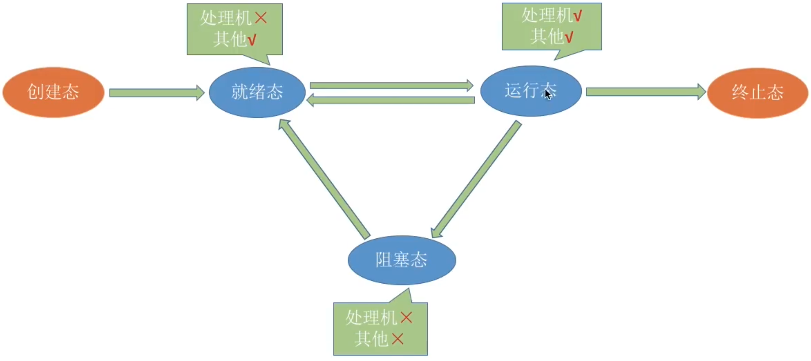

# 进程状态与进程控制

进程控制：实现进程状态的转化

### 进程的创建与终止

|          | 进程创建 通过创建原语完成：无 创建态 就绪态             | 进程终止 通过撤销原语完成：就绪态/阻塞态/运行态 终止态 无 |
| -------- | ------------------------------------------------------------ | ------------------------------------------------------------ |
| 引发事件 | 终端用户登录系统。 作业调度。 系统提供服务。 用户程序的应用请求。 | 正常结束。 异常结束，由于发生异常（如存储区越界）而终止进程。 外界干预，进程应外界请求而终止运行。 |
| 过程     | 申请空白PCB。 为新进程分配资源。 初始化PCB。 如果进程就绪队列能够接纳新进程，就将新进程插入到就绪队列。 | 根据被终止进程的标识符，检索PCB，从中读出该进程的状态。 若该进程处于执行状态，则终止其执行，将处理器资源分配给其他进程。 若该进程还有子进程，则将子进程终止。 释放该进程所拥有的全部资源。 将该PCB从所在队列中删除。 |

### 进程的阻塞与唤醒

|          | 进程阻塞                                                     | 进程唤醒                                                     |
| -------- | ------------------------------------------------------------ | ------------------------------------------------------------ |
| 引发事件 | 请求系统服务。 启动某种操作。 新数据尚未到达。 无新工作可做。 需要等待某个事件的发生时引发阻塞 | 引发阻塞的事件完成。                                         |
| 特点     | 阻塞：运行状态到阻塞状态 进程通过调用阻塞原语block把自己阻塞。进程的阻塞是进程自身的一种主动行为。 | 唤醒：阻塞状态到就绪状态 由完成相关事件的进程调用wakeup原语将阻塞进程唤醒，是被动完成的。 |

