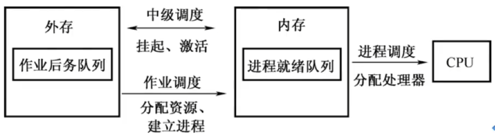

# 处理机调度

### 调度的基本概念

调度从作业提交到完成可以分为：作业调度、中级调度和进程调度三个层次：

### 调度的原则

| 指标             | 定义                                                         | 原则 |
| ---------------- | ------------------------------------------------------------ | ---- |
| CPU利用率        | CPU的工作时间在整个系统工作时间中所占的比例                  | 高   |
| 系统吞吐量       | 系统吞吐量表示单位时间内CPU完成作业的数量                    | 高   |
| 周转时间         | 周转时间＝作业完成时间－作业提交时间                         | 短   |
| 平均周转时间     | 平均周转时间＝(作业1的周转时间+...+作业n的周转时间)/n        | 短   |
| 带权周转时间     | 带权周转时间=作业周转时间/作业实际运行时间                   | 小   |
| 平均带权周转时间 | 平均带权周转时间＝(作业1的带权周转时间+...+作业n的带权周转时间)/n | 小   |
| 等待时间         | 进程处于等待处理器状态的时间之和                             | 短   |
| 响应时间         | 从用户提交请求到系统首次产生响应所用的时间                   | 短   |

### 进程调度的优先级

根据进程创建后其优先级是否可以改变，可以将进程优先级分为以下两种：

1. 静态优先级。在进程投入运行前就确定一个优先级，并且之后一直不变。
2. 动态优先级。在进程运行过程中，根据进程情况的变化动态调整优先级。

通常：系统进程优先级高于用户进程；前台进程优先级高于后台进程；I/O型进程（或称I/O繁忙型进程）优先级高于计算型进程（CPU繁忙型进程）；

### 不能进行处理机调度的情况

在操作系统内核程序运行时，如果某时发生了引起进程调度的因素，并不一定能够马上进行调度与切换。不能进行进程的调度与切换的情况有以下几种：

1. 在处理中断的过程中：中断处理过程复杂，在实现上很难做到进程切换，而且中断处理是系统工作的一部分，逻辑上不属于某一进程，不应被剥夺处理机资源。
2. 进程在操作系统内核程序临界区中：进入临界区后，需要独占式地访问共享数据，理论上必须加锁，以防止其他并行程序进入，在解锁前不应切换到其他进程运行。
3. 其他需要完全屏蔽中断的原子操作中：如加锁、解锁、中断现场保护、恢复等原子操作中。在原子过程中，连中断都要屏蔽，更不应该进行进程调度与切换。

如果在上述过程中发生了引起调度的条件，并不能马上进行调度和切换，应置系统的请求调度标志，直到上述过程结束后才进行相应的调度与切换。

### 典型的调度算法

重点思考：

1. 算法思想
2. 算法规则
3. 优缺点
4. 是否会导致饥饿

| 算法                                           | 调度方法                                                     | 特点                                                         |
| ---------------------------------------------- | ------------------------------------------------------------ | ------------------------------------------------------------ |
| 先来先服务调度算法                             | 作业：每次从后备作业队列中选择最先进入该队列的作业调入内存。 进程：每次从就绪队列中选择最先进入该队列的进程，将处理器分配给它，使之投入运行 | 算法简单，但效率低； 有利于长作业不利于短作业； 有利于CPU繁忙型工作而不利于I/O繁忙型作业 |
| 短作业/进程优先调度算法                        | 作业：每次从后备队列中选择一个或若干个估计运行时间最短的作业，将它们调入内存。 进程：每次从就绪队列中选择一个估计运行时间最短的进程，将处理器分配给它，使之投入运行 | 对长作业不利； 估计运行时间可能不准确； 平均等待时间、平均周转时间最少 |
| 高响应比优先调度算法                           | 先计算后被作业队列中每个作业的响应比，从中选出响应比最高的作业投入内存。 综合考虑了作业的等待时间和估计运行时间 | 有利于短作业； 长作业不至于产生饥饿； 等待时间越长，优先级越高 |
| 优先级调度算法                                 | 作业：每次从后备作业队列中选择优先级最高的一个或几个作业，将它们调入内存。 进程：每次从就绪队列中选择优先级最高的进程，将处理器分配给它，使之投入运行 | 优先级高的先运行。优先级分为静态优先级：创建时确定且不变。 动态优先级：创建时确定并动态改变。 |
| 时间片轮转调度算法                             | 所有就绪进程按先来先服务排队，总是选择就绪队列中第一个进程运行一个时间片。然后释放处理器给下一个就绪进程，而被剥夺处理器的进程返回到就绪队列的末尾重新排队 | 使所有用户在给定时间内得到响应。时间片大：系统开销小但交互性差。时间片小：有利于短作业，但系统开销大 |
| 多级反馈队列调度算法（适用于分时系统进程调度） | 1. 设置多个就绪队列，优先级越高的队列进程的运行时间片越小。优先级按第1~n级队列递减。 2. 当一个新进程进入内存后，首先将它放入第1级队列的末尾，按FCFS原则排队等待调度。当轮到位于第i级队列的某一进程执行时，若它在该时间片内完成，便可撤离系统，否则： 3. 仅当第1~(i-1)级队列均为空时，才会调度第i级队列中的进程运行。 4. 第i级队列中的进程运行时，若又有新进程进入第1~(i-1)中的任一队列，则把正在运行的进程放回第i级队列的末尾，把处理器分配给新进程 | 终端型作业用户：短作业优先。 短批处理作业用户：周转时间较短。 长批处理作业用户：不会长期得不到处理 |

$$
响应比R_p=\frac{等待时间+要求服务时间}{要求服务时间}
$$

