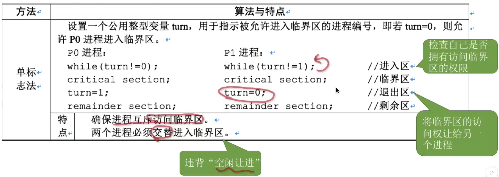
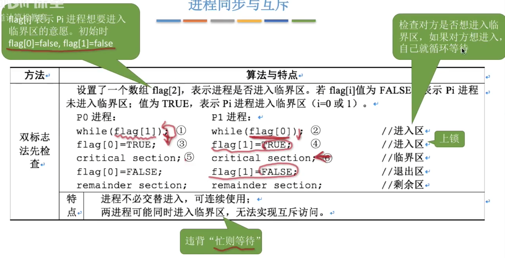
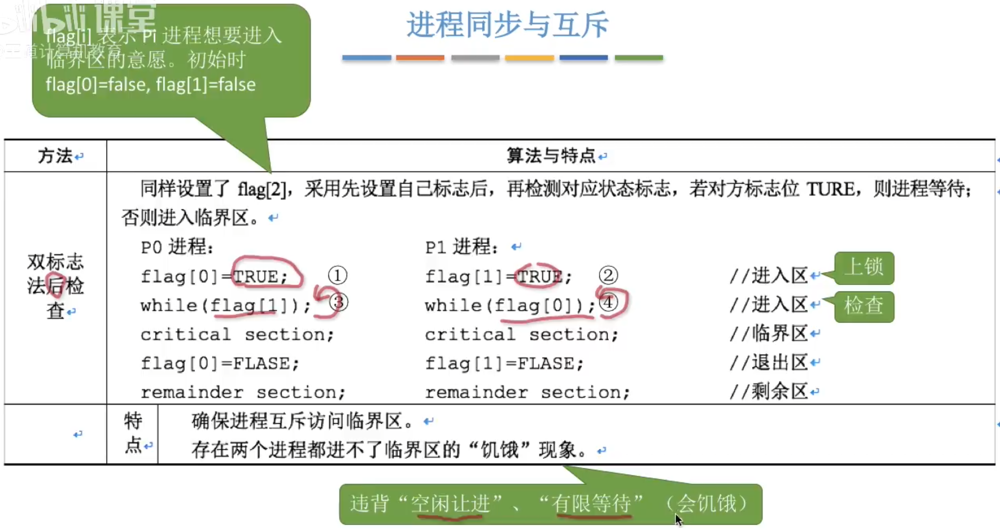
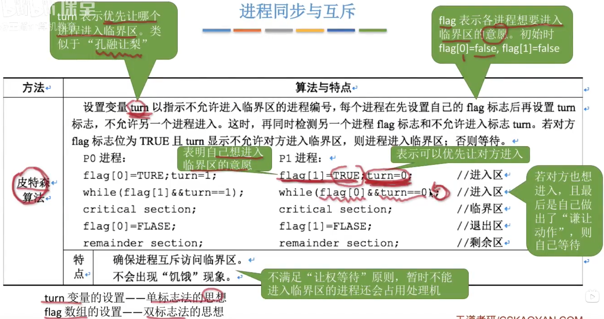
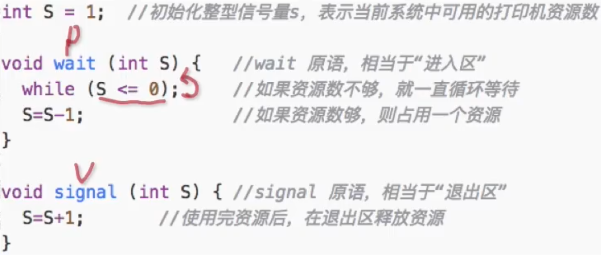

# 进程同步与互斥

为了实现对临界资源的互斥访问，同时保证系统整体性能，需要遵循以下原则：

1. 空闲让进。临界区空闲时，可以允许一个请求进入临界区的进程立即进入临界区；
2. 忙则等待。当已有进程进入临界区时，其他试图进入临界区的进程必须等待；
3. 有限等待。对请求访问的进程，应保证能在有限时间内进入临界区（保证不会饥饿）；
4. 让权等待。当进程不能进入临界区时，应立即释放处理机，防止进程忙等待。

互斥的四种软件实现方式

- 单标志法
- 双标志先检查法
- 双标志后检查法
- Peterson算法

### 临界区互斥的软件实现方法

对于两个进程P0、P1互斥访问临界区的软件实现方法：

- 单标志法

  

- 双标志先检查法

  

- 双标志后检查法

  

- Peterson算法

  

### 信号量机制

整型信号量被定义为一个用于表示资源个数的整型量S。当进程发现S<=0时，就会不断测试。因此进程处于忙等状态，为遵循”让权等待“原则。



记录型信号量遵循了”让权等待“原则，其数据结构描述：

```c++
typedef struct{
	int value;         //代表资源数目
	struct process *L; //链接等待该资源的进程
}semaphore;
```

信号量的P、V操作的实质是”加减“操作，P、V操作又是原语操作，所以，P操作是对信号量（只能对信号量，不可以对普通变量）进行减”1“操作，然后判断是否小于零，”是“则阻塞等待，”否“则什么都不做，而V操作是对信号量加“1”操作，然后判断是否小于等于零，“是“则唤醒进程，”否“则什么也不做。

记录型信号量S中value值的意义：

- S.value 的初值表示系统中某类资源的总数。
- S.value<0 表示当前系统中已经没有可用的该类资源
- S.value<0时，其绝对值表示S.L中因等待该资源而阻塞的进程个数。


