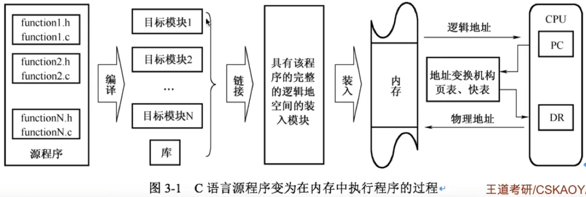

# 内存管理的概念

### （内存管理）命题重点

1. 程序装入的过程与原理，编译与链接，逻辑地址与物理地址。
2. 连续分配方式的原理与特点，动态分区分配算法的原理。
3. 分页存储管理的页表机制，分段存储管理的段表机制，分页与分段的比较。
4. 虚拟存储器的原理、特征，缺页中断的处理过程和特点，虚拟地址和物理地址的变换，引入快表后的页式虚拟存储器的地址变换过程，各种页面置换算法的原理，页面分配策略，工作集的定义，抖动产生的原因和解决办法。

### 程序运行的基本原理

将用户源程序变为可在内存中执行的程序，通常需要以下几个步骤：

- 编译，由编译程序将用户源代码编译称若干个目标模块，每个模块具有各自的逻辑地址空间。
- 链接，由链接程序将上述目标模块，以及所需库函数链接，形成具有完整的逻辑地址空间的装入模块。
- 装入，由装入程序将装入模块装入内存。

而程序执行过程中，在指令寻址与数据寻址时，CPU不断地进行从逻辑地址到物理地址的转换。下图展示了从源程序（C程序为例）变为在内存中执行的程序的过程。

