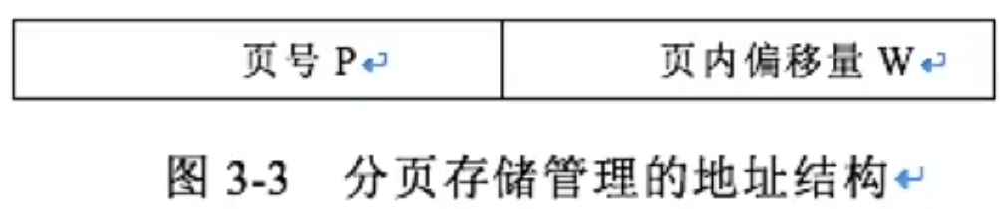
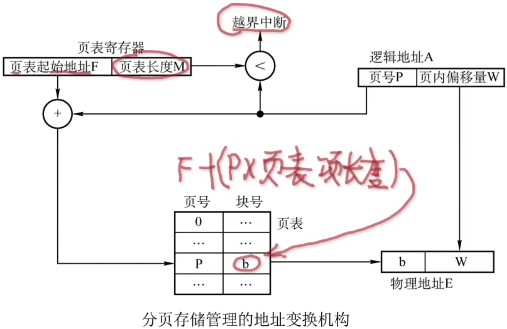
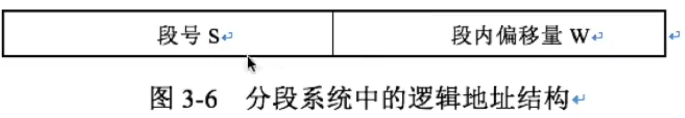
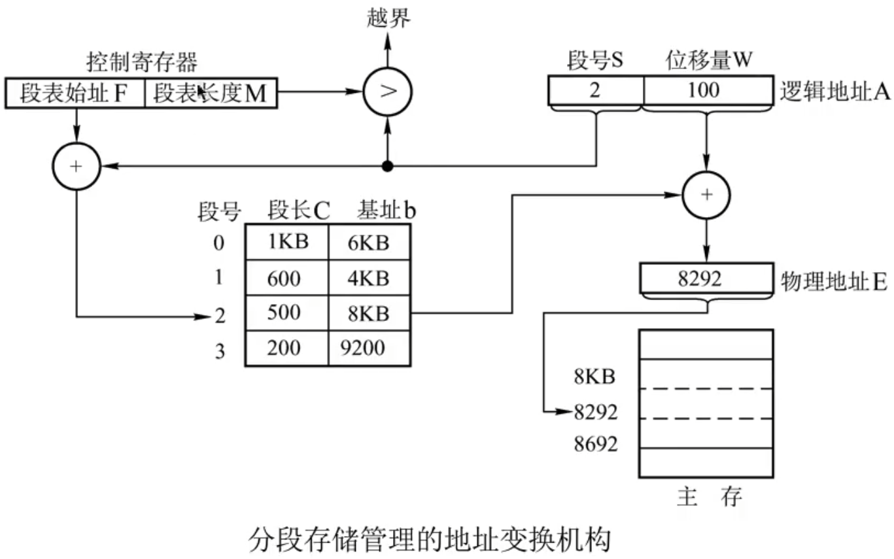

# 非连续分配管理方式

### 分页存储管理方式

把主存空间划分为大小相等且固定的块，块相对较小，作为主存的基本单位。每个进程也以块为单位进行划分，进程在执行时，以块为单位逐个申请主存中的块空间。进程中的块称为页，内存中的块称为页框（页帧）。外存也以同样单位进行划分，直接称为块。

分页存储管理的逻辑地址结构包含两部分：页号P，页内偏移量W。

系统为每个进程都建立了一张页表，记录页面在内存中对应的物理块号。

硬件支持：页表寄存器（PTR），存放页表在内存的始址和页表长度。

逻辑地址与物理地址的转变过程

1. 查页表

   先将页号P与页表长度M比较；若越界，即P>=M，则表示地址越界并中断

   若未越界，即将页表始址与页号和页表项长度的乘积相加，便得到该表项在页表中的位置，从中得到该页的物理块号，将之装入物理地址寄存器中。

2. 根据页表项算出物理地址

   将有效地址中的页内偏移量送入物理地址寄存器的块内地址字段中，即可得到要访问的内存物理地址。

### 分段存储管理

分段存储管理的逻辑地址由两部分组成：段号S与段内偏移量W，如图。段号字段决定了作业最大段数，段内偏移量字段决定了最大段长。

系统为每个进程都建立一张逻辑空间与主存空间映射的段表，每一个段表项对应进程的一个段，段表项记录该段在内存中的起始地址和段的长度。

硬件支持：段表寄存器，用于存放段表始址和段表长度TL。

逻辑地址到物理地址的转换过程如下：

1. 查段表

   系统将逻辑地址中的段号S，于段表长度TL进行比较。

   若越界，即S>TL，表示段号太大，访问越界，于是产生越界中断信号。

   若未越界，则根据段表的始址和该段的段号，计算出该段对应段表项的位置，从中读出该段在内存中的起始地址。

2. 根据段表项算出物理地址

   检查段内地址W是否超过该段的段长SL

   若超过，即W>SL，同样发出越界中断信号

   若未越界，则将该段的基址d与段内地址相加，即可得到要访问的内存物理地址。

# 分页式与分段式对比

| 分页式存储管理方式                                           | 分段式存储管理方式                                           |
| ------------------------------------------------------------ | ------------------------------------------------------------ |
| 是从计算机的角度考虑设计的，以提高内存的利用率，提升计算机的性能为目标。 | 考虑了用户关于方便编程、信息保护和共享、动态增长及动态链接等多方面的需要。 |
| 在页式系统中，分页通过硬件机制实现，逻辑地址的页号和页内偏移量对用户是透明的。 | 段号和段内偏移量必须由用户显式提供，在高级程序设计语言中，这个工作由编译程序完成。 |
| 逻辑地址是一维结构                                           | 逻辑结构是二维结构                                           |
| 产生内部碎片                                                 | 产生外部碎片                                                 |
| 页面大小一致                                                 | 段长大小不等                                                 |

