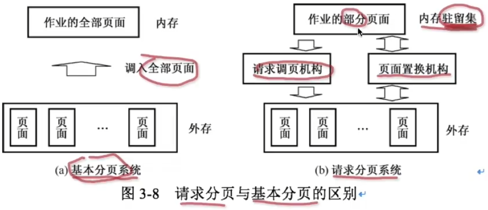
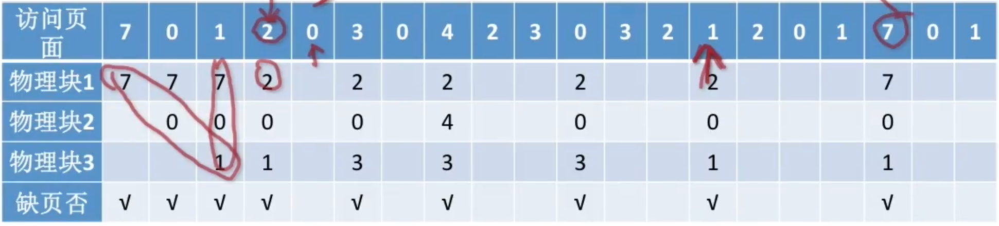
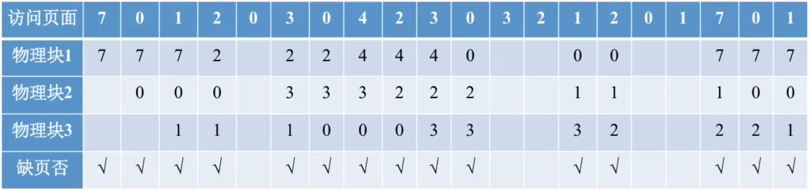

# 虚拟页式存储管理

### 虚拟存储器的定义和特征

基于局部性原理，在程序装入时，可以将程序的一部分装入内存，而将其余部分留在外存，就可以启动程序执行。在程序执行过程中，当所访问的信息不在内存时，由操作系统将所需要的部分调入内存。另一方面，操作系统将内存中暂时不适用的内容换出到外存上。这样，系统好像为用户提供了一个比实际内存大得多的存储器，称为虚拟存储器。

虚拟存储器有以下三种实现方式：请求分页；请求分段；请求段页式。

虚拟存储器有以下三个主要特征：多次性；对换性；虚拟性。

虚拟存储器的容量取决于地址空间的大小，而不是由实际的内容存量决定。

### 缺页中断机构

在页式虚拟存储管理系统中，程序是部分装入的，还有部分是处于外存上的，因此，当需要访问那部分位于外存上的代码或数据时，系统就会产生缺页中断。

产生缺页中断的目的是要将位于外出上的代码或数据装入内存，此时应将缺页的进程阻塞（调页完成唤醒），如果内存中有空闲块，则分配一个块，将要调入的页装入该块，并修改页表中相应页表项，若此时内存中没有空闲块，则需要淘汰某页。

缺页中断作为中断同样要经历，诸如保护CPU环境、分析中断原因、转入缺页中断处理程序、恢复CPU环境等几个步骤。但与一般的中断相比，它有以下两个明显的区别：

- 在指令执行期间产生和处理中断信号，而非一条指令执行完后。
- 一条指令在执行期间，可能产生多次缺页中断。

### 快表

在地址变换机构中增设了一个具有并行查找能力的高速缓冲存储器快表，又称联想寄存器（TLB），用以存放当前访问的若干页表项。

在具有快表的分页机制中，地址的变换过程如下：

### 请求分页存储管理

请求分页存储管理只要求将当前需要的一部分页面装入内存，便可以启动作业运行。在作业执行过程中，当所要访问的页面不在内存时，再通过请求调页功能将其调入，同时还可以通过页面置换功能将暂时不用的页面换出到外存上，以便腾出内存空间。如图所示。

| 硬件机制     | 说明                                                         |
| ------------ | ------------------------------------------------------------ |
| 页表机制     | 请求分页系统页表项中增加了四个字段，  增加的四个字段说明如下： 状态位P：用于指示该页是否已调入内存。 访问字段A：用于记录本页在一段时间内被访问的情况。 修改位M：标识该页在调入内存后是否被修改过。 外存地址：用于指出该页在外存上的地址，通常是物理块号。 |
| 缺页中断机构 | 在请求分页系统中，当所要访问的页面状态为P无效时，便产生一个缺页中断，此时硬件陷入内核，操作系统所缺的页调入内存，并更新页表，中断后返回产生缺页中断的那条指令继续执行。 |
| 地址变换机构 | 1. 先根据逻辑地址高位的页号检索快表 2. 若找到要访问的页，便修改页表项中的访问位（写指令则还须重置修改位），然后利用页表项中给出的物理块号和页内地址形成物理地址。 3. 否则，再到内存中查找页表，找到该页表项后检查状态位P，看该页是否已调入内存， a. 若已经在内存中，则修改页表项中的访问位和快表，并根据页表项中的物理块号和逻辑地址低位的页内地址形成物理地址。 b. 若未调入内存，则产生缺页中断，请求从外存把该页调入内存，并修改页表和快表。然后返回原指令重新执行，再次寻址。 |

### 页面置换算法

假定系统为某进程分配了三个物理块，并考虑有以下页面号引用串：
$$
7,0,1,2,0,3,0,4,2,3,0,3,2,1,2,0,1,7,0,1
$$

1. 最佳置换算法

   

   置换原则：选择的被淘汰的页面将是以后永不使用的，或者是在最长时间内不再被访问的页面。

   - 最佳置换算法可以保证获得最低的缺页率。

   - 最佳置换算法可以用来评价其他算法。

2. 先进先出页面置换（FIFO）算法

   

   置换原则：优先淘汰最早进入内存的页面，亦即在内存中驻留时间最久的页面。

   FIFO算法可能会产生当所分配的物理块数增大而页故障数不减反增的Belady异常。 

3. 最近最久未使用（LRU）置换算法

   置换原则：选择最近最长时间未访问过的页面予以淘汰。

4. 时钟（CLOCK）置换算法

   **选择一个页面 最多两轮扫描**

   系统为每一帧关联一个附加位，称为使用位。

   置换原则：

   将候选帧集合看做一个循环缓冲区

   当需要替换一页时，从当前指针位置开始查找首个使用位为0的帧。查找过程重复以下操作直到找到为止：

   若帧的使用位为0，则该帧中的页被替换，其使用位被置为1，并将指针指向缓冲区中的下一帧。

   如帧的使用位为1，操作系统就将该位重新置为0，并查找缓冲区的下一帧；

   例：系统位某个进程依次分配了页框号"7,9,2,4"总共4个页框（进程驻留集大小为4），刚开始所有页面都没有调入内存。进程按03215326的顺序访问页面，采用CLOCK算法

   要点1：根据驻留集大小、页面调入内存的先后顺序来确定循环队列的顺序。

   要点2：扫描指针初始时指向第一个到达的页面（有的题目会单独说明指针的方向）

   要点3：分配给进程的页框不够用时，需要换出一个页面，再将新的页面调入相应的页框中。页面放入后，访问位应设置为1，且扫描指针指向循环队列中的下一个页面。

5. 改进型的CLOCK置换算法

   **选择一个页面 最多四轮扫描**

   在使用位的基础上再增加一个修改位

   置换原则：

   从指针的当前位置开始，扫描帧缓冲区，选择遇到的第一个帧（使用位=0，修改位=0）用于替换。

   如果第1步失败，则重新扫描，选择遇到的第一个（使用位=0，修改位=1）帧用于替换。在这个扫描过程中，对每个跳过的帧，把它的使用位设置成0.

   如果第2步失败，指针将回到它的最初位置，并且集合中所有帧的使用位均为0。重复第1步，并且如果有必要，重复第2步。这样将可以找到提供替换的帧。

### 页面分配策略

1. 固定分配局部置换。

   它为每个进程分配一定数量的物理块，在整个运行期间都不改变。若进程在运行中发现缺页，则只能从进程在内存的页面中选出一个换出，然后再调入需要的页面。实现这种策略难以确定为每个进程应分配的物理块数量：太少会频繁出现缺页中断，太多又会使CPU和其他资源利用率下降。

2. 可变分配全局置换。

   这是最易于实现的物理块分配和置换策略，为系统中的每个进程分配一定数量的物理块，操作系统自身也保持一个空闲物理块队列。当某进程发现缺页时，系统从空闲物理块队列中取出物理块分配给该进程，并将欲调入的页装入其中。

3. 可变分配局部置换。

   它为每个进程分配一定数目的物理块，当某进程发现缺页时，只允许从该进程在内存的页面中选出一页换出，这样就不会影响其他进程的运行。如果进程在运行中频繁地缺页，系统需再为该进程分配若干附加物理块，直至该进程缺页率趋于适当程度为止；反之，若一个进程再运行过程中缺页率特别低，则此时可适当减少分配给该进程的物理块。

### 工作集（驻留集）

在某段时间间隔内，进程要访问的页面集合。经常被使用的页面需要在驻留集中，而长期不被使用的页面要从驻留集中被丢弃。驻留集模型使用较为简单：操作系统跟踪每个进程的驻留集，并为进程分配大于其驻留集的空间。如果还有空闲，那么可启动另一个 进程。如果所有驻留集之和增加以至于超过了可用物理块的总数，那么系统会暂停一个进程，将其页面调出并且将其物理块分配给其他进程。

正确选择驻留集的大小，对存储器的有效利用和系统吞吐量的提高，都将产生重要的影响。

### 抖动现象

在进程的页面置换过程中，频繁的页面调度行为称为抖动或颠簸。如果一个进程在换页上用的时间多于执行时间，那么这个进程就在颠簸。

使用虚拟内存技术，操作系统中进程通常只有一部分块位于主存中，从而可以在内存中保留更多的进程以提高系统效率。产生抖动后，使得系统吞吐量下降，缺页中断率迅速增长，由于处理机差不多花费所有时间在进行内外存页面置换，因此几乎不能做任何工作。

引起系统抖动的原因是对换的信息量过大、内存容量不足、置换算法选择不当，所以解决的办法就是降低交换页面的数量、加大内存容量、改变置换选择算法。但是降低交换页面数量和改变置换选择算法对于一个应用系统来讲是不可能的，只能增加内存容量，或者降低进程数量（相对地增加内存）。而增加交换区容量并不能解决物理内存不足地问题。