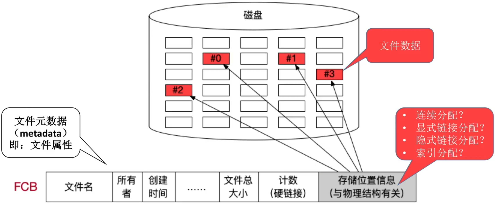
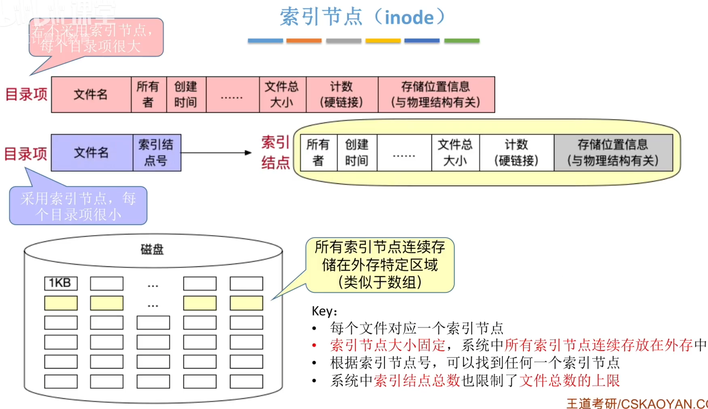
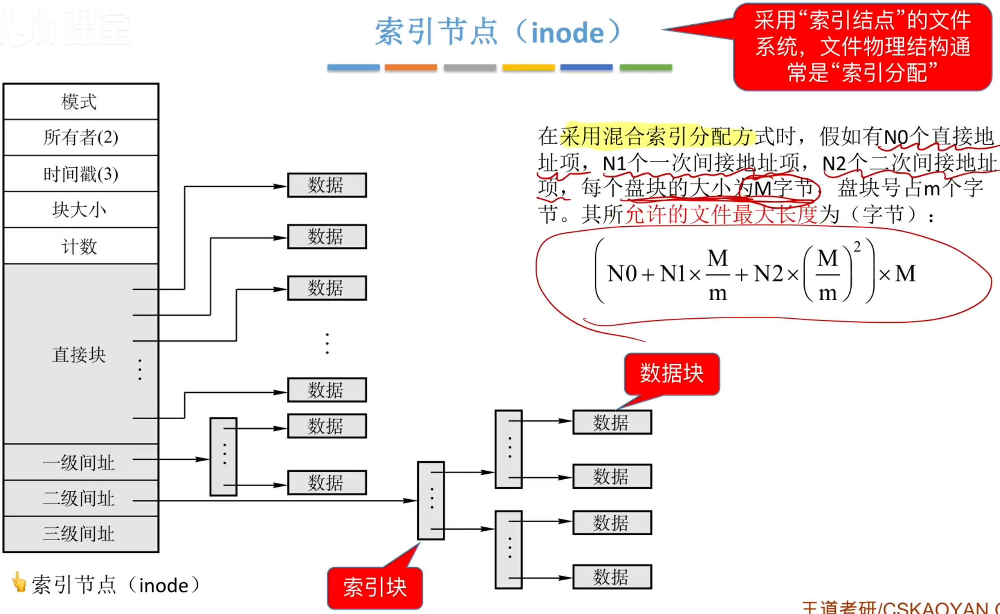
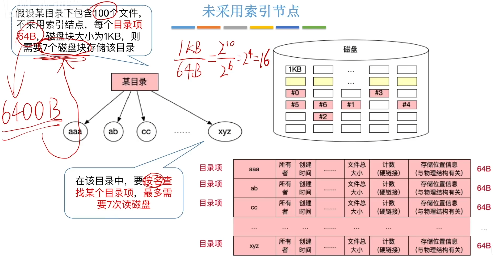
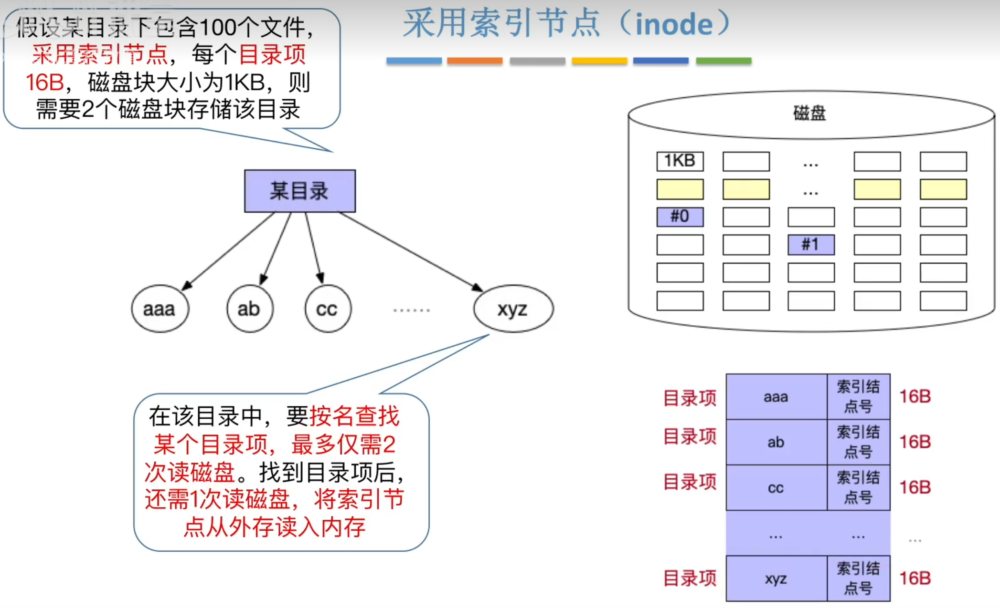

# 文件元数据和索引节点

**2010** 设文件索引结点有7个地址项，其中4个地址项是直接地址索引，2个地址项是一级间接地址索引，1个地址项是二级间接地址索引，每个地址项大小为4B。若磁盘索引块和磁盘数据块大小均为256B，则可表示地单个文件最大长度是

A 33KB

B 519KB

C 1057KB

D 16513KB

**2013** 若某文件系统索引节点（inode）中有直接地址和间接地址项，则下列选项中，与单个文件长度无关的因素是

A 索引结点的总是

B 间接地址索引的级数　

C 地址项的个数

D 文件块的大小

**2020** 某文件系统的目录项由文件名和索引结点号构成。若每个目录项长度为64字节，其中4字节存放索引结点号，60字节存放文件名。文件名由小写英文字母构成，则该文件系统能创建的文件数量的上限为

A 2^26

B 2^32

C 2^60

D 2^64