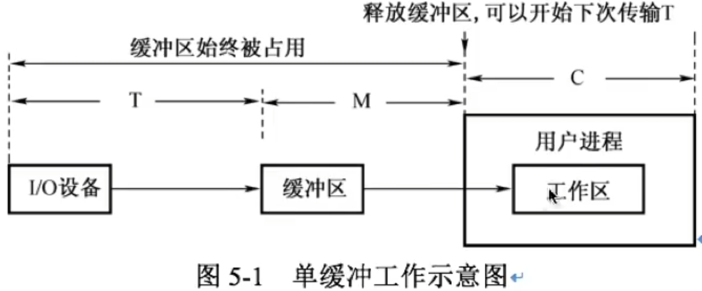
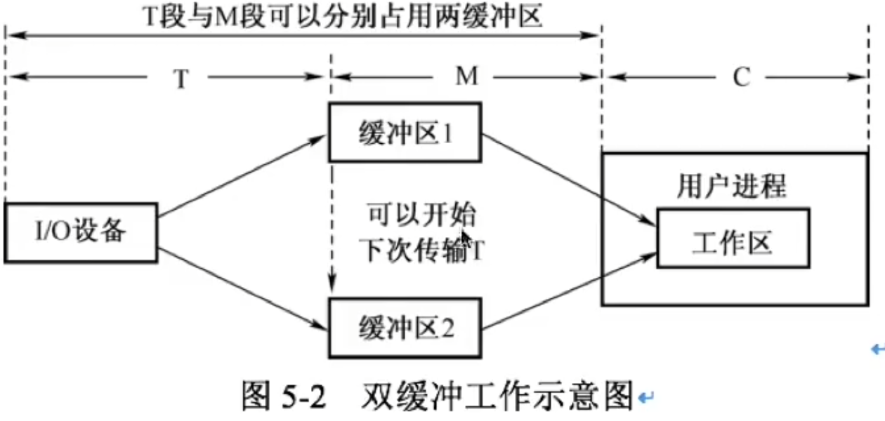

# I/O调度与缓冲区

### I/O调度的概念

I/O调度就是确定一个好的顺序来执行这些I/O请求。应用程序所发布的系统调用的顺序不一定总是最佳选择，所以需要I/O调度来改善系统整体性能，使进程之间公平地共享设备访问，减少I/O完成所需要的平均等待时间。

### 单缓冲和双缓冲

单缓冲。在设备和处理器之间设置一个缓冲区。设备和处理器交换数据时，先把被交换数据写入缓冲区，然后需要数据的设备或处理器从缓冲区取走数据，能够实现预读和滞后写。

如图，在块设备输入时，假定从磁盘把一块数据输入到缓冲区的时间为T，操作系统将该缓冲区中的数据传送到用户区的时间为M，而CPU对这一块数据处理的时间为C。系统对每一块数据的处理时间表示为Max(C, T)+M

双缓冲。在设备与处理器之间设置两个缓冲区。I/O设备输入数据时，两个缓冲区交替使用。双缓冲的使用提高了处理器和输入设备的并行操作的程度。

如图，系统处理一块数据的时间可以粗略地认为使Max(C,T)。