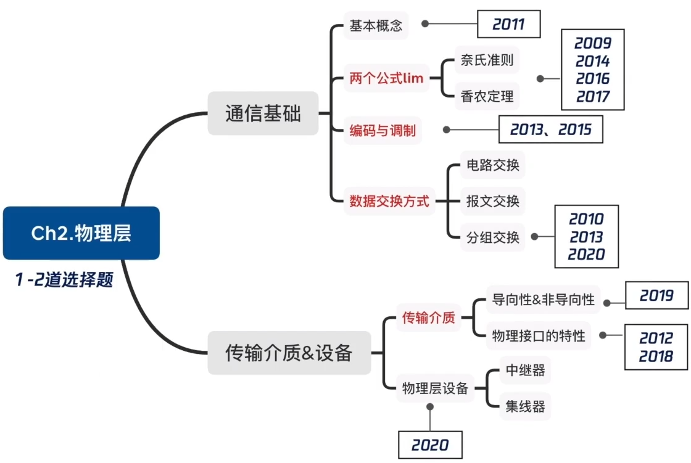
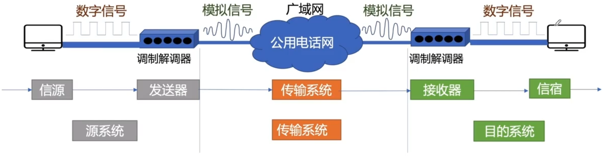
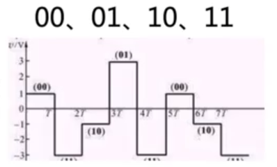

# 通信基础概念

### 考点分布

### 通信基础概念

### 码元、速率、波特、带宽

码元是指一个固定时长的信号波形（数字脉冲），代表不同离散数值的基本波形，是数字通信中数字信号的计量单位，当码元的离散状态有M个时，此时码元为M进制码元。1码元可携带多个比特信息。

4进制码元 码元的离散状态有4个 4种高低不同的信号波形

M进制码元 码元的离散状态有M个 M种高低不同的信号波形 log2 M个比特

速率（数据率）：数据传输速率

- 码元传输速率：单位时间传输的码元个数（脉冲个数或信号变化的次数），波特（Baud）
- 信息传输速率/比特率：单位时间传输的比特数，比特/秒（b/s）

关系：若一个码元携带n bit的信息量，则M Baud的码元传输速率所对应的信息传输速率为Mxn bit/s。

- 带宽
  1. 模拟信号系统中：输入信号的最高频率和最低频率间的差值就代表了系统的通频带宽，其单位为赫兹（Hz）
  2. 数字设备中：在单位时间内从网络中的某一点到另一点所能通过的“最高数据率”，常用来表示网络的通信线路所能传输数据的能力，其单位为比特/秒（b/s）

**2011** 若某通信链路的数据传输速率为2400bit/s，采用4相位调制，则该链路的波特率是 **B**

A 600波特

B 1200波特

C 4800波特

D 9600波特