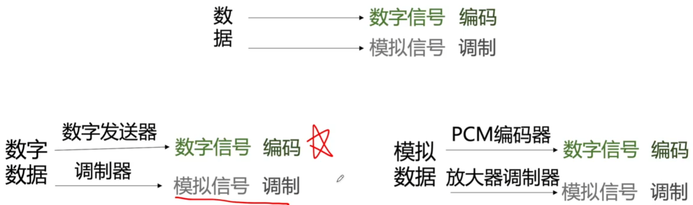
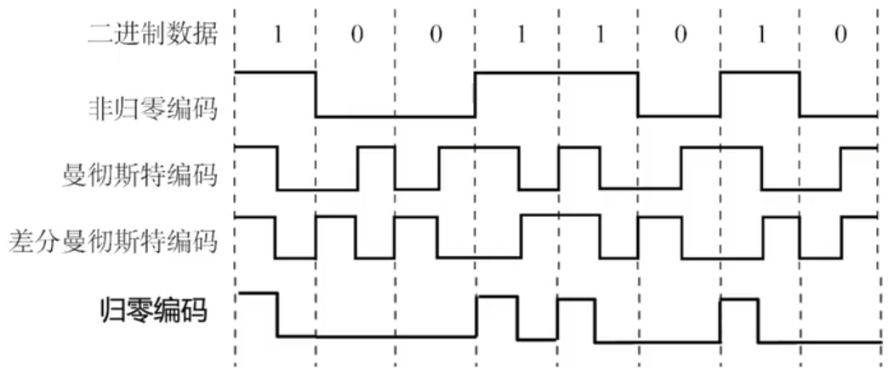
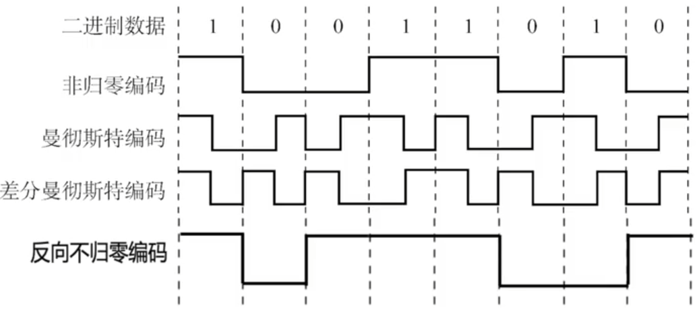
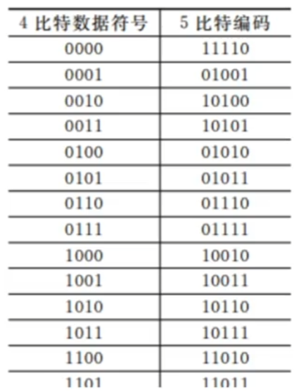
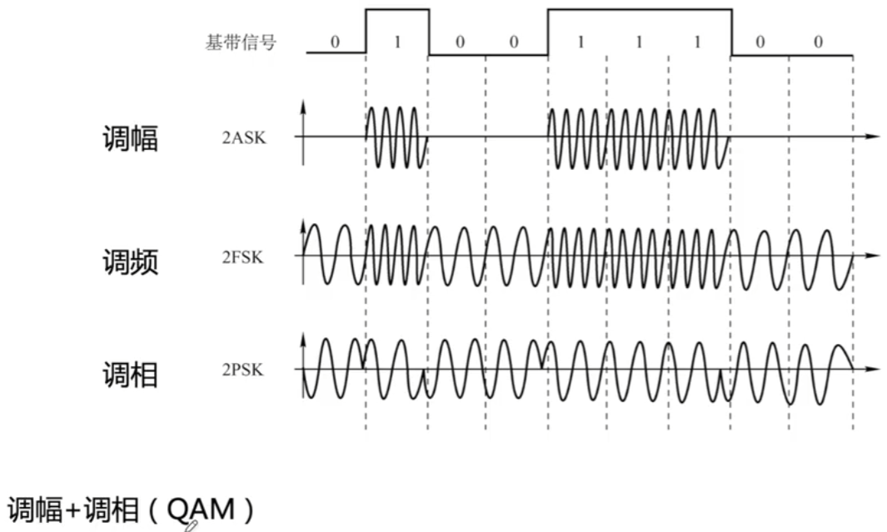
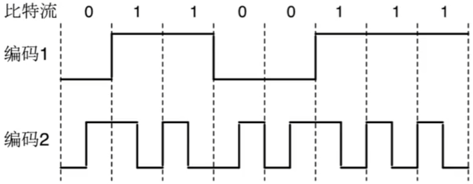
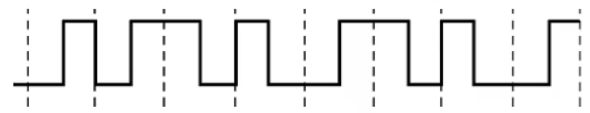

# 编码&调制

### 编码

- NRZ 非归零编码 高1低0

  编码容易实现，但没有检错功能，且无法判断一个码元的开始和结束，以至于收发双方难以保持同步。

- RZ 归零编码 跳变

- NRZI 反向不归零编码

  信号电平翻转表示0，信号电平不变表示1

- 曼彻斯特编码 跳变

  将一个码元分成两个相等的间隔，前一个间隔为低电平后一个间隔为高电平表示码元1；码元0则正好相反。也可以采用相反的规定。该编码的特点是在每一个码元的中间出现电平跳变，位中间的跳变既作时钟信号（可用于同步），又作数据信号，但它所占的频带宽度是原始基带宽度的两倍。

  每一个码元都被调成两个电平，所以数据传输速率只有调制速率的1/2。

- 差分曼彻斯特编码 同1异0 跳变

  常用于局域网传输，其规则是：若码元为1，则前半个码元的电平与上一个码元的后半个码元的电平相同，若为0，则相反。该编码的特点是，在每个码元的中间，都有一次电平的跳转，可以实现自同步，且抗干扰性强于曼彻斯特编码。

- 4B/5B 编码

  比特流中插入额外的比特以打破一连串的0或1，就是用5个比特来编码4个比特的数据，之后再传给接收方，因此称为4B/5B。编码效率为80%。

  只采用16种对应16种不同的4位码，其他的16种作为控制码（帧的开始和结束，线路的状态信息等）或保留。

  

### 编码

计算机内部处理的是二进制数据，处理的都是数字音频，所以需要将模拟音频通过采样、量化转换成有限个数字表示的离散序列（即实现音频数字化）。

最典型的例子就是对音频信号进行编码的脉码调制（PCM），在计算机应用中，能够达到最高保真水平的就是PCM编码，被广泛用于素材保存及音乐欣赏，CD、DVD以及我们常见的WAV文件中均有应用。它主要包括三步：抽样、量化、编码。

1. 抽样：对模拟信号周期性扫描，把时间上连续的信号变成时间上离散的信号

   为了使所得的离散信号能无失真地代表被抽样的模拟数据，要使用采样定理进行采样：
   $$
   f_{采样频率}>=2f_{信号最高频率}
   $$

2. 量化：把抽样取得的电平幅值按照一定的分级标度转化为对应的数字值，并取整数，这就把连续的电平幅值转换为离散的数字量

3. 编码：把量化的结果转换为与之对应的二进制编码

### 调制

数字数据调制技术在发送端将数字信号转换为模拟信号，而在接收端将模拟信号还原为数字信号，分别对应于调制解调器的调制和解调过程。

为了实现传输的有效性，可能需要较高的频率。这种调制方式还可以使用频分复用技术，充分利用带宽资源。在电话机和本地交换机所传输的信号是采用模拟信号传输模拟数据的方式；模拟的声音数据是加载到模拟的载波信号中传输的。

**2015** 使用两种编码方案对比特流 01100111 进行编码的结果如下图所示，编码1和编码2分别是 **A**

A NRZ 和曼彻斯特编码

B NRZ 和差分曼彻斯特编码

C NRZI 和曼彻斯特编码

D NRZI 和差分曼彻斯特编码

**2013** 若下图为10BaseT网卡接收到的信号波形，则该网卡收到的比特串是 **A**

A 0011 0110

B 1010 1101

C 0101 0010

D 1100 0101