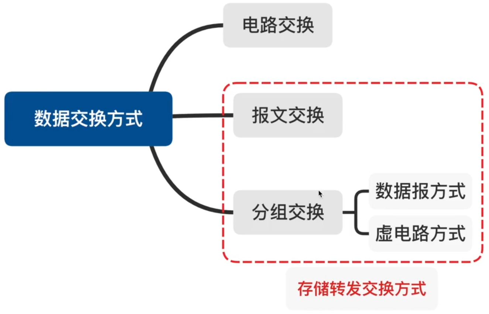
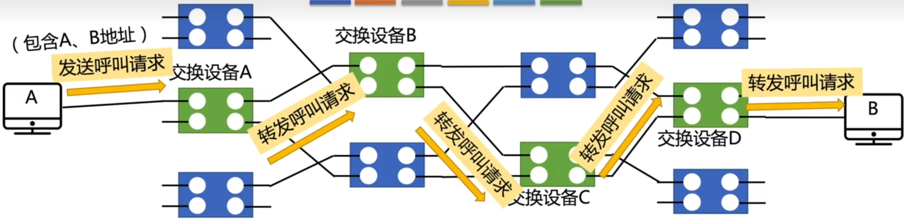
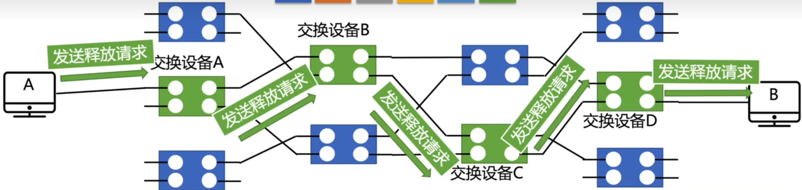
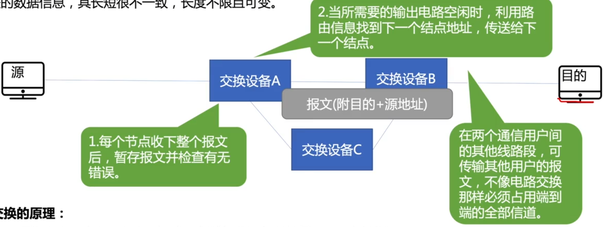
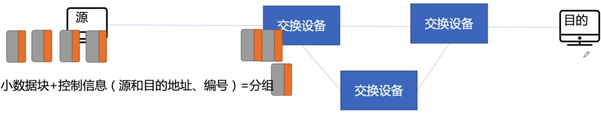
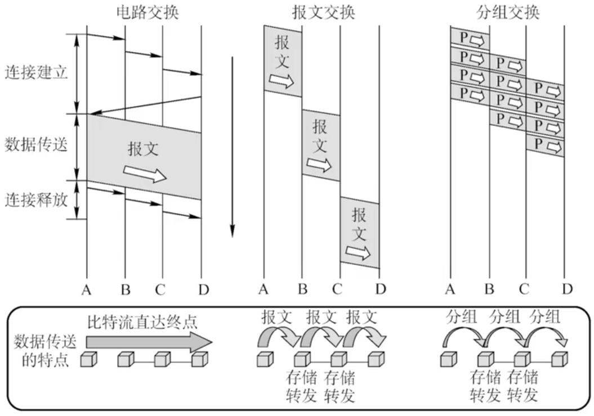
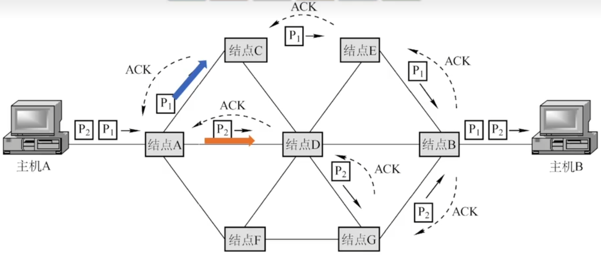
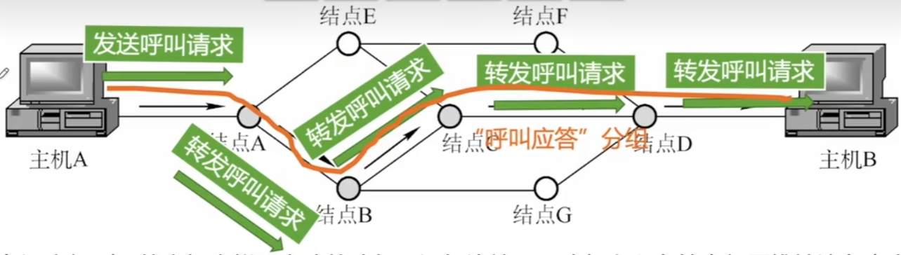
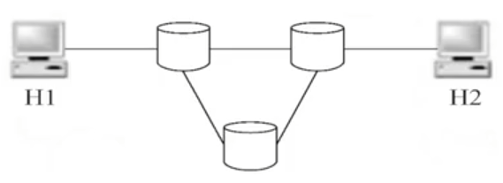

# 数据交换方式

### 电路交换

电路交换的原理：在数据传输期间，原结点与目的结点之间有一条由中间结点构成的专用物理连接线路，在数据传输结束之前，这条线路一直保持。

特点：独占资源，用户始终占用端到端的固定传输带宽。适用于远程批处理信息传输或系统间实时性要求高的大量数据传输的情况。

### 报文交换

报文：报文（message）是网络中交换与传输的数据单元，即站点一次性要发送的数据块。报文包含了将要发送的完整的数据信息，其长短很不一致，长度不限且可变。

报文交换的原理：无需在两个站点之间建立一条专用通路，其数据传输的单位是报文，传送过程采用存储转发方式。

### 分组交换

分组：大多数计算机网络都不能连续地传输任意长的数据，所以实际上网络系统把数据分割成小块，然后逐块地发送，这种小块就称作分组（packet）。

分组交换的原理：分组交换与报文交换的工作方式基本相同，都采用存储转发方式，形式上的主要差别在于，分组交换网中要限制所传输的数据单位的长度，一般选128B。发送结点首先对从终端设备送来的数据报文进行接收、存储，而后将报文划分成一定长度的分组，并以分组为单位进行传输和交换。接收结点将收到的分组组装成信息或报文。

### 三种交换方式对比

1. 传送数据量大，且传送时间远大于呼叫时，选择电路交换。电路交换传输时延最小。
2. 当端到端的通路有很多段的链路组成时，采用分组交换传送数据较为合适。
3. 从信道利用率上看，报文交换和分组交换优于电路交换，其中分组交换比报文交换的时延小，尤其适合于计算机之间的突发式的数据通信。

### 分组交换 数据报方式

1. 源主机（A）将报文分成多个分组，依次发送到直接相连的结点（A）。
2. 结点A收到分组后，对每个分组差错检测和路由选择，不同分组的下一跳结点可能不同。
3. 结点C收到分组P1后，对分组P1进行差错检测，若正确则向A发送确认信息，A收到C确认后则丢弃分组P1副本。
4. 所有分组到达主机B。

### 分组交换 虚电路方式

虚电路：一条源主机到目的主机类似于电路的路径（逻辑连接），路径上所有结点都要维持这条虚电路的建立，都维持一张虚电路表，每一项记录了一个打开的虚电路的信息。

### 数据报&虚电路方式

|                    | 数据报服务                                                 | 虚电路服务                                               |
| ------------------ | ---------------------------------------------------------- | -------------------------------------------------------- |
| 连接的建立         | 不要                                                       | 必须有                                                   |
| 目的地址           | 每个分组都有完整的目的地址                                 | 仅在建立连接阶段使用，之后每个分组使用长度较短的虚电路号 |
| 路由选择           | 每个分组独立地进行 路由选择和转发                     | 属于同一条虚电路的分组按照同一路由转发                   |
| 分组顺序           | 不保证分组的有序到达                                       | 保证分组的有序到达                                       |
| 可靠性             | 不保证可靠通信，可靠性由用户主机来保证                     | 可靠性由网络保证                                         |
| 对网络故障的适应性 | 出故障的结点丢失分组，其他分组路径选择发生变化，可正常传输 | 所有经过故障节点的虚电路均不能正常工作                   |
| 差错处理和流量控制 | 由用户主机进行流量控制，不保证数据报的可靠性               | 可由分组交换网负责，也可由用户主机负责                   |

**2010** 在图所示的采用”存储-转发“方式的分组交换网络中，所有链路的数据传输速率为100Mbit/s，分组大小为1000B，其中分组头大小为20B。若主机H1向主机H2发送一个大小为980 000B的文件，则在不考虑分组拆装时间和传播延迟的情况下，从H1发送开始到H2接收完为止，需要的时间至少是 **C**

A 80ms

B 80.08ms

C 80.16ms

D 80.24ms
$$
t=(\frac{980000B}{(1000-20)B}+2)*\frac{1000B}{\frac{100M}{8}B/s}=80ms
$$
**2013** 主机甲通过1个路由器（存储转发方式）与主机乙互联，两端链路的数据传输速率均为10Mbps，主机甲分别采用报文交换和分组大小为10kB的分组交换向主机乙发送1个大小为8MB(1M=1000k)。若忽略链路传播延迟、分组头开销和分组拆装时间，则两种交换方式完成该报文传输所需的总时间分别为 **D**

A 800ms 1600ms

B 801ms 1600ms

C 1600ms 800ms

D 1600ms 801ms
$$
\begin{align}
t_1&=2*\frac{8MB}{10Mbps}\\
t_2&=(\frac{8MB}{10kB}+1)*\frac{10kB}{10Mbps}=801ms
\end{align}
$$
**2020** 下列关于虚电路网络的叙述中，错误的是 **B**

A 可以确保数据分组传输顺序

B 需要为每条虚电路预分配带宽

C 建立虚电路时需要进行路由选择

D 依据虚电路号（VCID）进行数据分组转发