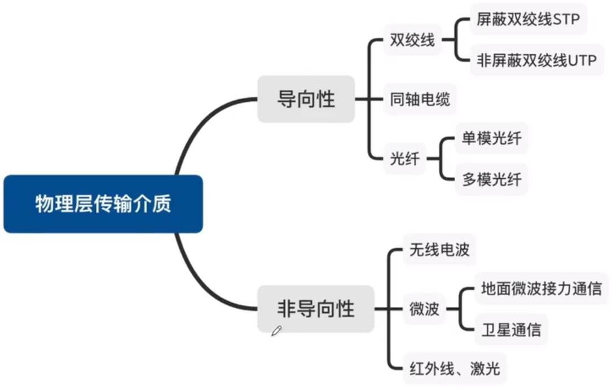
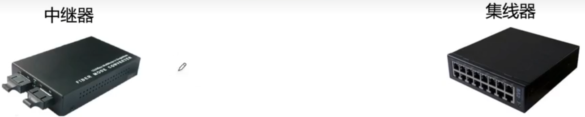

# 物理层设备&传输介质

### 传输介质

### 物理层设备

中继器的功能：对信号进行再生和还原，对衰减的信号进行放大，保持与原数据相同，以增加信号传输的距离，延长网络的长度。

集线器的功能：对信号进行再生放大转发，对衰减的信号进行放大，接着转发到其他所有（除输入端口外）处于工作状态的端口上，以增加信号传输的距离，延长网络的长度。不具备信号的定向传送能力，是一个共享式设备。

### 物理接口特性

物理层解决如何在连接各种计算机的传输媒体上传输数据比特流，而不是指具体的传输媒体。主要任务是确定与传输媒体接口有关的一些特性。

1. 机械特性

   定义物理连接的特性，规定物理连接时所采用的规格、接口形状、引线数目、引脚数量和排列情况。

2. 电气特性

   规定传输二进制位时，线路上信号的电压范围、阻抗匹配、传输速率和距离限制等。

   某网络在物理层规定，信号的电平用+10V~+15V表示二进制0，用-10V~-15V表示二进制1，电线长度限于15m以内

3. 功能特性

   指明某条线上出现的某一电平表示何种意义，接口部件的信号线（数据线、控制线、定时线等）的用途。

4. 规程特性

   （过程特性）定义各物理线路的工作规程和时序关系

**2012** 在物理层接口特性中，用于描述完成每种功能的事件发生顺序是 **C**

A 机械特性

B 功能特性

C 过程特性

D 电气特性

**2018** 下列选项中，不属于物理层接口规范定义范畴的是 **C**

A 接口形状

B 引脚功能

C 物理地址

D 信号电平

**2019** 100BaseT快速以太网使用的导向传输介质是 **A**

A 双绞线

B 单模光纤

C 多模光纤

D 同轴电缆

**2020** 下图所示的网络中，冲突域和广播域的个数分别是 **C**

A 2，2

B 2，4

C 4，2

D 4，4