# 介质访问控制

### 考点分布

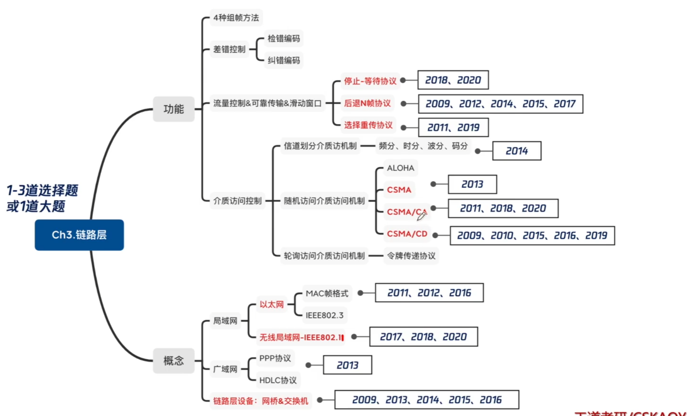

### 介质访问控制

介质访问控制的内容就是，采取一定的措施，使得局域网两对结点之间的通信不会发生互相干扰的情况。

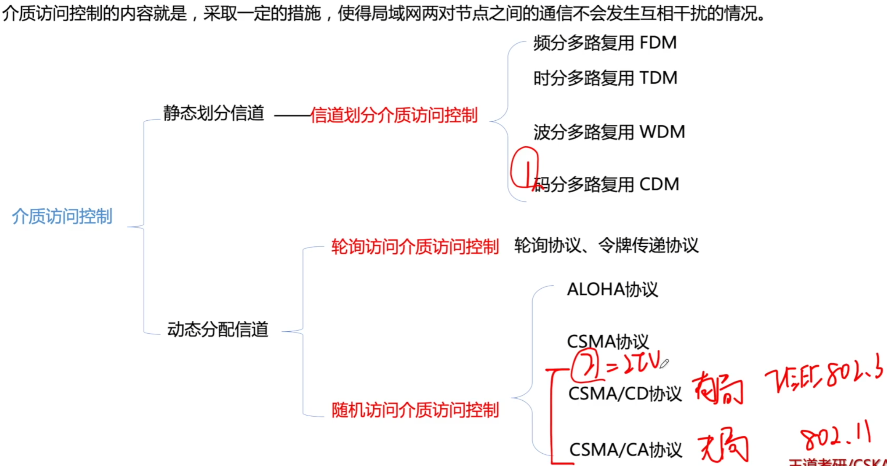

### 静态划分信道

1. 频分多路复用FDM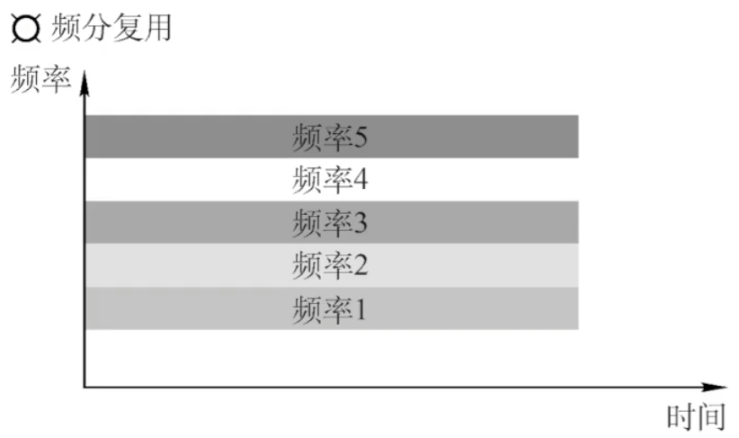

2. 时分多路复用TDM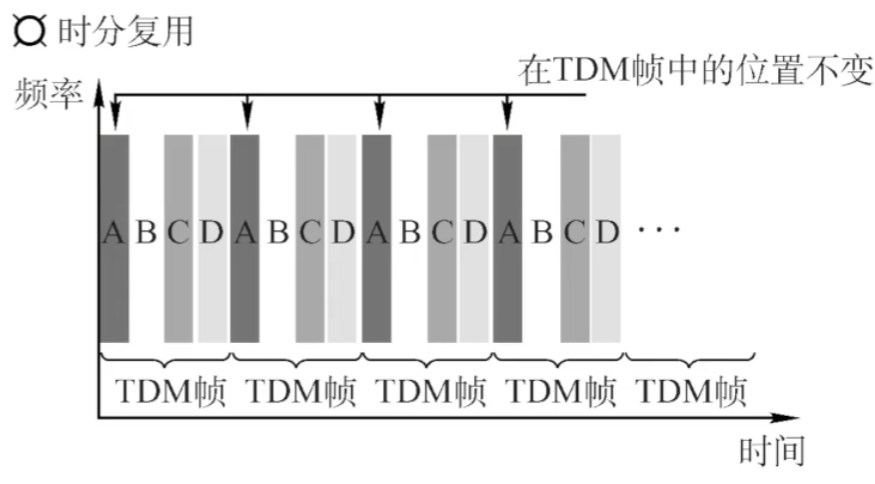

3. 统计时分多路复用STDM

4. 波分多路复用WDM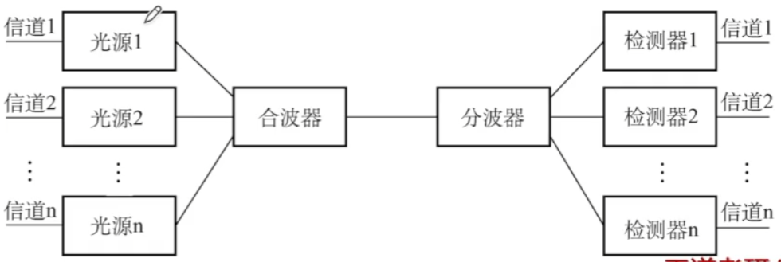

5. 码分多路复用

   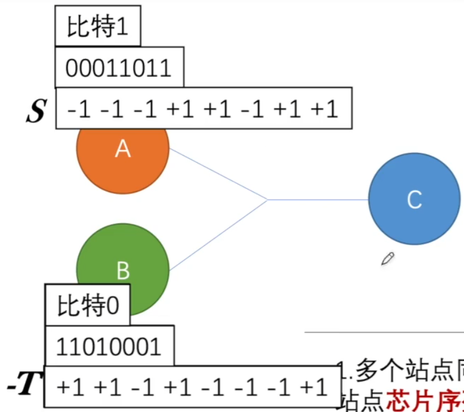

   码分多址（CDMA）是码分复用的一种方式。1个比特分为多个码片/芯片（chip），每一个站点被指定一个唯一的m位芯片序列，发送1时发送芯片序列（通常把0写成-1）。 

   

   - 多个站点同时发送数据的时候，要求各个站点芯片序列相互正交，规格化内积为0。
   - 两个向量到了公共信道上，线性相加
   - 数据分离：合并的数据和源站规格化内积。

**2014** 站点A、B、C通过CDMA共享链路，A、B、C的码片序列（chipping sequence）分别是(1,1,1,1)、(1,-1,1,-1)、(1,1,-1,-1)。若C从链路上收到的序列是(2,0,2,0,0,-2,0,-2,0,2,0,2)，则C收到A发送的数据是

A 000

B 101

C 110

D 111

**2013** 下列介质访问控制方法中，可能发生冲突的是

A CDMA

B CSMA

C TDMA

D FDMA

### 随机访问介质访问机制

1. ALOHA协议

   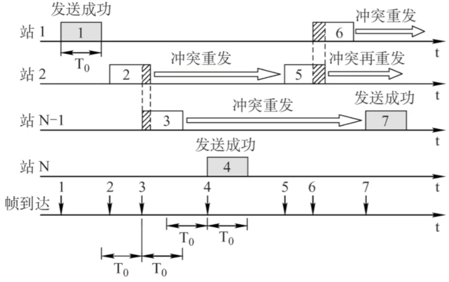

   原理：不监听信道，不按时间槽发送，发生冲突则随机重发。

2. 时隙ALOHA协议

   原理：不监听信道，按时间槽发送，发生冲突则随机重发。

3. CSMA协议（载波监听多点接入）

   原理：一个站点要发送数据前需要先监听总线，如果总线上没有其他站点发送信号，则该站点发送数据，否则需等待一段时间后再重新监听，再根据情况决定是否发送数据。

   |          | 1-坚持CSMA   | 非坚持CSMA                     | p-坚持CSMA                                   |
   | -------- | ------------ | ------------------------------ | -------------------------------------------- |
   | 信道空闲 | 马上发       | 马上发                         | p概率马上发 1-p概率等到下一个时隙再发送 |
   | 信道忙   | 继续坚持监听 | 放弃监听，等一个随机事件再监听 | 持续监听，直到信道空闲再以p概率发送          |

4. CSMA/CD协议（载波监听多点接入/碰撞检测）

   原理：每个站在发送数据之前要检测总线上是否有其他计算机在发送数据，若有则暂时不发送数据，以免发生冲突；若没有则发送数据。计算机发送数据的同时检测信道上是否有冲突发生，若有，则采用截断二进制数退避算法等待一段时间后再重发。

   **帧的传输时延至少要两倍于信号在总线中的传播时延**

   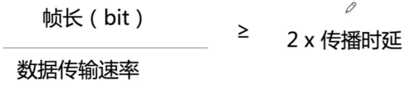

   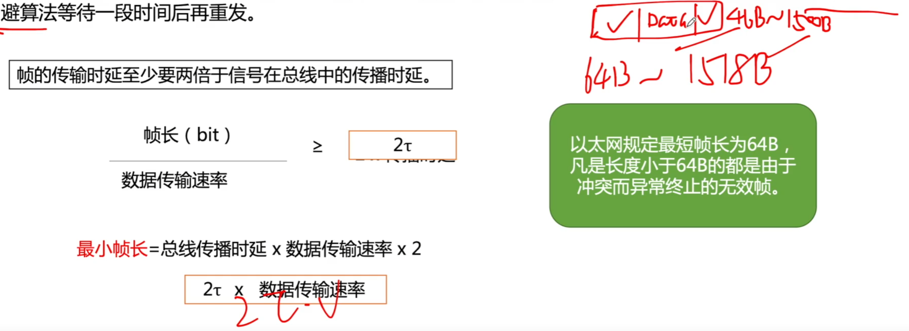

   **2009** 在一个采用CSMA/CD协议的网络中，传输介质是一根完整的电缆，传输速率为1Gbps，电缆中的信号传播速度是200000km/s。若最小数据帧长度减少800比特，则最远的两个站点之间的距离至少需要

   A 增加160m

   B 增加80m

   C 减少160m

   D 减少80m

   **2015** 下列关于CSMA/CD协议的叙述中，错误的是

   A 边发送数据帧，边检测是否发生冲突

   B 适用于无线网络，以实现无线链路共享

   C 需要根据网络跨距和数据传输速率限定最小帧长

   D 当信号传播延迟趋近0时，信道利用率趋近100%

   **2016** 若Hub再生比特流过程中，会产生1.535us延时，信号传播速度为200m/us，不考虑以太网帧的前导码，则H3与H4之间理论上可以相距的最远距离是

   A 200m

   B 205m

   C 359m

   D 512m

   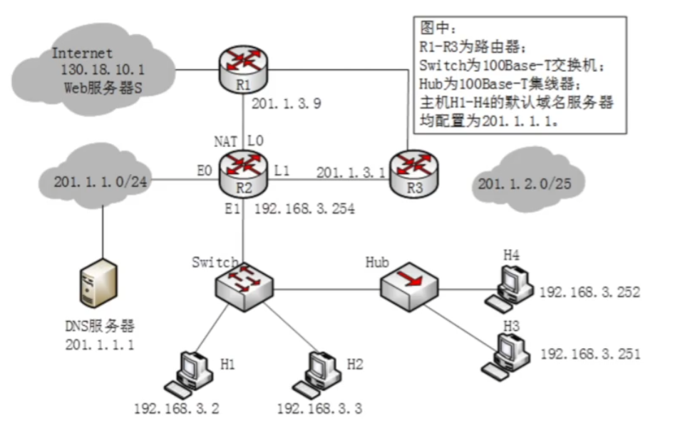

    **2019** 假设一个采用CSMA/CD协议的100Mbps局域网，最小帧长是128B，则在一个冲突域内两个站点之间的单向传播延时最多是

   A 2.56us

   B 5.12us

   C 10.24us

   D 20.48us

   **2010** 某局域网CSMA/CD协议实现介质访问控制，数据传输速率为10Mbps，主机甲和主机乙之间的距离为2km，信号传播速度是200000km/s。请回答下列问题，要求说明理由或写出计算过程。

   1. 若主机甲和主机乙发送数据时发生冲突，则从开始发送数据时刻起，到两台主机均检测到冲突时刻止，最短需经过多长时间？最长需经过多长时间（假设主机甲和主机乙发送数据过程中，其他主机不发送数据）？

   2. 若网络不存在任何冲突与差错，主机甲总是以标准的最长以太网数据帧（1518字节）向主机乙发送数据，主机乙每成功收到一个数据帧后立即向主机甲发送一个64字节的确认帧，主机甲收到确认帧后方可发送下一个数据帧。此时主机甲的有效数据传输速率是多少（不考虑以太网的前导码）？

5. CSMA/CA协议（载波监听多点接入/碰撞避免）

   发送数据前，先检测信道是否空闲

   空闲则发出RTS(request to send)，RTS包括发射端的地址、接收端的地址、下一份数据将持续发送的时间等信息；信道忙则等待。

   接收端收到RTS后，将响应CTS(clear to send)。

   发送端收到CTS后，开始发送数据帧（同时预约信道：发送方告知其他站点自己要传多久数据）。

   接收端收到数据帧后，将用CRC来检验数据是否正确，正确则响应ACK帧。

   发送方收到ACK就可以进行下一个数据帧的发送，若没有则一直重传至规定重发次数为止（采用二进制指数退避算法来确定随机的推迟时间）。

   **2020** 某IEEE 802.11 无线局域网中，主机H与AP之间发送或接受CSMA/CA帧的过程如下图所示。在H或AP发送帧前所等待的帧间间隔时间（IFS）中，最长的是

   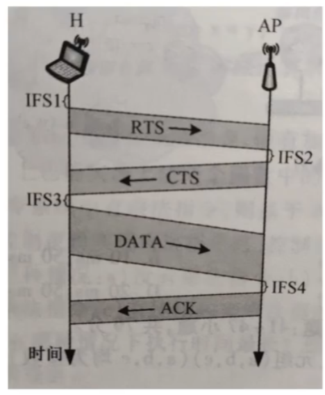

   A IFS1

   B IFS2

   C IFS3

   D IFS4

   **2018** IEEE 802.11无线局域网的MAC协议CSMA/CA进行信道预约的方法是

   A 发送确认帧

   B 采用二进制指数退避

   C 使用多个MAC地址

   D 交换RTS与CTS帧

   **2011** 下列选项中，对正确接受到的数据帧进行确认的MAC协议是

   A CSMA

   B CDMA

   C CSMA/CD

   D CSMA/CA

### CSMA/CD & CSMA/CA

1. 两者的传输介质不同，CSMA/CD用于总线式以太网，而CSMA/CA则用于无线局域网802.11a/b/g/n等等；

2. 检测方式不同，CSMA/CD通过电缆中电压的变化来检测，当数据发生碰撞时，电缆中的电压就会随着发生变化；而CSMA/CA采用能量检测（ED）、载波检测（CS）和能量载波混合检测三种检测信道空闲的方式。

3. CSMA/CD：带有冲突检测的载波监听多路访问，可以检测冲突，但无法“避免”。

   CSMA/CA：带有冲突避免的载波监听多路访问，发送包的同时不能检测到信道上有无冲突，只能尽量“避免”。

### 令牌传递协议

